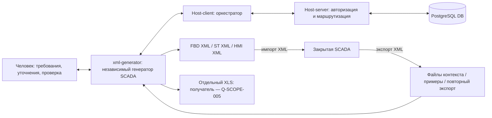
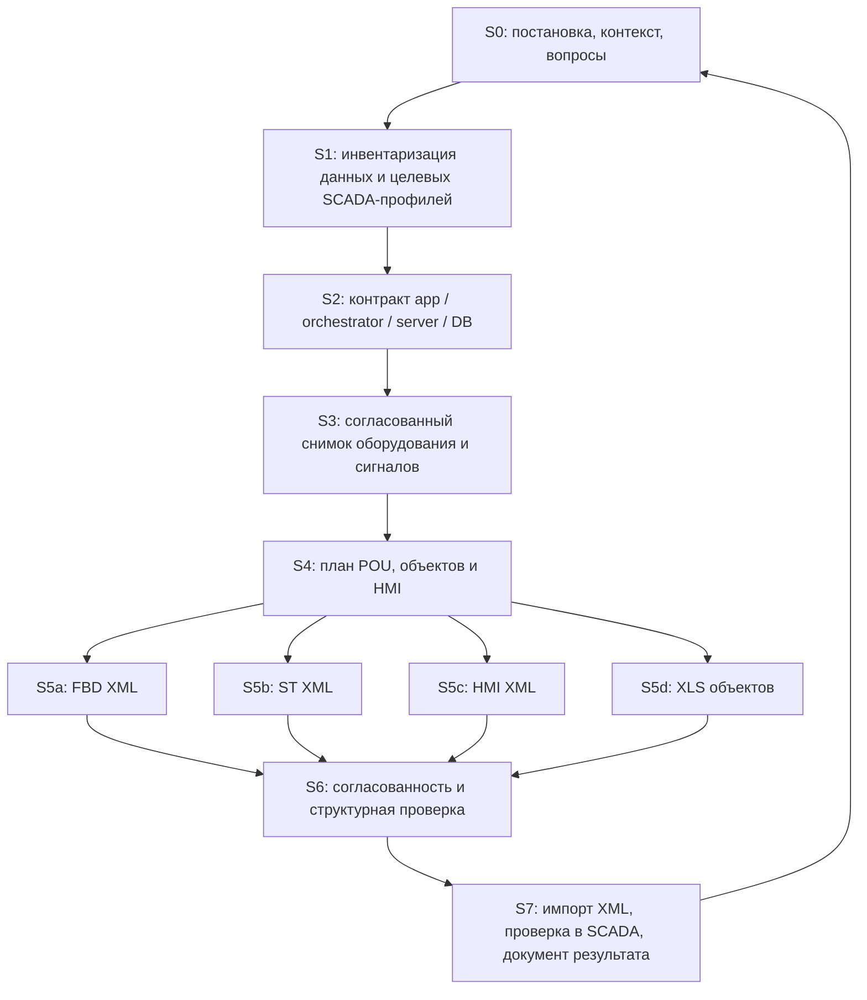

# 01. Формальная постановка задачи

Дата исходной постановки: 25.09.2026; роли проектов уточнены 28.09.2026 в [ADR-0009](decisions/ADR-0009-unified-spec-kit.md). Неизвестные параметры перечислены в [реестре вопросов](06-open-questions.md). Фактические возможности отделены от целевых.

## 1. Назначение

Система должна превращать согласованное описание оборудования, сигналов, технологических объектов, программной логики и операторских представлений в набор импортируемых артефактов SCADA. Основные результаты — FBD- и ST-POU и операторский интерфейс. Технологические объекты и резервы в XLS уже являются отдельным результатом текущего приложения и должны учитываться при согласовании общего состава проекта.

**Принятая схема получения данных:**

Стрелки между четырьмя компонентами заданы владельцем. Уточнение 29.09.2026: Host-client — поставляемый оркестратор приложений и данных; модули запрашивают данные через него и сами настраивают выходы. Host-server отвечает за авторизацию, хранение и маршрутизацию IO-листов всего проекта; IO-листы — только структурированные записи БД, модулям в первой версии доступно только получение. Host читает и записывает раздельные контексты приложений (Markdown/SDD) и рабочего проекта; вопросы/результаты формируют приложения, ИИ и пользователь. Машинные контракты и фактическая интеграция требуют собственной реализации и проверки, [ADR-0010](decisions/ADR-0010-host-context-and-plc-domains.md).

РСУ, ПАЗ и СОГО — строго непересекающиеся области, каждый ПЛК находится ровно в одной. Модель 715/850 независима от области; каждый экземпляр имеет собственные ST/FBD/HMI, [круги Эйлера](11-project-domains.md). Выбор первого проверяемого профиля не отменяет существования остальных элементов SCADA.

**Принятое ограничение R-016:** SCADA закрыта; взаимодействие с ней возможно только через экспорт/импорт XML-файлов ([ADR-0003](decisions/ADR-0003-scada-xml-boundary.md)). Прямые API/SDK и доступ к внутренней БД SCADA недоступны. PostgreSQL указанной цепочки не следует отождествлять с её внутренней БД. Исполнитель и способ доставки XML, полнота экспортов и возможная автоматизация файловых операций требуют сведений; универсальная обработка повторного экспорта сейчас не заявляется как реализованная.

## 2. Какую проблему решает проект

Одни и те же сигналы и модули используются в нескольких представлениях: физические каналы ST, вызовы объектов FBD, мнемосимволы HMI, технологические объекты и резервы XLS. Несогласованность состава, имён, версий шаблонов или идентификаторов приводит к пропускам, отсутствующим привязкам и ошибкам импорта.

Проект должен обеспечить объяснимое преобразование: для любого результата должно быть понятно, из каких данных и правил он получен, почему элемент создан или пропущен и что требуется для его корректного импорта. Изменение параметров должно быть отличимо от изменения уже сформированного артефакта.

## 3. Объект автоматизации и границы

| Область | Текущее положение | Целевое требование / вопрос |
|---|---|---|
| Данные оборудования и сигналов | XML-библиотеки, TXT AO, XLSX инвентаризации/назначений, ручные параметры | Получение согласованного контекста по цепочке; Q-DATA-001…006 |
| FBD | Только подключённая библиотека: шаблоны и модульная сборка DO из её блоков; прежние встроенные HTTP-профили отключены | Генерация требуемых составляющих SCADA; текущий контракт — пакет 003 |
| ST | Перекладки AO и назначений AI/DO/DI; DO/DI из исходного IO XLSX | Границы алгоритмов управления за пределами перекладок — Q-SCOPE-003 |
| HMI | Диагностические кадры AO/ПЛК | Полный состав операторского интерфейса — Q-SCOPE-004 |
| XLS | Технологические объекты модулей и резервы AI/AO, отдельная функция | Роль в целевой интеграции — Q-SCOPE-005 |
| Импорт/исполнение | Генератор выдаёт файлы; импорт выполняется вне него | Граница SCADA — только XML; исполнители и автоматизация файловых операций — Q-OPS-004 |
| Интеграция | Локальный HTTP UI и файловое состояние | Orchestrator, сервер, PostgreSQL ещё не подключены |
| Обратная связь | Сообщения/тесты генератора; внешний импорт не подтверждается приложением | Повторный XML-экспорт и протокол наблюдений инженера; состав доказательств — Q-APP-006/Q-ACC-002 |

Само наличие FBD/ST не означает реализацию технологических алгоритмов, противоаварийной защиты, промышленной эксплуатации или сертификации. Требуемые функции и порядок их проверки должны быть названы владельцем; не допускается достраивать их из назначения сигнала или суффикса тега.

## 4. Участники и ответственность

Роли ниже — **предлагаемая классификация**, конкретные исполнители неизвестны.

| Роль | Какие сведения предоставляет | За что нужна явная ответственность |
|---|---|---|
| Владелец проекта | Цели, приоритеты, допустимые результаты | Приёмка требований и изменения области проекта |
| Инженер АСУ/SCADA | Типы, шаблоны, адреса, команды, библиотеки, версия SCADA | Семантика генерации и проверка импорта |
| Инженер данных | Схема БД, происхождение и качество данных | Сопоставление полей и разрешение противоречий |
| Владелец orchestrator/сервера | Контракты, окружение, роли компонентов | Доставка задач, ошибки, версии и повторные запросы |
| Разработчик / программный агент | Реализация, проверки, документация | Выполнение принятых правил без догадок |
| Проверяющий | Контрольный проект, протокол испытаний | Разделение структурной проверки и подтверждения в SCADA |

Назначить конкретных ответственных требуется в Q-SCOPE-001 и Q-OPS-001. Программный агент не является источником недостающей предметной семантики.

## 5. Требования

| ID | Требование | Статус и основание | Как проверяется |
|---|---|---|---|
| R-001 | Генерировать FBD- и ST-POU и операторский интерфейс | ПРИНЯТО: задача владельца | Реестр поддержанных профилей + импортные сценарии |
| R-002 | Получать данные по цепочке app ↔ orchestrator ↔ server ↔ PostgreSQL | ПРИНЯТО; контракты НЕИЗВЕСТНЫ | Тест обмена согласованным снимком данных |
| R-003 | Основной ответ каждой задачи хранить в документации | ПРИНЯТО: задача владельца | Карточка задачи, обновлённые спецификации, ссылки |
| R-004 | Все найденные пробелы контекста записывать и требовать сведений для зависимой подзадачи | ПРИНЯТО | Вопрос с ID, причиной, ожидаемым ответом и статусом |
| R-005 | Давать графическое и подробное объяснение XML каждого поддержанного типа | ПРИНЯТО | Главы 04/05 и визуальный обзор |
| R-006 | Сохранять типы, теги и физические назначения согласно источнику/принятым правилам | РЕАЛИЗОВАНО по отдельным профилям; целевая общность требует Q-DATA | Контрольные входы, схема сопоставления, сравнение результата |
| R-007 | Пользователь задаёт количество модулей назначений; новые модули получают резервы по профилю | ПРИНЯТО ранее и РЕАЛИЗОВАНО | Пример AI_A1: 15 полных исходных модулей → 16 выбранных → 256 каналов |
| R-008 | Исторический AI FBD-профиль создавал отдельную POU на модуль | СОХРАНЕНО как правило эталона; встроенный HTTP-режим отключён | Новый библиотечный путь и его проверки — пакет 003 |
| R-009 | Исторический AI FBD связывался с тегами Excel; физические Xin/Xs оставались в ST | СОХРАНЕНО как семантика эталона; FBD теперь требует библиотеку | Привязки библиотеки и отдельные ST-присваивания |
| R-010 | DO ST назначений берёт значение из D32V._NN | ПРИНЯТО ранее и РЕАЛИЗОВАНО | Сравнение с образцом SOGO_DO |
| R-011 | XLS технологических объектов независим от генерации XML; один файл на ПЛК | ПРИНЯТО ранее и РЕАЛИЗОВАНО | Модули и резервы в одном XLS выбранного ПЛК |
| R-012 | Отдельные резервные технологические объекты — AI/AO; AN_v1 использует шаблон AN | ПРИНЯТО ранее и РЕАЛИЗОВАНО в XLS | Строки OBJTYPE/TEMPLATE и отсутствие отдельных DI/DO резервов |
| R-013 | Каждый артефакт связывается с источником, выбранным составом и версиями правил | ПРЕДЛОЖЕНИЕ для целевого решения | Манифест воспроизводимости; Q-DATA-003/Q-CTX-004 |
| R-014 | FBD/ST/HMI/XLS одного выпуска используют согласованный состав оборудования | ПРЕДЛОЖЕНИЕ; текущие режимы независимы | Сравнение состава по одному снимку; Q-GEN-001 |
| R-015 | Неполные данные не восполняются выдуманными адресами/правилами | ПРЕДЛОЖЕНИЕ общего контракта; частично реализовано валидаторами | Запрос недостающих полей и отказ зависимого преобразования |
| R-016 | Взаимодействовать с закрытой SCADA только через экспорт/импорт XML-файлов | ПРИНЯТО: уточнение владельца, ADR-0003 | На границе SCADA — только XML; способы доставки и доказательства импорта документированы отдельно |
| R-017 | Поддерживать ПЛК715 и850 с учётом состава целевой системы | ПРИНЯТО владельцем 28–29.09.2026: модель CPU независима от области РСУ/ПАЗ/СОГО; у каждого ПЛК собственные ST/FBD/HMI. Уточнение TASK-0006 об отсутствии AO относится к конкретной ПАЗ; DI FBD/ST и книга предоставлены, Main_module → C1, Redundant_module → C2, имена Tag No без LZS → LZSA | [Матрица профилей](08-controller-profiles.md), [ADR-0005](decisions/ADR-0005-paz850-no-ao.md), [ADR-0010](decisions/ADR-0010-host-context-and-plc-domains.md); текущие ограничения и история TASK-0005 сохраняются, импорт проверяется отдельно |
| R-018 | Добавить DO из исходного IO XLSX, сохранив DI и подготовленные AI/DO | ПРИНЯТО владельцем в TASK-0007: Tag No + `_DDVH`; четыре размещения с исходным Channel берутся из явных полей книги, Loop не задаёт имя | [ADR-0006](decisions/ADR-0006-raw-do-source-and-placements.md), выбор только DO/DI или совместно; отдельные XML по SCS, физические ID вводятся явно |
| R-019 | DO ST назначает все физические каналы 0…31 каждого модуля | ПРИНЯТО владельцем в TASK-0009: все 32 через D32V, независимо от пропусков Excel | [ADR-0007](decisions/ADR-0007-do-st-full-channels.md); без вымышленных тегов FBD, для обоих поддержанных CPU-профилей |
| R-020 | Отдельный DO FBD ПАЗ850: все источники через NOT, качество канала0 через QUAL_STAT к sts, экземпляры от имени ПЛК | ПРИНЯТО владельцем в TASK-0010 и нативным XML | [ADR-0008](decisions/ADR-0008-do-paz-native-fbd.md); старый software и DO ST сохраняются |

Численные характеристики качества, задержек и объёма данных не определены. Вопросы Q-OPS-002/Q-OPS-003 обязательны перед принятием решений о размещении и производительности.

## 6. Декомпозиция работ

| Подзадача | Вход | Результат в документации | Что требуется до реализации |
|---|---|---|---|
| S0 | Запрос человека | Карточка задачи, вопросы, критерии приёмки | Определённые границы задачи |
| S1 | Книги, экспорты, библиотеки, данные БД | Каталог сущностей/полей/версий и доказательств | Q-SCOPE, Q-DATA, Q-GEN |
| S2 | Схема цепочки владельца | Согласованный контракт обмена и ответственности | Q-INT, Q-DB, Q-OPS |
| S3 | Полученные строки + ручные дополнения | Снимок состава с происхождением каждого значения | Q-DATA-002…006, Q-GEN-001 |
| S4 | Снимок + профиль + ответы | План имён, POU, ID, резервов и кадров | Q-GEN, Q-XML, Q-HMI, Q-XLS |
| S5a/S5b | Утверждённый план | Правила XML + артефакты + сопоставление вход/выход | Глава 04, конкретная библиотека/CPU |
| S5c | План объектов и страниц | Карта HMI, переходы, привязки, события | Глава 05, Q-SCOPE-004 |
| S5d | Инвентарь и правила объектов | Состав XLS и его потребитель; путь в целевую систему требует уточнения | Глава 05, Q-XLS, Q-SCOPE-005 |
| S6 | Все выбранные артефакты | Протокол структурных и перекрёстных проверок | Q-ACC-002/003 |
| S7 | XML-артефакты + тестовый проект SCADA | Подтверждение/отклонение с воспроизводимым примером, повторным XML-экспортом и протоколом | Q-ACC-001…004, Q-OPS-004 |

## 7. Уровни готовности

1. **Контекст готов:** задача и входы определены, критичные для неё вопросы отвечены, источники доступны, нет неразрешённого противоречия в правилах.
2. **Реализация готова:** нужное поведение построено, связанные документы обновлены, предусмотренные проверки выполнены.
3. **Артефакт готов структурно:** XML/XLS прочитан обратно, ссылки и состав проверены, результат связан с конкретным входом.
4. **Совместимость подтверждена:** импорт выполнен в указанной версии SCADA с указанными зависимостями; результат записан в протоколе.
5. **Готовность к применению:** критерии эксплуатации и ответственные приняты отдельно; успешная генерация сама по себе этот статус не даёт.

## 8. Приоритет дальнейших уточнений

Первыми заполняются оставшиеся части: Q-SCOPE-001…005 (область результата), Q-INT-001/002 (контракты и размещение Host-client/Host-server; роли уже приняты), Q-DB-001/002 (схема и доступные сущности), Q-DATA-001/002 (источник истины и конфликты), Q-GEN-001/002 (единый состав и профили), Q-ACC-001 (целевая среда проверки). Остальные вопросы закрываются перед соответствующими подзадачами, а не догадками на этапе реализации.

Согласование этой постановки: **[ТРЕБУЕТСЯ: владелец, дата, изменения/подтверждение]**. Этот пункт не отменяет явно принятые требования R-001…R-012; он относится к полноте формальной спецификации и предложенным расширениям.
