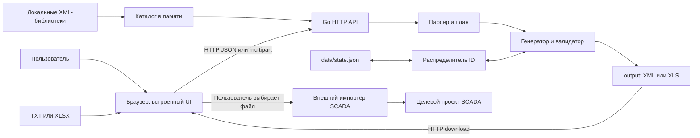
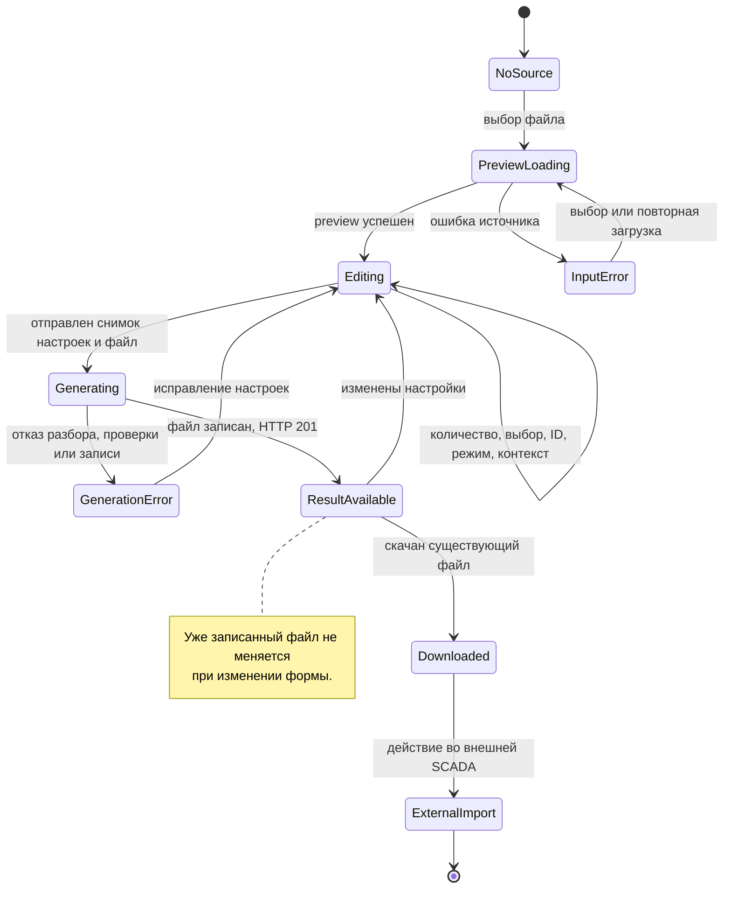

# 02. Текущая реализация приложения

Статус: описание существующего исходного кода на 25.09.2026.
Документ фиксирует фактические границы приложения; целевая интеграция описывается отдельно в [03-target-architecture.md](03-target-architecture.md).
Наличие проверки в коде не означает подтверждённый импорт в конкретную базу SCADA.

**Принятое внешнее ограничение:** SCADA закрыта и обменивается только XML-файлами ([ADR-0003](decisions/ADR-0003-scada-xml-boundary.md)). Описанные ниже HTTP API принадлежат самому приложению. Обработка успешного запроса генерации подтверждает создание файла, а не изменение проекта SCADA. Универсальный разбор повторного экспорта и учёт внешнего импорта требуют отдельной реализации и ответа Q-APP-006.
Точные структуры XML и правила привязок находятся в [04-xml-formats.md](04-xml-formats.md), интерфейс оператора и XLS — в [05-operator-interface-and-xls.md](05-operator-interface-and-xls.md).

## 1. Состав и граница процесса

Программа — автономный Go-процесс с HTTP API и встроенным веб-интерфейсом.
В Windows поставляется `XmlSchemeGenerator.exe`; браузер отображает HTML, CSS и JavaScript из EXE.
Go-модуль называется `scheme-xml-generator`, версия языка в [go.mod](../go.mod) — `1.24`.
Внешние Go-зависимости в модуле не объявлены.
JavaScript не требует npm для работы приложения.

| Компонент | Реальная ответственность | Исходный код |
|---|---|---|
| Точка входа | Корень данных, настройки, запуск HTTP, открытие браузера, завершение | [main.go](../cmd/schemegen/main.go) |
| Конфигурация | Значения HTTP, Common, страницы, начальные ID | [config.go](../internal/config/config.go) |
| HTTP-приложение | Проверка запросов, выбор генератора, выдача результатов | [appserver](../internal/appserver/server.go) |
| Каталог библиотек | Загрузка XML, совместимость шаблонов, снимок каталога | [repository.go](../internal/library/repository.go) |
| Парсер AO | TXT-карта AO, физические позиции, дубли, шкалы | [aomap/parser.go](../internal/aomap/parser.go) |
| Парсер IO | XLSX-инвентаризация ПЛК, крейтов, модулей и каналов | [iomap/parser.go](../internal/iomap/parser.go) |
| Парсер СКЗ | XLSX-перекладки AI/DO для CPU850 | [skzmap/parser.go](../internal/skzmap/parser.go) |
| Генераторы | План, модель документа, привязки, проверка, сериализация | [generator](../internal/generator/generator.go) |
| Распределитель ID | Локальные курсоры T11, карточек, POU, страниц | [allocator.go](../internal/generator/allocator.go) |
| Технологические объекты | Самостоятельная генерация XLS без XML ID | [techobjects.go](../internal/techobjects/techobjects.go) |
| XLS-запись | BIFF8 и контейнер OLE средствами Go | [xls.go](../internal/xls/xls.go), [compound.go](../internal/xls/compound.go) |
| Веб-интерфейс | Формы, предварительный просмотр, проверка ввода, скачивание | [embed.go](../web/embed.go), [index.html](../web/index.html) |



В этой цепочке отсутствуют отдельный оркестратор, удалённый сервер приложения и PostgreSQL.
Локальный HTTP-сервер внутри EXE нельзя автоматически считать целевым интеграционным сервером.
В рабочем коде нет клиента PostgreSQL, SQL-миграций, удалённой очереди задач или сетевого импорта в SCADA.
Поле `Project`, включая значение с `otpscadafb3:` и `SCADABD.GDB`, переносится в экспорт как контекст.
Оно не открывается как база данных и не служит действующим подключением.
Открытие браузера через системную команду также не является связью с оркестратором.

## 2. Реализованные режимы

| Режим | Источник | Настройки пользователя | Выход и разделение |
|---|---|---|---|
| Библиотечный FBD | XML в `libraries/` | POU, шаблоны, сигналы, физические модули, ID, размещение | Один XML с одной или несколькими POU |
| AO FBD | TXT-перекладка | Имя результата, контекст | XML на FCS; POU по группам AO |
| AO ST | Та же TXT-карта | Выбор групп, количество модулей, физические ID | ST внутри XML на FCS |
| Диагностика AO | TXT-карта | Выбор FCS, контекст диагностики | XML кадров панели на ПЛК |
| Диагностика ПЛК | XLSX IO | Выбор и имена ПЛК, контекст | XML кадров панели на ПЛК |
| Технологические объекты | XLSX IO | Выбор и имена ПЛК, номер ресурса | Один XLS на ПЛК: модули и резервы вместе |
| СКЗ ST/FBD | XLSX AI/DO | Выбор групп, количество модулей, режим, контекст; физические ID для ST | XML на SCS/ПЛК |

Библиотечный режим определяет поддержку AI/AO/DI/DO по структуре выбранного шаблона.
Он не считает любой файл библиотеки совместимым автоматически.
Привязки физического ввода/вывода в этом режиме формируются через подтверждённый профиль шаблона.
Вместимость профилей: AI — 16, AO — 4, DI/DO — 32 канала.
При отсутствии физического ID библиотечный режим назначает минимальный свободный неотрицательный ID в документе.

Специализированные AO и СКЗ используют собственные профили и не требуют загрузки библиотеки пользователем.
В СКЗ числовой физический ID для ST обязателен для каждого выбранного модуля; ноль допустим.
Обозначение `A1-02` не определяет физический ID: в предоставленном примере ему соответствует ID 24.
Число модулей СКЗ общее для ST и FBD; значение по умолчанию равно числу модулей книги.
Уменьшение ниже числа исходных модулей отклоняется.
Дополнительные модули следуют после максимального исходного номера; пропуски исходной нумерации не заполняются.
AI FBD создаёт отдельную POU на каждый модуль, например `AI_A1_00` и `AI_A1_01`.
ST и DO FBD сохраняют группировку модулей по исходной группе.
Новые AI-модули получают 16 резервных AD3_v2; новые DO-модули — D32V с 32 позициями ST.
Отдельные резервные BOOL-объекты для новых DO-модулей не создаются.
Исходные неполные модули СКЗ сохраняют только каналы из книги.
Суффикс `_reserve` рабочего резервированного сигнала не равен свободному каналу.

Технологические объекты генерируются через `iomap.ParseInventory`, без разрешения диагностических привязок.
Диагностика ПЛК использует `iomap.Parse`, которому нужны правила привязки сигналов.
Поэтому успешный XLS технологических объектов сам по себе не доказывает полноту диагностического XML.
В XLS отдельные резервы создаются только для AI/AO; у AO тип `AN_v1`, шаблон `AN`.

## 3. Фазы обработки и необходимый контекст

| Фаза | Входной контекст | Результат | Что сохраняется |
|---|---|---|---|
| Загрузка каталога | Каталог `libraries/`, XML-файлы | Поддержанные шаблоны, ключи, ошибки | Снимок в памяти процесса |
| Preview карты | Байты одного TXT/XLSX | Исходные группы, модули, каналы, предупреждения | Ответ HTTP и состояние открытой страницы |
| Настройка | Preview, выбор пользователя, число модулей, ID, контекст | Тело запроса генерации | В памяти браузера |
| Повторный разбор | Файл из запроса генерации | Проверенный исходный план | В памяти запроса |
| Подготовка | План и выбранная конфигурация | Независимый план для каждого ПЛК | В памяти запроса |
| Расчёт объёма | Итоговые POU, каналы, карточки, графика | Требуемые диапазоны и проверка лимитов | В памяти запроса |
| Формирование | План, контекст импорта, зарезервированные диапазоны | Документ и XML-байты | До успеха — в памяти |
| Проверка | Модель, ссылки, счётчики, сериализованный XML | Успех либо ошибка | Ошибка не расходует диапазоны |
| Фиксация ID | Успешная генерация всей партии | Новые курсоры | `data/state.json` |
| Запись | Готовые XML/XLS и безопасные имена | Файлы результата | `output/` |
| Получение | Имя существующего файла | Байты скачивания | Запись в целевом проекте не выполняется |
| Импорт | Файл и состояние внешнего проекта | Объекты в SCADA | За пределами текущего приложения |

Формирование и проверка в отдельных генераторах имеют несколько внутренних проходов.
Общий инвариант: XML не передаётся на запись результата до успешного завершения генератора.
Для XML-партии сначала формируются все документы ПЛК, затем фиксируются ID, затем записываются файлы.
XLS-партия также полностью подготавливается до записи, но распределитель XML ID в ней не участвует.

Генерация карты повторно получает файл целиком; сервер не хранит токен preview или ранее загруженную книгу.
Preview и generate поэтому являются разными HTTP-операциями с отдельным разбором.
API не связывает их хешем исходника или номером ревизии.
Библиотечная генерация закрепляет ссылки на один снимок каталога через `ResolveMany`.
Обновление каталога другим запросом не подменяет уже разрешённые шаблоны текущей генерации.



Диаграмма описывает пользовательский цикл, а не серверную таблицу состояний задач.
В СКЗ UI использует `revision`, номер preview и `AbortController`, чтобы не показывать ответ для устаревшей формы.
Изменение настроек скрывает предыдущую карточку результата; старый файл остаётся в `output/`.
Смена режима сохраняет количество модулей и введённые физические ID в текущей загруженной книге.
Перезагрузка страницы не восстанавливает полноценный проект: постоянного хранилища форм нет.
Отмена ожидания в браузере не реализована как транзакционная отмена серверной генерации.

## 4. HTTP API: действующие маршруты

Контракт определяется обработчиками [server.go](../internal/appserver/server.go), а не отдельной OpenAPI-схемой.
JSON-поля ниже приведены в реальном регистре; `fcs` используется в пакетных ответах также для SCS СКЗ.
Сервер не требует пользовательской сессии или токена API.

| Метод и маршрут | Тело / назначение | Успешный ответ |
|---|---|---|
| `GET /api/health` | Проверка процесса | `200 {"ok":true}` |
| `GET /api/templates` | Каталог библиотек | `200 {libraries,templates,errors}` |
| `POST /api/refresh` | Повторно прочитать `libraries/` | `200` каталог |
| `POST /api/preview-name` | JSON: `templateKey,objectName,nameMode` | `200 {baseName,matchedPrefix,objectNames}` |
| `POST /api/generate` | JSON `generator.Request` | `201 {fileName,url,baseName,summary,warnings}` |
| `GET /api/temporary/ao/profile` | Профиль AO | `200 {context,description}` |
| `POST /api/temporary/ao/preview` | Multipart TXT | `200` план AO |
| `POST /api/temporary/ao/generate` | Multipart TXT, `context,fileName` | `201` пакет XML FBD |
| `POST /api/temporary/ao/generate-st` | Multipart TXT и JSON-поле `st` | `201` пакет XML ST |
| `POST /api/temporary/ao/generate-diagnostic` | Multipart TXT и `diagnostic` | `201` пакет кадров диагностики |
| `POST /api/temporary/diagnostic/preview` | Multipart XLSX IO | `200` план IO |
| `POST /api/temporary/diagnostic/generate` | Multipart XLSX IO и `diagnostic` | `201` пакет кадров диагностики |
| `POST /api/techobjects/preview` | Multipart XLSX IO | `200 {controllers,warnings}` |
| `POST /api/techobjects/generate` | Multipart XLSX IO и `objects` | `201 {files,summary,warnings}` |
| `GET /api/skz/profile` | Профили CPU850 | `200 {context,contexts,fbdContexts,description}` |
| `POST /api/skz/preview` | Multipart XLSX СКЗ | `200 {groups,warnings}` |
| `POST /api/skz/generate` | Multipart XLSX СКЗ и `config` | `201` пакет XML ST/FBD |
| `GET /api/outputs` | Список XML/XLS в `output/` | `200 {files:[{name,size,createdAt,url}]}` |
| `GET /api/output/{name}` | Скачать существующий XML/XLS | `200` файл вложением |
| `GET /` | Встроенные веб-ресурсы | HTML/CSS/JS |

`POST /api/generate` поддерживает старый одиночный запрос и новый `pous`.
В новом формате глобальны `fileName,t11Start,cardStart`; параметры POU и сигналов находятся внутри `pous`.
POU содержит `name,pouId,groupId,pouNumber,page,defaultTemplateKey` и либо `signals`, либо `io.modules`.
Модуль содержит `id,bindingPrefix,instanceName,signals`; канал определяется позицией сигнала с нуля.
Смешивание форматов или плоских `signals` с `io.modules` отклоняется.
Полные типы запроса и ответа: [types.go](../internal/generator/types.go).

Multipart-запросы содержат ровно один файл в поле `file`.
Общие необязательные текстовые поля — `fileName` и `context`; специализированные обработчики уточняют допустимые поля.
Текст JSON передаётся значением поля multipart, а не отдельным JSON-телом HTTP.

```json
{
  "kind": "fbd",
  "pous": [
    {
      "groupKey": "3000_G_SC_B01:AI:A1",
      "moduleCount": 16,
      "moduleIds": []
    }
  ]
}
```

Это пример содержимого `config` СКЗ; рабочий `groupKey` берётся из preview конкретной книги.
Для `kind:"st"` `moduleIds` содержит по одному числу на каждый итоговый модуль.
Порядок: исходные модули preview, затем добавленные модули по возрастанию номера.
Отсутствующий `moduleCount` сохраняет исходное число модулей для совместимости старых клиентов.
Физические ID в режиме FBD не определяют привязку карточек и не используются генератором.

Другие поля выбора имеют следующие реальные формы:

| Поле | Содержимое |
|---|---|
| AO ST `st` | `{"pous":[{"groupKey":"...","moduleCount":3,"moduleIds":[0,1,24]}]}` |
| AO `diagnostic` | `{"fcs":["имя FCS"]}` |
| IO `diagnostic` | `{"controllers":[{"key":"ключ preview","name":"имя ПЛК"}]}` |
| XLS `objects` | `{"controllers":[{"key":"ключ preview","name":"имя ПЛК"}],"resourceNumber":1}` |
| Контекст AO/СКЗ | Строки `version,project,controllerTypeName,controllerId,resourceId,groupId,pouNumber` |
| Контекст диагностики | Строки `version,project,resourceNumber` |

XLS не принимает контекст XML; `resourceNumber` в `objects` является числом.
В контексте диагностики номер ресурса обозначает часть пути карточки, а не `ResourceID` проекта.
Профиль СКЗ: CPU850; AI GroupID 19912, начальный POUNum ST 4 / FBD 8; DO GroupID 19913, POUNum 47.
Значения взяты из примеров и редактируются перед генерацией; проверка свободных POUNum в целевой базе не выполняется.

Пакетный XML-ответ имеет `kind,files,summary,warnings`.
Элемент `files` содержит `fcs,fileName,url,baseName,summary,warnings`.
Сводка содержит фактические счётчики; набор включает POU, сигналы, модули, блоки, карточки, а для ST — присваивания.
Список `outputs` восстанавливается чтением каталога, а `createdAt` фактически берётся из времени модификации файла.
Это не журнал генераций с сохранённой конфигурацией.

## 5. Ограничения и ошибки

| Ограничение | Действующее значение / область |
|---|---|
| JSON-тело общего API | 8 МиБ |
| TXT AO | 2 МиБ; не более 50 000 строк |
| XLSX | 16 МиБ; распакованные части до 128 МиБ |
| XLSX структура | До 10 000 частей, 1024 листов, 100 000 строк, 512 столбцов, 1 000 000 ячеек |
| Multipart целиком | Лимит файла плюс 128 КиБ |
| Поле multipart | До 64 КиБ; `fileName` до 512 байт, `context` до 8 КиБ |
| Общий XML-документ | До 128 POU, 4096 модулей, 4096 сигналов |
| Графика XML | До 200 000 объектов и 100 000 карточек в проверяемом запросе |
| СКЗ | До 50 000 строк назначений; итоговые 4096 каналов и 128 POU включают добавленные модули |
| IO-инвентаризация | До 128 ПЛК и 4096 модулей; отдельный лимит 4096 сигналов общего FBD сюда не переносится |
| Технологические объекты | До 128 выбранных ПЛК, 4096 модулей суммарно, 65 532 объектов на лист после четырёх строк шапки |
| Транспортные ID | Положительные signed 32-bit; курсор допускает значение после последнего ID |
| Физические ID ST СКЗ | Неотрицательные signed 32-bit, уникальные в пределах одного ПЛК |

XLSX-чтение использует сохранённые значения формул, не вычисляет формулы и не запускает макросы.
Формула без сохранённого результата и ячейка с ошибкой Excel отклоняются.
Внешние связи книги не загружаются; проверяются пути частей и объём распаковки.
Семантические ошибки парсеров обычно содержат строку, модуль или поле, в котором обнаружено противоречие.

Ошибки обработчиков возвращаются как `{"error":"текст"}` без стабильного машинного кода.
`400` используется для неверного тела, формата, конфигурации, превышения лимитов и ошибок генерации.
`403` означает отказ проверки Origin; `404` — отсутствующий шаблон или файл.
`500` используется для ошибок инфраструктуры, включая сохранение ID или результата.
Неизвестные JSON-поля и данные после основного JSON-объекта отклоняются в API-декодерах.
Проверка `null` неодинакова: контексты и XLS имеют явные дополнительные проверки, указательные поля других запросов сохраняют семантику Go JSON.
Стандартные ответы маршрутизатора и статики не обязаны иметь JSON-обёртку прикладной ошибки.

## 6. Состояние, запись и восстановление

Корень данных выбирается в порядке: `-root`, переменная `SCHEME_XML_GENERATOR_HOME`, текущий каталог с `libraries`, каталог EXE.
Программа создаёт `libraries/`, `output/`, `data/`, `logs/`, если они отсутствуют.
`config.json` необязателен; значения накладываются на `config.Default()`.
`data/state.json` хранит только `nextT11,nextCard,nextPou,nextPage`.
При чтении старого состояния без `nextPage` добавляется начальное значение страниц без сброса остальных курсоров.
Лог `logs/application.log` дописывается; время сообщений процесса записывается в UTC.

`Allocator.WithReservation` удерживает mutex на расчёт диапазонов, генерацию и фиксацию состояния.
Если проверка или сериализация завершилась ошибкой, курсоры не изменяются.
Состояние записывается через `state.json.tmp` и переименование; после успеха обновляется память процесса.
Для диагностики расходуются T11, карточки и страницы; курсор POU не меняется.
Для ST расходуются POU, без графических T11 и карточек.
XLS технологических объектов не расходует ни один из этих курсоров.

Файл результата записывается через временный файл `.generating-*.tmp`, `Sync`, закрытие и переименование.
Имена очищаются от путей и недопустимых символов; при совпадении выбирается суффикс `-2`, `-3` и далее.
Уже существующие файлы обычной генерацией не перезаписываются.
Для пакетного вывода при поздней ошибке записи удаляются только файлы, созданные текущей партией.
Ошибка удаления при откате фиксируется в логе и добавляется к ошибке ответа.

Критическая граница: фиксация ID и запись результата не образуют одну транзакцию.
Если `state.json` сохранён, а запись `output/` не удалась, диапазоны остаются израсходованными.
При повторе после такого отказа используются следующие ID.
Падение процесса в середине записи партии может оставить часть файлов: автоматического журнала восстановления партии нет.
Потеря HTTP-ответа после успешной записи также может привести к повторной генерации с новым именем и ID.
Идемпотентный ключ запроса и API проверки статуса задания не реализованы.

Оба mutex действуют только внутри одного процесса.
Два EXE с общим корнем не синхронизируют курсоры и выбор имён через межпроцессную блокировку.
Локальный распределитель не знает занятые ID целевого проекта SCADA.
Файлы результата не сопровождаются manifest с хешем исходника, настройками, версией EXE и статусом импорта.
Сформированный файл является снимком только в смысле отсутствия автоматического изменения приложением.
Ручная замена или удаление файла средствами ОС не обнаруживается как нарушение истории проекта.

## 7. Запуск, сборка и проверка

По умолчанию сервер слушает `127.0.0.1:3210` и открывает браузер.
Ключи EXE: `-root`, `-port`, `-no-browser`; `-port` допускает 1–65535.
`config.listenAddress` технически позволяет изменить адрес прослушивания: код не ограничивает его loopback.
POST проверяет только hostname заголовка Origin: допускаются `127.0.0.1` и `localhost`; отсутствующий Origin разрешён.
TLS, аутентификация, роли и пользовательские сессии не реализованы.
Добавлены заголовки `nosniff`, запрет iframe, отсутствие Referer и Content-Security-Policy для собственных ресурсов; они не заменяют удалённую авторизацию.
HTTP-таймауты: заголовки 5 секунд, чтение 15 секунд, запись 2 минуты, idle 60 секунд.

```powershell
go test ./...
go vet ./...
node --test web/temporary_test.cjs web/techobjects_test.cjs web/skz_test.cjs
./build.ps1
```

[build.ps1](../build.ps1) устанавливает `CGO_ENABLED=0`, запускает Go-тесты и прекращает сборку при их отказе.
EXE собирается командой `go build -trimpath -ldflags='-s -w' -o 'XmlSchemeGenerator.exe' ./cmd/schemegen`.
Node-тесты и `go vet` не входят в build.ps1; приведённые команды запускают их отдельно.
[start.ps1](../start.ps1) собирает EXE, только если его ещё нет, затем запускает существующий файл.
Изменение исходников при наличии EXE само по себе не обновляет исполняемый файл.
Встроенные веб-ресурсы также обновляются только после пересборки EXE.
[Start-XmlSchemeGenerator.cmd](../Start-XmlSchemeGenerator.cmd) является Windows-обёрткой запуска.
Для отдельной проверки API применяется уникальный `-root`, чтобы не расходовать рабочие ID и не смешивать результаты.

Тесты покрывают парсеры, привязки, геометрию, формат XML/XLS, пределы ID, API, ошибки записи и изоляцию ПЛК.
Пример регрессии СКЗ: `TestSKZAPINativeAIFBDSeparatesModulesAndAddedReserve` проверяет отдельные POU и добавленный резервный модуль.
Тесты каталога полного проекта могут зависеть от наличия локальных библиотек и пропускаться при их отсутствии.
JavaScript-тесты проверяют формы, переключение режимов, запросы и устаревшие ответы через тестовую среду DOM.
Они не запускают редактор SCADA и не подтверждают импорт или выполнение логики на PLC.
Для проверки фактической интеграции нужны экспорт после импорта, версия импортёра и сравнение ожидаемых объектов с результатом.

## 8. Неопределённости для следующего этапа

Вопросы фиксируются в документации до реализации зависимой интеграции; ответы здесь не предполагаются.
Общий реестр ведётся в [06-open-questions.md](06-open-questions.md).

| ID | Чего не хватает и что блокируется | Основание | Ответ |
|---|---|---|---|
| Q-APP-001 | Нужна ли воспроизводимая история исходника, настроек, версии генератора и хеша результата? Блокирует контракт артефакта и модель хранения сервера. | `outputs` содержит только метаданные файлов; manifest отсутствует. | [ТРЕБУЕТСЯОТВЕТ] |
| Q-APP-002 | Как связывать выделение ID и публикацию файла при сбое: допустимы пропуски, нужен журнал или серверная транзакция? Блокирует проектирование восстановления. | allocator фиксируется до `writeAtomic`; поздний отказ не возвращает ID. | [ТРЕБУЕТСЯОТВЕТ] |
| Q-APP-003 | Допускаются ли несколько процессов/рабочих мест для одного проекта и кто владеет пространством ID? Блокирует совместную работу и серверный allocator. | Только mutex процесса; неизвестны занятые ID SCADA. | [ТРЕБУЕТСЯОТВЕТ] |
| Q-APP-004 | Требуются ли сохранение черновиков, повторное открытие проекта и общая конфигурация ST/FBD между запусками? Блокирует постоянную модель проекта. | Формы и выбранная книга находятся в памяти браузера. | [ТРЕБУЕТСЯОТВЕТ] |
| Q-APP-005 | Как клиент однозначно узнаёт успех после потери ответа, повторяет или отменяет генерацию? Блокирует контракт задания оркестратора. | Синхронный POST; нет idempotency key, job ID или status API. | [ТРЕБУЕТСЯОТВЕТ] |
| Q-APP-006 | Какой повторный XML-экспорт и протокол наблюдений достаточны для подтверждения внешнего импорта, кто их предоставляет и фиксирует? Блокирует переход от «файл создан» к «проект обновлён». | Программа пишет и отдаёт файл; автоматического учёта внешнего импорта нет. Единственная доступная граница SCADA — XML-файлы. | **ЧАСТИЧНО ОТВЕЧЕН:** владелец, 25.09.2026, [ADR-0003](decisions/ADR-0003-scada-xml-boundary.md): прямого программного ответа SCADA нет. Состав доказательств, доступные поля экспорта и порядок фиксации требуют ответа. |
| Q-APP-007 | Какие субъекты и процессы получат сетевой доступ к целевому серверу? Блокирует авторизацию и сетевой контракт новой архитектуры. | Текущий API не имеет идентификации пользователя и допускает конфигурируемый listenAddress. | [ТРЕБУЕТСЯОТВЕТ] |

Эти вопросы не мешают описывать текущие форматы и проверять автономную генерацию.
Они ограничивают только решения, которые требуют нового постоянного состояния, удалённого исполнения или записи в целевую систему.
