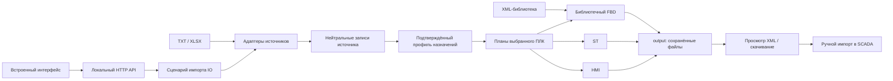

# 02. Текущая реализация приложения

Редакция: 30.09.2026, сверена с текущими исходниками. Документ описывает контракты кода, а не автоматически подтверждённую поставку. Исправление чтения реального SCS IO находится в [пакете008](../specs/008-real-io-workbook/spec.md); его приёмка установленного модуля пока [NOT-RUN](../specs/008-real-io-workbook/verification.md). Предыдущие результаты и ограничения сохранены в [пакете003](../specs/003-unified-workspace/verification.md) и [пакете004](../specs/004-semantic-layout/verification.md). Целевая интеграция описана отдельно в [главе03](03-target-architecture.md).

**FBD создаётся только из подключённой библиотеки.** Прежние HTTP-сценарии встроенных AO/AI/DI/DO-графов отключены. Описание их XML и сохранённые регрессии формата не означают доступный режим приложения. Структурная проверка, просмотр и успешное создание файла не подтверждают импорт, компиляцию или исполнение в закрытой SCADA; её внешняя граница — XML ([ADR-0003](decisions/ADR-0003-scada-xml-boundary.md)).

## 1. Состав и граница процесса

Программа — независимый Go-процесс с локальным HTTP API и встроенным веб-интерфейсом. В Windows поставляется `XmlSchemeGenerator.exe`; браузер получает HTML/CSS/JavaScript из EXE. В [go.mod](../go.mod) задан Go 1.24 без внешних Go-зависимостей. Для работы интерфейса npm не требуется.

| Компонент | Ответственность | Точка входа в исходники |
|---|---|---|
| Запуск | Корень данных, конфигурация, HTTP, браузер, завершение | [cmd/schemegen](../cmd/schemegen/main.go) |
| Конфигурация | Контракты Common/Page/ID, начальные значения и чтение | [contracts.go](../internal/config/contracts.go), [defaults.go](../internal/config/defaults.go), [load.go](../internal/config/load.go) |
| HTTP | Тонкая сборка предметных сервисов и маршрутов | [server.go](../internal/appserver/server.go), [карта пакетов](SOURCE_LAYOUT.md) |
| Предметные данные | Нейтральные исходные сигналы и размещения, ПЛК, назначения, AO и инвентаризация без зависимости от Excel или HTTP | [io](../internal/domain/io/records.go), [assignments](../internal/domain/assignments/model.go), [analogoutput](../internal/domain/analogoutput/model.go), [inventory](../internal/domain/inventory/model.go) |
| Входные адаптеры | TXT AO, XLSX IO и подготовленные/исходные карты назначений | [aomap](../internal/aomap/parser.go), [iomap](../internal/iomap/parser.go), [assignments](../internal/inputs/assignments/assignments.go), [XLSX](../internal/inputs/xlsx/workbook.go) |
| Сценарий импорта IO | Связывает разбор формата и применение предметного профиля для preview и ST | [ioimport/read.go](../internal/application/ioimport/read.go) |
| Профиль исходного IO | Создаёт подтверждённые назначения DI/DO/AI из нейтральных записей; не разбирает Excel и не выбирает FBD-шаблон | [source_assignments.go](../internal/generator/moduleprofile/source_assignments.go) |
| Библиотека | Импорт XML, типы, шаблоны и согласованный снимок каталога | [repository.go](../internal/library/repository.go), [import.go](../internal/library/import.go), [catalog_snapshot.go](../internal/library/catalog_snapshot.go) |
| Генерация | Самостоятельные FBD/ST/HMI и их запросы/результаты, адресация, XML и ID | [FBD](../internal/generator/fbd/service.go), [ST](../internal/generator/st/service.go), [HMI](../internal/generator/hmi/service.go), [allocator.go](../internal/generator/allocation/allocator.go) |
| Дополнительный XLS | Технологические объекты и запись BIFF8/OLE без XML ID | [table.go](../internal/techobjects/table.go), [workbook.go](../internal/xls/workbook.go) |
| Интерфейс | Две страницы, источники, библиотека, выпуск и просмотр файлов | [index.html](../web/index.html), [bootstrap.js](../web/shell/bootstrap.js), [embed.go](../web/embed.go) |

Подробные зависимости и обязательный review CODE-003 находятся в [SOURCE_LAYOUT.md](SOURCE_LAYOUT.md). SKZ/СКЗ — историческое название конкретного источника; общий предметный уровень — ПЛК, модули, каналы и назначения. Заголовки `SCS/FCS` принадлежат адаптерам форматов; модель назначений использует `ControllerName`.



Клиент PostgreSQL и обмен инженерными IO-данными пока не реализованы. При запуске из Host генератор читает `HOST_CLIENT_API_URL` и обновляет реальное состояние серверного соединения через `/api/device` оркестратора. `/api/host/session` и совместимое поле `host` в `/api/workspace` возвращают текущий снимок вместо постоянного `contract-pending`; [контракт соединения](integration/host-session.md). Соединение не означает готовность IO-данных для генерации. Целевая цепочка данных: XML Generator → Host-client → Host-server → PostgreSQL. Локальный HTTP-сервер EXE не является Host-server. Поле XML `Project`, даже с путём к базе SCADA, — контекст экспорта, а не открытое соединение.

## 2. Страницы и доступные результаты

Интерфейс содержит ровно две страницы: основную для будущего получения данных через Host и временную для локальных источников. Основная показывает фактическое состояние подключения и отдельный компактный диалог библиотеки. Пока IO-контракт Host не подключён, получение IO и выпуск по серверным данным недоступны. На локальной странице пользователь выбирает источники, конкретный ПЛК и FBD/ST/HMI, затем настраивает только выбранные виды результата. Область РСУ/ПАЗ/СОГО не выбирает алгоритм генерации.

Для SCS-источника интерфейс показывает счётчики DI/DO/AI/AO и раскрываемый просмотр прочитанных строк: до25 на страницу, поиск, фильтр направления, исходный лист/строка, теги/Loop, все размещения и обе шкалы AI. Исключённые строки учитываются отдельно с причиной. Для пользовательской книги ожидаются619 DI,487 DO,270 AI,0 AO и401 строка без физического IO; это свойства книги, не универсальные пределы. [Подробный контракт источника](12-scs-io-source.md). Проверка этого поведения установленной поставки относится к008.

| Результат | Данные и настройки | Реализованный путь |
|---|---|---|
| FBD AI/AO/DI | Назначения выбранного ПЛК, совместимый библиотечный шаблон, имя и параметры POU | `/api/generate`, один или несколько библиотечных POU |
| FBD DO | Библиотечные блоки и каналы выбранных модулей, числовой ModuleID, подтверждённый CPU850/`measurement-quality` | `/api/generate/library-do`, один экземпляр D32 на модуль с диагностикой |
| Инверсная логика | Независимый флаг `invert` выбранного DO-сигнала/канала | NOT добавляется в поддержанную библиотечную цепь; это не переключатель шаблона и не отдельная область «ПАЗ» |
| ST AO | TXT AO, выбор групп/модулей и физических ID | `/api/temporary/ao/generate-st` |
| ST назначений AI/DI/DO | Подготовленная карта либо исходный IO XLSX, группы/число модулей, ModuleID, CPU и адресация | `/api/mappings/generate`, `kind:"st"` |
| HMI | TXT AO или XLSX-инвентаризация, выбранный ПЛК, диагностический контекст | Специализированные маршруты диагностики по подтверждённому HMI-профилю |
| Технологические объекты XLS | Инвентаризация, выбор ПЛК и номер ресурса | Отдельный API `/api/techobjects/*`; не дополнительная страница интерфейса |

Каталог содержит не только шаблоны, но и типы владельцев из библиотеки, включая типы без шаблонов. Наличие типа в каталоге не означает наличие пригодного FBD-шаблона. Несовместимость или отсутствие необходимых библиотечных блоков приводит к отказу; скрытого перехода на встроенный FBD нет.

Поддержка конкретных CPU и физических профилей различается по генератору. Например, имеющийся специализированный AO ST отклоняет CPU850, а DI ST требует подтверждённого профиля850 `measurement-quality`. Это ограничения текущих профилей, а не запрет AO или DI в общей модели оборудования. Образец HMI850 `850_DIAG.xml` получен; его самостоятельный профиль и связь SCS-источника с диагностическими кадрами ещё не реализованы. Повторно требовать этот образец как отсутствующий нельзя. Различия с715 и пробелы инвентаря описаны в [главе12](12-scs-io-source.md); прежняя матрица [главы08](08-controller-profiles.md) сохраняет историческую границу. Каждый ПЛК715/850 имеет собственные ST/FBD/HMI независимо от области ([модель проекта](11-project-domains.md)).

Числовой физический ModuleID сверяется с целевым проектом, а не выводится из названия `A1-02`. Для ST ID неотрицателен и уникален внутри ПЛК. DO ST назначает все 32 выхода модуля; DI850 — все 32 входа и статус. Подробности исходных форматов и профилей сохраняются в [главе 04](04-xml-formats.md), [DI850](09-di850-native-semantics.md) и [DO850](10-do-paz-native-semantics.md).

## 3. Фазы обработки и необходимый контекст

1. Адаптер разбирает локальный источник. Для SCS он возвращает нейтральные `source.records/source.excluded`: исходные имена, размещения и шкалы; собственного назначения SCADA-типов/имён в адаптере нет.
2. Сценарий `application/ioimport` применяет профиль `moduleprofile/source_assignments` и возвращает preview с исходными записями, группами, модулями, каналами и предупреждениями. DI использует C1/C2, DO — исходный Tag No с DDVH, AI — подтверждённые владельцем Loop + main/reserve и самостоятельные Xin/Xs каждого физического канала.
3. Интерфейс готовит запрос только выбранного ПЛК. Контекст Common/Page берётся из фактических настроек `/api/workspace` и видимых значений формы.
4. Для ST/HMI multipart-запрос повторно передаёт источник. ST использует тот же сценарий ioimport; HMI сохраняет отдельный контракт инвентаризации. Для библиотечного FBD интерфейс передаёт явный JSON-план и ключи шаблонов; сервер разрешает их из каталога.
5. Генератор проверяет окончательный план и рассчитывает ID до записи результата. Библиотечная партия использует согласованный снимок шаблонов.
6. После успешной генерации и структурной проверки фиксируются курсоры ID и сохраняются файлы. Ответ содержит реальные имена и URL результата.
7. Просмотр загружает сохранённый XML из `/api/output/`, а не реконструирует результат из текущей формы. Скачивание и последующий импорт в SCADA — отдельные действия.

Preview источника не является постоянным проектом или серверным заданием. Multipart preview/generate не связаны токеном ревизии исходника; браузер хранит текущие файлы в памяти. Уже записанный XML не изменяется при редактировании настроек. Отмена ожидания в браузере не является транзакционной отменой серверной генерации.

Встроенный просмотр показывает фактические узлы и связи FBD, текст `STCODE`, кадры/примитивы HMI и параметры выбранного элемента. Неизвестная библиотечная мнемоника отображается с явным ограничением представления. Это просмотр структуры файла, не исполнение SCADA. Для больших схем предусмотрена навигация по фрагментам; проверка конкретного поведения просмотра фиксируется в пакете 003.

## 4. HTTP API: действующие маршруты

Источник маршрутов — [appserver/server.go](../internal/appserver/server.go). HTTP использует синхронные запросы; отдельной OpenAPI-схемы, job API или пользовательской сессии в генераторе нет.

| Метод и маршрут | Назначение / тело | Результат |
|---|---|---|
| `GET /api/health` | Проверка процесса | `200 {ok:true}` |
| `GET /api/workspace` | Фактические Common/Page и состояние Host | `200 {common,page,host}` |
| `GET /api/host/session` | Свежий снимок соединения Host/Server без секретов и кэша | `200 {available,connected,authenticated,reachable,status,message,...}` |
| `GET /api/templates` | Каталог | `200 {libraries,types,templates,errors}` |
| `POST /api/libraries/import` | Один multipart `file`, XML | `201` новый файл либо `200` уже подключённые байты; `{file,created,catalog}` |
| `POST /api/refresh` | Перечитать `libraries/` | `200` каталог |
| `POST /api/preview-name` | JSON `templateKey,objectName,nameMode` | `200 {baseName,matchedPrefix,objectNames}` |
| `POST /api/generate` | Библиотечный JSON `Request` | `201 {fileName,url,baseName,summary,warnings}`; прежнее `pous[].io` — **`410`** до нормализации, ID и вывода |
| `POST /api/generate/library-do` | JSON `LibraryDORequest` | `201` сохранённый библиотечный DO XML |
| `GET /api/temporary/ao/profile` | Метаданные источника AO | `200` профиль |
| `POST /api/temporary/ao/preview` | Multipart TXT | `200` план AO |
| `POST /api/temporary/ao/generate` | Старый встроенный AO FBD | **`410`**, без разбора карты, резервирования ID и выпуска файла |
| `POST /api/temporary/ao/generate-st` | Multipart TXT, поле `st` | `201` пакет ST XML |
| `POST /api/temporary/ao/generate-diagnostic` | Multipart TXT, `diagnostic` | `201` пакет кадров |
| `POST /api/temporary/diagnostic/preview` | Multipart XLSX IO | `200` план IO |
| `POST /api/temporary/diagnostic/generate` | Multipart XLSX IO, `diagnostic` | `201` пакет кадров |
| `POST /api/techobjects/preview` | Multipart XLSX IO | `200 {controllers,warnings}` |
| `POST /api/techobjects/generate` | Multipart XLSX IO, `objects` | `201 {files,summary,warnings}` с XLS |
| `GET /api/mappings/profile` | Метаданные адресации и контекстов | `200`; встроенный FBD обозначен `fbdAvailable:false` |
| `POST /api/mappings/preview` | Multipart XLSX назначений; чтение и профиль через ioimport | `200 {groups,warnings,source?}`; исходный SCS содержит `source.records/source.excluded` |
| `POST /api/mappings/generate` | Multipart XLSX, `config` с `kind:"st"` | `201` пакет ST; `fbd`/`fbd-native-do` — **`410`** до разбора книги, ID и вывода |
| `GET /api/skz/profile`, `POST /api/skz/preview`, `POST /api/skz/generate` | Исторические адреса | Псевдонимы соответствующих `/api/mappings/*`, с тем же запретом встроенного FBD |
| `GET /api/outputs` | Список XML/XLS в `output/` | `200 {files:[{name,size,createdAt,url}]}` |
| `GET /api/output/{name}` | Сохранённый XML/XLS | `200` файл |
| `GET /` | Встроенные ресурсы | HTML/CSS/JS |

Отказ встроенного FBD сообщает: «FBD создаётся только из подключённой библиотеки. Выберите шаблон на основной странице». Метаданные исторических профилей в совместимом API не разрешают их выпуск. Проверка Origin выполняется раньше предметного маршрута, поэтому нелокальный Origin получает `403`, в том числе на отключённых адресах.

`/api/generate` принимает одиночный библиотечный запрос или `pous`; смешивать эти форматы нельзя. В каждой POU передаются библиотечные `signals`. Прежнее `pous[].io.modules` добавляло фиксированные аппаратные FBD-блоки и назначало отсутствующие ModuleID; HTTP отклоняет любую ненулевую секцию `io` с `410` до нормализации, разрешения библиотеки, резервирования ID и записи файла. Исторические утверждения хранятся как неисполняемый текст в tests/retired, фиксированный алгоритм удалён. Контракты: [запросы FBD](../internal/generator/fbd/request/requests.go), [диапазоны ID](../internal/generator/identity/ranges.go). Модульный DO выпускается через `/api/generate/library-do` с явно заданными ModuleID: [library_do.go](../internal/generator/fbd/library_do.go); `invert` — отдельный флаг канала.

Multipart принимает ровно один `file`; настройки передаются JSON-строкой в текстовом поле, а не вторым файлом. Например, настройки ST назначений:

```json
{"kind":"st","pous":[{"groupKey":"ключ из preview","moduleCount":2,"moduleIds":[0,24]}]}
```

Ключ берётся из preview текущего источника. `moduleIds` задаёт исходные, затем добавленные модули. Пример API не задаёт универсальные номера для SCADA. Совместимые пакетные ответы могут сохранять историческое имя поля `fcs` для имени ПЛК; это транспортное имя не меняет предметную модель.

## 5. Ограничения и ошибки

| Ограничение | Значение / область |
|---|---|
| Импорт XML-библиотеки | До 512 МиБ; один `.xml`, без текстовых полей multipart |
| JSON общего API | До 8 МиБ |
| TXT AO | До 2 МиБ, не более 50 000 строк |
| XLSX | До 16 МиБ; распакованные части до 128 МиБ |
| Структура XLSX | До 10 000 частей, 1024 листов, 100 000 строк, 512 столбцов, 1 000 000 ячеек |
| Документ FBD | До 128 POU, 4096 модулей/сигналов, 200 000 графических объектов и 100 000 карточек в проверяемом запросе |
| Назначения модулей | До 50 000 строк; итоговые каналы и POU включают добавленные модули |
| IO-инвентаризация | До 128 ПЛК и 4096 модулей |
| Технологические объекты | До 128 выбранных ПЛК, 4096 модулей, 65 532 объектов на лист после четырёх строк шапки |
| Транспортные XML ID | Положительные signed 32-bit; физический ModuleID допускает ноль |

XLSX использует сохранённые значения формул, не вычисляет формулы и не запускает макросы. Точные пределы принадлежат соответствующим входным адаптерам и HTTP-компонентам; ограничение XML-библиотеки не повышает лимит XLSX.

Импорт библиотеки сначала проверяет приватную копию, затем сохраняет под именем с хешем содержимого без перезаписи существующих файлов. Неверный XML отклоняется с `400`, превышение размера — `413`; каталог обновляется после успешного подключения. Фильтр недопустимых управляющих символов применяется при чтении в памяти и не переписывает исходные байты.

## 6. Состояние, запись и восстановление

Процесс создаёт `libraries/`, `output/`, `data/`, `logs/`, если их нет. Необязательный `config.json` накладывается на [config.Default](../internal/config/defaults.go). `data/state.json` хранит `nextT11,nextCard,nextPou,nextPage`; старое состояние без страниц дополняется без сброса остальных курсоров. Лог дописывается в `logs/application.log`.

`Allocator.WithReservation` удерживает mutex на расчёт диапазонов, генерацию и фиксацию состояния. Ошибка генерации/валидации не расходует ID. Состояние записывается через временный файл и переименование. ST расходует POU; HMI — T11, карточки и страницы; XLS не расходует XML ID.

Выход записывается через временный файл, `Sync`, закрытие и переименование. Имена очищаются от путей и недопустимых символов; совпадение получает суффикс. Существующие результаты не перезаписываются. При позднем отказе записи партии удаляются только созданные ею файлы; ошибка удаления сообщается и журналируется.

**Фиксация ID и запись `output/` не образуют одной транзакции.** После фиксации состояния поздний отказ вывода оставляет диапазоны израсходованными. Падение процесса может оставить часть партии; автоматического журнала восстановления нет. Потеря успешного HTTP-ответа и повтор запроса могут создать новый файл с новыми ID. Идемпотентный ключ и API статуса задания не реализованы.

Mutex действует внутри одного процесса. Несколько EXE с общим корнем не координируют ID и имена межпроцессной блокировкой. Локальный allocator не знает занятые ID целевой SCADA. `outputs` — перечень файлов, а не журнал генераций: `createdAt` берётся из времени модификации. Manifest исходника, настроек, версии EXE и статуса импорта отсутствует.

## 7. Запуск, сборка и проверка

По умолчанию — `127.0.0.1:3210` и открытие браузера. Ключи: `-root`, `-port` (1–65535), `-no-browser`. `config.listenAddress` технически может изменить адрес прослушивания. POST допускает Origin с hostname `localhost`/`127.0.0.1`; отсутствующий Origin разрешён. Это локальная проверка, не аутентификация: TLS, роли и сессии пользователей в генераторе не реализованы. Заголовки ограничивают внешние ресурсы и встраивание страницы. HTTP-таймауты: заголовки 5 с, чтение 15 с, запись 2 мин, idle 60 с.

```powershell
./build.ps1
```

[build.ps1](../build.ps1) компилирует EXE с `CGO_ENABLED=0`, `-trimpath` и `-ldflags='-s -w -H windowsgui'`, проверяет код завершения компилятора и не запускает тесты или отдельный экземпляр приложения. Флаг `windowsgui` задаёт оконную подсистему Windows без отдельной консоли. [start.ps1](../start.ps1) собирает приложение только при отсутствии EXE; изменение исходников и встроенного UI требует явной пересборки. Успех компиляции не означает приёмку.

Существующие тесты и фикстуры сохраняются в `tests/` как история проверок. [Описание драйвера](../tests/README.md) не разрешает изолированный запуск по прежней инструкции. Отдельные тестовые каталоги, подмены, новые проверочные профили и тестовые модули не используются для текущей приёмки.

Проверяется фактически установленный из GitHub стандартный модуль, запущенный полным Host-client в действующей пользовательской среде с подключением Host → Server → PostgreSQL. Перед разрешёнными изменениями состояния сохраняется резервная копия, после сценария данные/настройки восстанавливаются; исходная книга и библиотека не меняются. При недоступности установленного ПО запрещено подменять проверку другим способом. По явному указанию владельца от 30.09.2026 reviewer выключен до его явной просьбы ([009](../specs/009-remove-kiro/spec.md)). При запрошенной независимой приёмке отдельный subagent проверяет все 12 пунктов [checklist](../../../Develop/Host-client/checklist.md); незакрытый пункт означает отказ. Исторические результаты не переносятся на новую сборку. Анализ исходников, просмотр XML и компиляция не подтверждают импорт или выполнение в SCADA.


## 8. Неопределённости для следующего этапа

Вопросы фиксируются в документации до реализации зависимой интеграции; ответы здесь не предполагаются.
Общий реестр ведётся в [06-open-questions.md](06-open-questions.md).

| ID | Чего не хватает и что блокируется | Основание | Ответ |
|---|---|---|---|
| Q-APP-001 | Нужна ли воспроизводимая история исходника, настроек, версии генератора и хеша результата? Блокирует контракт артефакта и модель хранения сервера. | `outputs` содержит только метаданные файлов; manifest отсутствует. | [ТРЕБУЕТСЯОТВЕТ] |
| Q-APP-002 | Как связывать выделение ID и публикацию файла при сбое: допустимы пропуски, нужен журнал или серверная транзакция? Блокирует проектирование восстановления. | allocator фиксируется до `writeAtomic`; поздний отказ не возвращает ID. | [ТРЕБУЕТСЯОТВЕТ] |
| Q-APP-003 | Допускаются ли несколько процессов/рабочих мест для одного проекта и кто владеет пространством ID? Блокирует совместную работу и серверный allocator. | Только mutex процесса; неизвестны занятые ID SCADA. | [ТРЕБУЕТСЯОТВЕТ] |
| Q-APP-004 | Требуются ли сохранение черновиков, повторное открытие проекта и общая конфигурация ST/FBD между запусками? Блокирует постоянную модель проекта. | Формы и выбранная книга находятся в памяти браузера. | [ТРЕБУЕТСЯОТВЕТ] |
| Q-APP-005 | Как клиент однозначно узнаёт успех после потери ответа, повторяет или отменяет генерацию? Блокирует контракт задания оркестратора. | Синхронный POST; нет idempotency key, job ID или status API. | [ТРЕБУЕТСЯОТВЕТ] |
| Q-APP-006 | Какой повторный XML-экспорт и протокол наблюдений достаточны для подтверждения внешнего импорта, кто их предоставляет и фиксирует? Блокирует переход от «файл создан» к «проект обновлён». | Программа пишет и отдаёт файл; автоматического учёта внешнего импорта нет. Единственная доступная граница SCADA — XML-файлы. | **ЧАСТИЧНО ОТВЕЧЕН:** владелец, 25.09.2026, [ADR-0003](decisions/ADR-0003-scada-xml-boundary.md): прямого программного ответа SCADA нет. Состав доказательств, доступные поля экспорта и порядок фиксации требуют ответа. |
| Q-APP-007 | Какие субъекты и процессы получат сетевой доступ к целевому серверу? Блокирует авторизацию и сетевой контракт новой архитектуры. | Текущий API не имеет идентификации пользователя и допускает конфигурируемый listenAddress. | [ТРЕБУЕТСЯОТВЕТ] |

Эти вопросы не мешают описывать текущие форматы и проверять автономную генерацию.
Они ограничивают только решения, которые требуют нового постоянного состояния, удалённого исполнения или записи в целевую систему.
