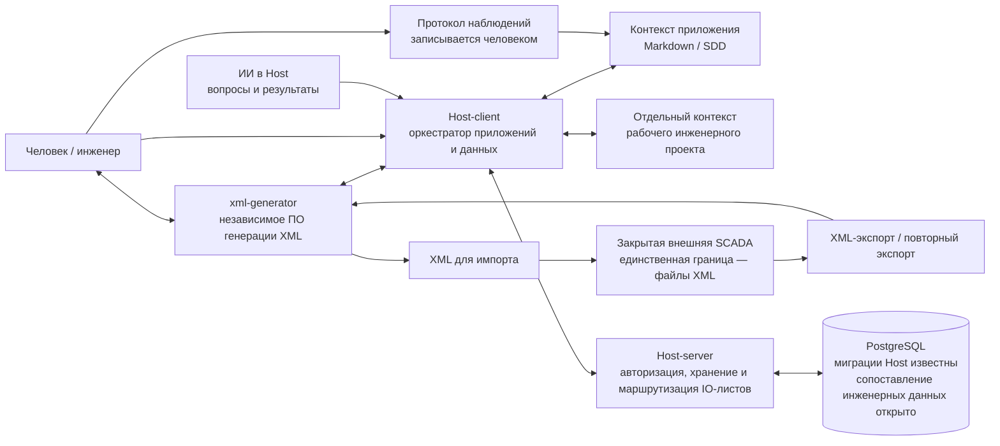
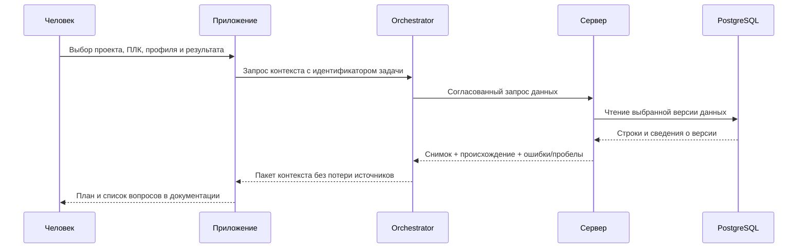
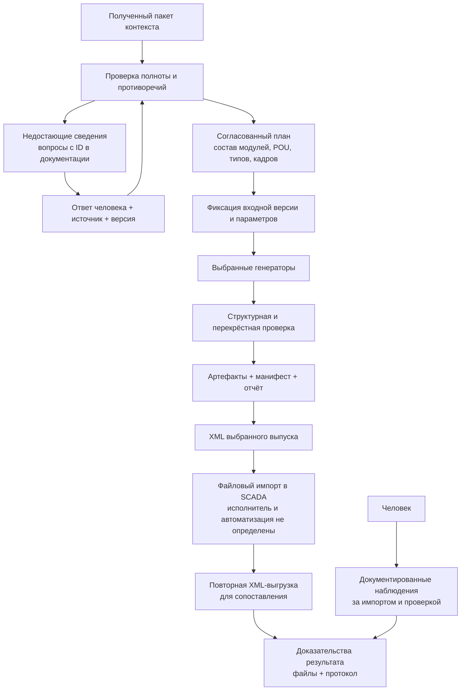
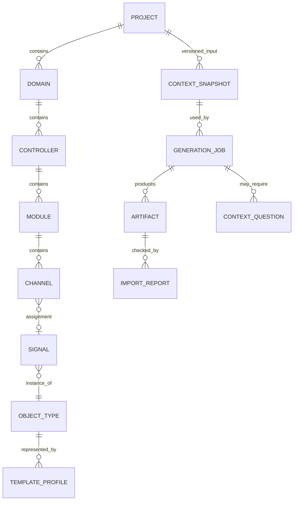
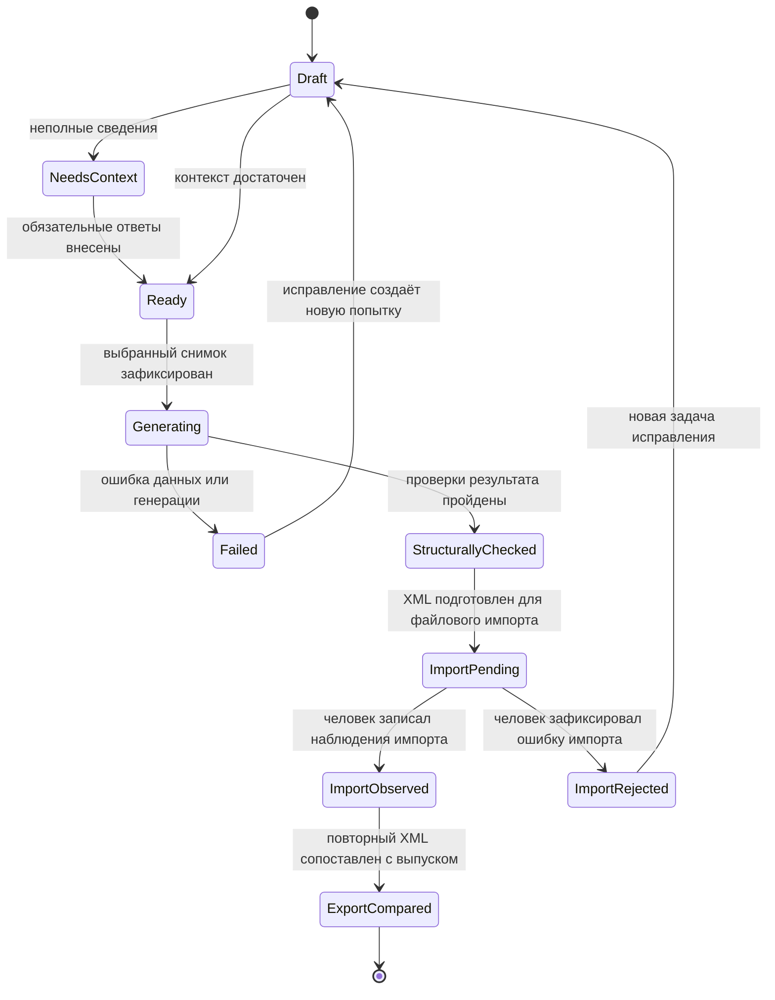
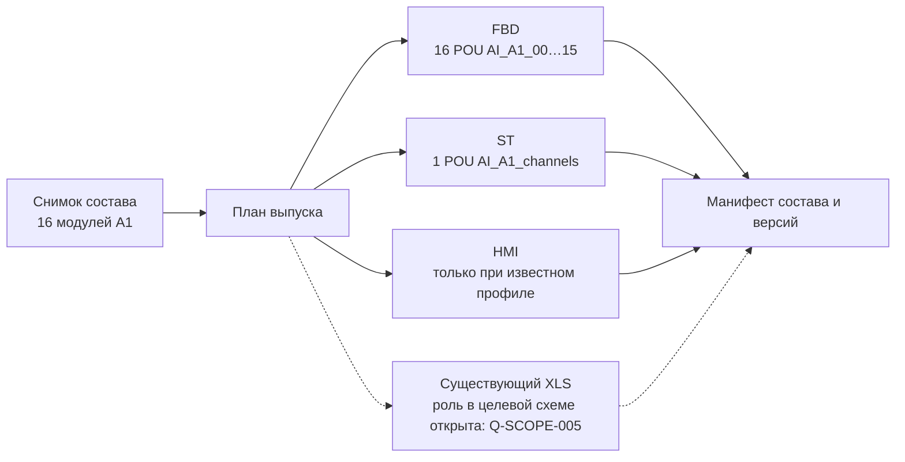

# 03. Целевая архитектура и контракт контекста

Исходная редакция: 25.09.2026; роли уточнены 28–29.09.2026. **Принято:** топология `xml-generator ↔ Host-client ↔ Host-server ↔ PostgreSQL DB`; независимый генератор запрашивает данные через поставляемый Host-client, который управляет приложениями и данными. Host-server отвечает за авторизацию клиентов, хранение и маршрутизацию IO-листов всего проекта. IO-листы хранятся только как структурированные записи БД; в первой версии модули только получают их. Выходные данные настраиваются модулями. Проекты разделены, [ADR-0009](decisions/ADR-0009-unified-spec-kit.md), [ADR-0010](decisions/ADR-0010-host-context-and-plc-domains.md). SCADA закрыта, обмен с ней только через файлы XML, [ADR-0003](decisions/ADR-0003-scada-xml-boundary.md). **Предложение:** конкретные сообщения, внутренние состояния заданий и схема БД ниже. Эти интерфейсы ещё не реализованы в генераторе и не заменяют реальные API [главы 02](02-current-implementation.md).

## 1. Контекст системы



Стрелки к SCADA обозначают направление файлового обмена, а не сетевые вызовы. Контракт не предполагает SCADA API, SDK, прямой доступ к её БД или автоматические уведомления из SCADA. Кто переносит файлы и выполняет экспорт/импорт, какими средствами и с какой степенью автоматизации — открытые вопросы Q-OPS-004 / Q-ACC-001. Ограничение «только XML» не означает, что все файловые действия уже признаны исключительно ручными.

XML-экспорт может служить источником структуры и состояния, представленных в самом файле. Возможность универсально разобрать любую выгрузку и сравнить её с выпуском пока не реализована и требует отдельного контракта анализа. Протокол импорта — запись наблюдений человеком с привязкой к файлу и окружению; это не callback закрытой SCADA.

Host читает контекст и записывает вопросы и результаты от приложений, ИИ и пользователя. Markdown/SDD приложений и контекст рабочего инженерного проекта хранятся раздельно; это принято 29.09.2026. Конкретные права записи, схема, механизм синхронизации и реализация ИИ открыты. Контекстная запись не даёт модулям права изменять IO-листы.

В существующем EXE есть локальный HTTP-сервер для браузера. Отдельный участник `server` — проект Host-server с авторизацией клиентов и маршрутизацией. Локальный HTTP-сервер генератора остаётся частью независимого генератора; интерфейсы интеграции и размещение Host-server требуют оставшихся ответов Q-INT-002.

PostgreSQL в целевой цепочке не отождествляется с внутренней БД SCADA. Происхождение её инженерных данных, способ наполнения и связь с файловыми экспортами остаются предметом Q-DB-001 / Q-DATA-001. Чтение сервером PostgreSQL не даёт доступа к закрытой SCADA.

Существующая отдельная генерация XLS сохраняется как реализованная функция. Её место в целевой схеме пока не определено: установленная граница SCADA допускает только XML. Потребитель XLS, необходимость сохранения этого артефакта и возможное создание технологических объектов в XML требуют ответа Q-SCOPE-005. Ни удаление XLS, ни его автоматическое преобразование в XML этим решением не задаются.

## 2. Принятые роли и предлагаемые дополнительные обязанности

| Компонент | Принятая роль / предлагаемая обязанность | Не должно считаться установленным без ответа |
|---|---|---|
| xml-generator | **Принято:** независимое ПО, запрашивает данные у Host; сам настраивает свои выходные данные. **Предложение:** анализировать согласованные XML-экспорты | Машинный контракт, режимы развёртывания/анализа, какие экспорты читаются; Q-INT-003/004, Q-ACC-001/002 |
| Host-client | **Принято:** поставляемый оркестратор приложений и данных; чтение контекста и запись вопросов/результатов от приложений, ИИ и пользователя; два контекста раздельно | Права контекстных изменений, схема, реализация ИИ, ретраи, очередь; [004-module-context](https://github.com/KovalenkoNS/Host-client/blob/main/specs/004-module-context/spec.md) |
| Host-server | **Принято:** авторизация клиентов, хранение и маршрутизация IO-листов всего проекта; в первой версии модулям только чтение | Предметный API, первичное наполнение и администрирование; [003-io-project-context](https://github.com/KovalenkoNS/Host-server/blob/main/specs/003-io-project-context/spec.md) |
| PostgreSQL / Host-database | Структурированные записи IO-листов; инфраструктура и миграции остаются отдельным проектом | Предметная схема, ключи, версии и источник наполнения; [002-project-context](https://github.com/KovalenkoNS/Host-database/blob/main/specs/002-project-context/spec.md), Q-DB-002/003 |
| Человек | Заполнять предметные пробелы, принимать правила, оценивать план и результат | Конкретные роли и обязательность согласования каждого этапа; Q-CTX-003 |
| Документация | Сохранять долговременный контекст, вопросы и доказательства | Автоматическая синхронизация файлов и БД; Q-CTX-001/002 |
| Закрытая SCADA | Выполнять собственный XML-импорт/экспорт; это установленная внешняя граница | Исполнитель файловых действий, объём выгрузки, правила импортера и дальнейшие проверки; Q-OPS-004, Q-ACC-001…004 |

Принятые роли не определяют владельца каждого предметного правила. Его следует явно указать до реализации, чтобы не создавать независимые версии поведения в UI, Host-client и БД. Место исполнения фиксируется в локальном пакете Spec Kit, межпроектные зависимости — ссылками на владельца контракта.

## 3. Направления обмена

### 3.1. Получение исходных данных



Здесь «снимок» — требование к согласованности входа, а не выбранный механизм транзакций PostgreSQL. Как гарантировать чтение одной версии всех сущностей — Q-DB-003. Недоступная БД, отсутствие строки и намеренно свободный канал — три разных состояния; их нельзя объединять в «резерв».

### 3.2. Уточнение и генерация



Слово «согласованный» означает отсутствие неразрешённого противоречия для текущей подзадачи. Оно не вводит дополнительное подтверждение человеком перед каждой уже разрешённой операцией. Где требуется отдельное инженерное согласование, необходимо определить в Q-CTX-003.

### 3.3. Обратная передача

Стрелки `↔` внутренней цепочки допускают обратный обмен, но не дают автоматически права изменять исходные инженерные данные. Они не являются каналом обратных вызовов SCADA. Следует раздельно определить:

| Вид обратных данных | Пример | Требуемое решение |
|---|---|---|
| Внутренний статус запроса | Контекст получен / неполон / ошибка генератора | Q-INT-004/005 |
| Уточнение человеком | Реальный ModuleID, новое количество модулей | Q-DATA-004/005, Q-INT-006 |
| Производные данные | План POU, рассчитанные резервы | Q-GEN-001, Q-DB-004 |
| Артефакт | XML, размер, контрольная сумма; роль существующего XLS уточняется отдельно | Q-INT-007, Q-OPS-005, Q-SCOPE-005 |
| Экспорт SCADA | Файл XML после импорта, его версия/дата/область и сравнение | Q-ACC-001/002/004 |
| Наблюдение импорта | Запись человеком: ошибка, найденный тип, привязка мнемосимвола | Q-ACC-001/004 |

Для вопросов и результатов принята запись Host в соответствующий вид контекста; место и машинный контракт пока не определены. Для IO-листов ответ уже получен: в первой версии модулям доступно **только получение данных**, без загрузки новых версий или правки записей. Обратные артефакты, первичное наполнение БД и администрирование требуют отдельных контрактов.

Внутренний сервер может в будущем хранить загруженную выгрузку и человеческий протокол; это не делает его источником автоматически полученного статуса SCADA. Не наблюдавшееся действие остаётся неизвестным. Успешная генерация или запись XML на диск не доказывают его импорт.

## 4. Предлагаемая логическая модель данных

РСУ, ПАЗ и СОГО — принятые главные непересекающиеся множества; каждый ПЛК принадлежит ровно одной области, модель 715/850 независима от неё, у каждого ПЛК собственные ST/FBD/HMI. См. [круги Эйлера](11-project-domains.md). Ниже предлагается логическая проекция, **не существующая схема БД и не готовая SQL-миграция**. Реальные таблицы и ключи требуется сопоставить в Q-DB-002.



Кратности также предварительны. Один логический DO может назначаться нескольким физическим каналам; основной и резервирующий AI могут иметь отдельные теги. Поэтому универсальная связь «один сигнал = один канал» не установлена. Привязки, резервирование и версия библиотеки должны быть описаны явно.

| Сущность | Минимальный смысл | Обязательные уточнения |
|---|---|---|
| Project | Целевой инженерный проект | Не смешивать DB ID, имя и строку XML Project |
| Controller | ПЛК и его целевой профиль | SCS/FCS, CPU, ресурсы, версия SCADA, транспортный ControllerID |
| Module | Физический/добавленный модуль | Тип, обозначение, количество каналов, происхождение, настоящий ModuleID |
| Channel | Позиция модуля | Номер, занятость, резерв, источник назначения, качество/измерение |
| Signal | Логический сигнал/экземпляр | Тег, тип, направление, связанные поля, варианты main/reserve |
| ObjectType | Тип SCADA | Идентичность и версия; числовой ID зависит от профиля |
| TemplateProfile | Правила FBD/HMI/XML/XLS | Поддерживаемые CPU, библиотека, графика и лексический диалект |
| ContextSnapshot | Зафиксированный набор исходных данных | Версия, дата, происхождение, согласованность, изменения пользователя |
| GenerationJob | Намерение получить конкретные результаты | Выбранные группы/модули, типы артефактов, параметры и ответы |
| Artifact | Конкретный неизменяемый результат генерации | Тип, ПЛК, состав, контрольная сумма, входная версия |
| ContextQuestion | Пробел знания для задачи | ID, причина, блокируемый этап, ответ/источник/статус |
| ImportReport | Записанные человеком наблюдения проверки в SCADA | Автор/дата, версия/проект, исходный XML, повторный XML-экспорт, шаги и наблюдения; не автоматическое сообщение SCADA |

## 5. Пакет контекста для человека и программы

Одна задача должна иметь контекст, достаточный для восстановления результата без чтения всей истории чата. Ни одна обязательная характеристика не должна существовать только в памяти сессии.

### 5.1. Слои контекста

| Слой | Содержимое | Проверка полноты |
|---|---|---|
| Намерение | Задача, требуемый результат, что считается готовым | Указаны ID требования и критерий приёмки |
| Окружение | Версии приложения, SCADA, библиотек, CPU, проекта | Есть точные значения или открытые вопросы |
| Источники | Файл/таблица/запрос, версия, происхождение | Можно повторно получить тот же смысловой вход |
| Состав | ПЛК, группы, модули, каналы, сигналы, резервы | Понятно, почему каждая позиция присутствует/отсутствует |
| Правила | Имена, шаблоны, группировка POU, преобразования | Ссылки на принятую версию спецификации |
| Ручные изменения | Количество, реальные ID, переименования | Значение до/после, автор/источник, область действия |
| Неизвестное | Отсутствующие данные и противоречия | Вопросы имеют ID и зависимую подзадачу |
| Результат | План, файлы, состав, ошибки генератора, XML-экспорт SCADA и наблюдения человека | Есть связь с входом, область выгрузки и протокол; генерация, импорт и выполнение разделены |

### 5.2. Эскиз конверта

Ниже **проектный пример**, не JSON текущего `/api/skz/generate`. Поля `null` означают обязательные уточнения; такой объект не готов к генерации.

```json
{
  "contractVersion": null,
  "taskId": "TASK-XXXX",
  "projectRef": null,
  "sourceSnapshot": {
    "id": null,
    "revision": null,
    "capturedAt": null,
    "provenance": []
  },
  "targetProfile": {
    "scadaProduct": null,
    "scadaVersion": null,
    "cpuFamily": null,
    "libraryRevision": null,
    "generatorRevision": null
  },
  "selection": {"controllers": [], "modules": [], "artifactKinds": []},
  "manualOverrides": [],
  "rules": [],
  "openQuestions": [],
  "answers": [],
  "acceptanceCriteria": [],
  "artifacts": []
}
```

Для каждого значения с инженерным смыслом нужно уметь получить: исходное поле, применённое правило, ручное переопределение и текущую причину выбора. Формат происхождения, версия схемы и размер пакета — Q-CTX-001/Q-DATA-003/Q-INT-007.

### 5.3. Предлагаемое правило при конфликте

Не вводить скрытый приоритет «ручное всегда выше БД» или «последний ответ всегда прав». Записать конфликт как отдельное требование информации: обе версии, источники, затронутые артефакты, ответственный и выбранный вариант. Приоритет источников должен быть принят по Q-DATA-002. Принятое правило исправления одного конкретного Excel не переносится на произвольные данные PostgreSQL.

## 6. Контракты взаимодействий, которые требуется согласовать

Операции таблицы — предложения для обмена внутри `приложение ↔ orchestrator ↔ server ↔ PostgreSQL`. Ни одна из них не является проектируемым API/SDK закрытой SCADA.

| Логическая операция | Запрос должен определять | Ответ должен определять | Вопросы |
|---|---|---|---|
| Получить доступные проекты/версии | Область доступа и фильтр | Идентификаторы и доступные версии | Q-INT-002/006, Q-DB-001 |
| Получить инженерный контекст | Проект, ПЛК, состав, версия | Снимок, источники, отсутствующие значения | Q-DATA-001/003, Q-DB-003 |
| Зарегистрировать вопрос | Задача, недостающие сведения, зависимость | Устойчивый ID и состояние | Q-CTX-001/002 |
| Принять ответ | ID вопроса, значение, источник, автор | Новая версия контекста или конфликт | Q-DATA-002/004 |
| Запустить генерацию | Версия контекста, профиль, результаты | ID задания и принятые параметры | Q-INT-003/004 |
| Получить внутренний статус/ошибку | ID задания/корреляции | Этап генератора, код, причины, требуемое действие; без автоматического статуса SCADA | Q-INT-004/005 |
| Получить артефакты | ID задания/выпуска | Состав, файлы, контрольные суммы | Q-INT-007, Q-OPS-005 |
| Зарегистрировать XML-экспорт SCADA | Файл, окружение, область выгрузки, связь с выпуском | Сохранённый артефакт и результат согласованного анализа | Q-ACC-001/002/004 |
| Зарегистрировать наблюдение человека | Артефакт, окружение, автор, дата, действия и наблюдения | Документированный результат и связанные вопросы | Q-ACC-001/004 |

Пути HTTP, методы авторизации, модели очереди, номера портов и SQL ещё не выбраны. Названия операций в таблице — смысловые, не существующие маршруты.

## 7. Жизненный цикл задания — предложение



Состояния `Cancelled`, тайм-ауты, конкурентное редактирование и повтор запроса не определяются автоматически этой схемой; нужны Q-INT-004/005. Эти состояния принадлежат нашему учёту задания, а не закрытой SCADA. Переход к `ImportObserved` основан на человеческой записи; `ExportCompared` — на полученном XML, его области и документированном сравнении. Способ получения файлов ещё не выбран.

| Уровень доказательства | Что можно утверждать | Чего он не доказывает |
|---|---|---|
| XML создан и структурно проверен | Генератор сформировал результат по своему контракту | Файл был импортирован в SCADA |
| Человек записал наблюдение импорта | В указанном окружении наблюдалось описанное действие/сообщение | Полное состояние всех объектов после импорта |
| Повторный XML + протокол сопоставления | Выгруженная часть проекта содержит наблюдаемые структуру и привязки | Исполнение алгоритма, аппаратный отклик или полноту невошедших в экспорт данных |
| Протокол функциональной проверки | Зафиксировано конкретное наблюдаемое поведение | Автоматически все непроверенные режимы и условия |

Состояние SCADA после импорта восстанавливается только в пределах полученного XML-экспорта и человеческих подтверждений. Сам повторный экспорт не является доказательством выполнения ST/FBD; критерии функциональной проверки задаются отдельно в Q-ACC-002.

## 8. Единый выпуск нескольких артефактов

Интерфейс пакета 003 позволяет выбрать несколько FBD/ST/HMI для одного ПЛК и выполнить соответствующие HTTP-запросы. Они сохраняют результаты независимо. Предлагаемая здесь сущность **выпуск** — постоянный набор артефактов по одной версии состава, с манифестом и согласованным восстановлением — ещё не реализована. Она не равна общей кнопке генерации. Схема ниже использует числа из исторического AI-эталона; новый FBD требует подключённую библиотеку.



Сопоставлять FBD и ST только по числу POU неверно: в данном эталоне при одинаковых 16 модулях AI FBD имел 16 POU, ST — одну. Сверяются принадлежность ПЛК, модули, каналы, логические теги, физические назначения и версия правил. Для CPU850 диагностический HMI-профиль ещё не подтверждён; стрелки к H/X показывают подзадачи согласованного выпуска, не готовую общую транзакцию. Внешняя граница SCADA остаётся только XML; пунктирный XLS не обозначает разрешённый путь импорта в неё.

## 9. Идентификаторы, параллельность и воспроизводимость

Сейчас транспортные ID выделяются из локального `data/state.json`; это не реестр идентификаторов целевого проекта SCADA и не распределённый механизм. До многопользовательской/многомашинной генерации требуется решить:

- кто владеет транспортными диапазонами и пространством POUNum;
- как физический ModuleID связан с версией конфигурации ПЛК;
- допустимы ли пропуски ID после ошибки записи файлов;
- как различать повтор одного запроса и новый выпуск;
- какие части результата должны совпадать побайтно, а какие допускают новые транспортные ID;
- как восстанавливать контекст после смены устройства.

Это Q-GEN-003/004, Q-INT-004, Q-OPS-005 и Q-APP в главе 02. Существующие локальные mutex и счётчики не выдаются за решение этих задач.

## 10. Порядок внедрения после получения сведений

| Этап | Документированный результат | Условие перехода |
|---|---|---|
| A. Инвентаризация | Схема БД, примеры, версии, владельцы интерфейсов | Ключевые Q-SCOPE/Q-INT/Q-DB отвечены |
| B. Контракт чтения | Таблица DB-поле → инженерное поле → правило → генератор | Нет неразрешённых обязательных полей |
| C. Контрольный снимок | Сравнение с существующим файловым входом | Одинаковые смысловые планы для одного примера |
| D. Один профиль генерации | Сквозной файловый сценарий, повторный XML и протокол | Структурные проверки и документированный тестовый импорт; выполнение проверено отдельно |
| E. Несколько артефактов | Единый состав FBD/ST и согласованные HMI-зависимости; роль XLS решена отдельно | Q-GEN-001, Q-SCOPE-005 и требуемые профили определены |
| F. Обратная связь/запись внутри нашей цепочки | Версионирование ответов, файлов и человеческих наблюдений | Согласованы права, конфликты и повторные операции; прямого канала к SCADA нет |

Приоритет профиля для этапа D требуется определить в Q-SCOPE-002; он не выбирается автоматически из того, какой генератор реализован последним.
