# Форматы XML и алгоритмы сборки

Статус: описание фактического кода на 25.09.2026. Будущая схема `приложение ↔ orchestrator ↔ server ↔ PostgreSQL` должна поставлять согласованные исходные данные этим генераторам; подключение к ней само по себе ещё не реализует новые форматы. Точки, для которых нет подтверждённого контракта SCADA, перечислены в конце документа и требуют заполнения.

Этот документ объясняет состав файла, зависимости объектов и последовательность сборки. Он не заменяет протокол импорта и проверки в целевой SCADA. Наличие валидного XML и прохождение тестов генератора не подтверждает выполнение программы в ПЛК.

**Принятая граница:** закрытая SCADA взаимодействует с внешней системой только через экспорт/импорт `.xml` ([ADR-0003](decisions/ADR-0003-scada-xml-boundary.md)). Экспорты — источник доступного контекста и эталонов профиля; результаты генерации — файлы для её импортёра. Полнота экспортируемых сущностей, версии и правила импорта требуют Q-XML-001; универсальный анализ всего проекта по экспорту не считается реализованным.

## 1. Карта семейств

| Семейство | Источник | Корень результата | Единица разделения внутри файла | Физические назначения |
|---|---|---|---|---|
| FBD по библиотечным шаблонам | Библиотека XML и настройки пользователя | `BufScadaPOUS` | POU пользователя; внутри экземпляры шаблонов | Опциональный профиль I/O AI/AO/DI/DO |
| AO FBD | Карта AO из TXT | `BufScadaPOUS` | Группа AO, например `AO_A11` | В этом профиле отсутствуют |
| AO ST | Карта AO из TXT, количество модулей, физические ID | `BufScadaPOUS` | Группа, например `AO_A11_channels` | `AN_v1.OUT → REAL_TO_DINT → ValueDINT` |
| СКЗ AI FBD | Карта СКЗ XLSX, количество модулей | `BufScadaPOUS` | **Один модуль в одной POU**, например `AI_A1_00` | Выполняются отдельной ST POU |
| СКЗ DO FBD | Карта СКЗ XLSX, количество модулей | `BufScadaPOUS` | Группа, например `DO_A3` | Выполняются отдельной ST POU |
| СКЗ AI ST | Карта СКЗ XLSX и физические ID | `BufScadaPOUS` | Группа, например `AI_A1_channels` | `Measurement → Xin`, `Quality → QUAL_STAT → Xs` |
| СКЗ DO ST | Карта СКЗ XLSX и физические ID | `BufScadaPOUS` | Группа, например `DO_A3_channels` | `D32V._NN → Measurement` |
| Диагностика AO на панели | Карта AO и профиль мнемосхем | `BufScada` | Кадры модулей | Привязки отображения к объектам |
| Диагностика ПЛК на панели | Карта I/O Excel и профиль мнемосхем | `BufScada` | ПЛК, корзины, модули, дочерние кадры | Привязки отображения к объектам |

В пакетных режимах AO/СКЗ один XML содержит данные одного ПЛК (`FCS` или `SCS`). Основной библиотечный генератор собирает документ по явно заданному списку POU с совместимым `Common`. Технологические объекты модулей и резервов экспортируются отдельной функцией в **XLS**, поэтому в дереве XML ниже не представлены.

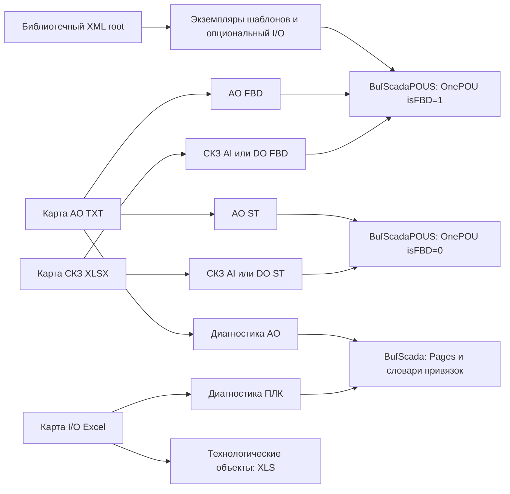

Состав `BufScada`, кадры и привязки мнемосимволов описаны в [документе операторского интерфейса и XLS](05-operator-interface-and-xls.md). Далее рассматривается `BufScadaPOUS`.

## 2. Общий конвейер и идентификаторы

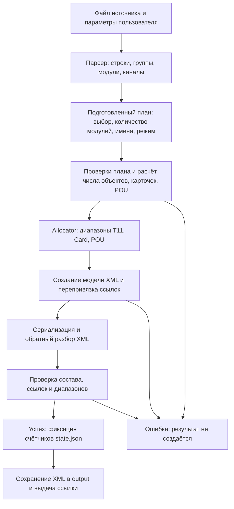

В пакетной генерации счётчики фиксируются после успешной сборки всех документов. Запись выходных файлов выполняется после резервирования; это не общая транзакция с PostgreSQL. Ошибка файловой системы после резервирования может оставить пропуск в диапазоне ID. Связи между артефактом, исходным файлом и состоянием целевого проекта требуют будущего контракта `Q-XML-011`.

| Поле | Где находится | Что обозначает | Откуда берётся |
|---|---|---|---|
| `T11ID` | `Block/@T11ID` | Графический блок | Локальный allocator |
| `SourceT11ID` | `GrObj/OnePrim/@SourceT11ID` | Графический примитив FBD | Тот же диапазон T11 |
| `cardId` | `Block/Params/@cardId` | Ссылка на экземпляр/карточку | Переназначается генератором |
| `ID` карточки | `ISACARDSINFO/rec/@ID` | Экземпляр тега, общий для его полей | Диапазон Card |
| `IsaObjId` | `Block/Params/@IsaObjId` | Тип блока или встроенный тип | Профиль или библиотека, **не allocator** |
| `ID` типа | `ISAOBJSINFO/rec/@ID` | Тип из библиотеки | Например `17480 = AD3_v2` |
| `POU ID` | `OnePOU/@ID` | Транспортный идентификатор POU | Диапазон POU или ручное значение основного режима |
| `POUNum` | `OnePOU/@POUNum` | Номер POU в контексте импорта | Контекст и последовательное увеличение |
| `GroupID` | `OnePOU/@GroupID` | Группа назначения POU | Контекст импорта |
| `ControllerID` | `Common/@ControllerID` | Контроллер проекта SCADA | Контекст импорта |
| `ResuorceID` | `Common/@ResuorceID` | Ресурс проекта SCADA | Контекст; написание именно `ResuorceID` |
| `ModuleID` | Входной план; затем текст физических адресов | Реальный ID аппаратного модуля | Пользователь для AO/СКЗ ST |
| `A1-00` / `A1_00` | Исходная карта / имя в программе | Обозначение модуля | Excel и правило преобразования имени |

`ModuleID=24` может соответствовать модулю `A1-02`. Номер в обозначении не доказывает значение аппаратного ID. `ControllerID` также не является ID модуля. В ST значение `0` допустимо; пустое поле является ошибкой.

Диапазон обычных транспортных ID — положительный signed 32-bit, до `2147483647`. Встроенные типы используют отрицательные ID; это другой класс идентификаторов. `cardId="0"` допустим для констант и объектов без карточки. Связь `Link` расходует позицию общего счётчика T11, хотя отдельный атрибут T11ID у неё в этом диалекте не сериализуется. Поэтому число видимых атрибутов `T11ID` не равно использованному диапазону.

Источники: [allocator.go](../internal/generator/allocator.go), [types.go](../internal/generator/types.go), [document.go](../internal/generator/document.go), [appserver/skz.go](../internal/appserver/skz.go).

## 3. Дерево FBD XML

Порядок корневых секций определяется структурой `outputDocument`: `Common`, `POUS`, необязательный `FONTSTYLES`, `ISAOBJSINFO`, `ISACARDSINFO`. Словари типов и карточек относятся ко **всему документу**, а блоки, связи и графика — к своей POU.

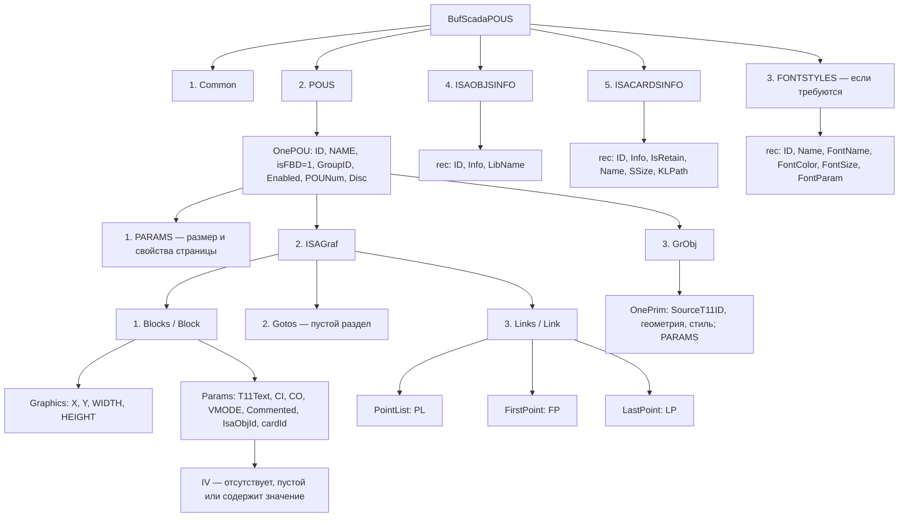

`Common` содержит атрибуты `VER`, `Project`, `isCut`, `isFFB`, `ControllerTypeName`, `ControllerID`, `ResuorceID`. У специализированных AO/СКЗ профилей `isCut="false"`, `isFFB="false"`. Это свойства контейнера, а FBD/ST конкретной POU определяется `OnePOU/@isFBD`.

`OnePOU/PARAMS` содержит `DPARAMS`, `HEIGHT`, `WIDTH`, `SHABLONPAGEID`, `FONCOLOR`, `PRINTWIDTH`, `PRINTHEIGHT`, `PRINTPAGEA4`. Размер страницы расширяется с учётом размещённых объектов. Для основной генерации параметры страницы могут задаваться пользователем; AO/СКЗ имеют профиль размещения.

`Block` содержит атрибуты `GROBJTYPE`, `Info`, `T11ID`. В `Params` значения `CI/CO` описывают сигнатуру; `IsaObjId` задаёт тип; `cardId` связывает графику с экземпляром; `T11Text` может выбирать поле экземпляра, например `.Out`. Простого совпадения отображаемого `Info` недостаточно для описания этой связи.

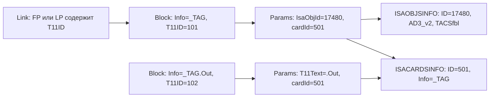

Числа `101`, `102`, `501` в диаграмме — учебные. Графический владелец карточки с пустым `T11Text` помещается **перед** блоками, обращающимися к её полям. [ordering.go](../internal/generator/ordering.go) реализует устойчивое упорядочивание зависимостей. В СКЗ AI порядок задаётся непосредственно нативным фрагментом и проверяется валидатором.

Для генерируемых I/O связей формат концов следующий:

```text
FP = <T11ID источника>|False|<выход>|0,0,100,20
LP = <T11ID приёмника>|True|<вход>|0,0,100,20
```

`PointList/@PL` содержит геометрию линии; `FP/LP` содержат её логические концы. Изменение координат не заменяет смену ссылки на блок или имени контакта. `Link` также содержит `Negative`, `asPointer`, `UserEdit`, `Color`, `GetBitNum`, `ConvertTo`.

Источники: [model.go](../internal/generator/model.go), [io.go](../internal/generator/io.go), [validate.go](../internal/generator/validate.go).

## 4. Лексический контракт файла

Файлы создаются как UTF-8 с BOM и декларацией XML. Между элементами не добавляются отступы и переносы для форматирования. Переносы внутри текстовых значений приводятся к CRLF. В атрибутах управляющие пробельные символы экранируются. Пустые элементы записываются самозакрывающимися.

У `IV` различаются три состояния: отсутствующий элемент, `<IV/>`, `<IV>значение</IV>`. Эти состояния нельзя автоматически приводить к одному виду. Недопустимые символы XML 1.0 отклоняются. В некоторых старых эталонах присутствуют служебные символы; очистка такого эталона в тесте не является разрешением генерировать их в новом файле.

Следующий пример **иллюстративный и неполный, для импорта не предназначен**. Отступы добавлены только для чтения; часть атрибутов, типов и содержимого намеренно опущена.

```xml
<BufScadaPOUS>
  <Common VER="29" ControllerTypeName="TENIX-CPU850"
          ControllerID="189311" ResuorceID="647"/>
  <POUS>
    <OnePOU ID="701" NAME="AI_A1_00" isFBD="1" GroupID="19912"
            Enabled="1" POUNum="8" Disc="">
      <PARAMS WIDTH="2000" HEIGHT="4200"/>
      <ISAGraf>
        <Blocks>
          <Block GROBJTYPE="37" Info="_TAG" T11ID="101">
            <Graphics X="710" Y="60" WIDTH="100" HEIGHT="400"/>
            <Params T11Text="" CI="19" CO="3" VMODE="0"
                    Commented="false" IsaObjId="17480" cardId="501"/>
          </Block>
        </Blocks>
        <Gotos/>
        <Links/>
      </ISAGraf>
      <GrObj/>
    </OnePOU>
  </POUS>
  <ISAOBJSINFO><rec ID="17480" Info="AD3_v2" LibName="TACSfbl"/></ISAOBJSINFO>
  <ISACARDSINFO><rec ID="501" Info="_TAG" IsRetain="-1" Name="_TAG" SSize="0" KLPath=""/></ISACARDSINFO>
</BufScadaPOUS>
```

Полный `IV`, вспомогательные блоки и графика AI приведены в разделе 8 через описание нативного профиля. Источник лексических правил: [serialize.go](../internal/generator/serialize.go), проверка трёх состояний `IV`: [serialize_test.go](../internal/generator/serialize_test.go).

## 5. Основной генератор: из библиотечного шаблона в FBD

Входная библиотека и результирующий XML имеют разные деревья. Библиотека хранит шаблоны графики и описания объектов; результат содержит экземпляры этих шаблонов с новыми именами и транспортными ID.

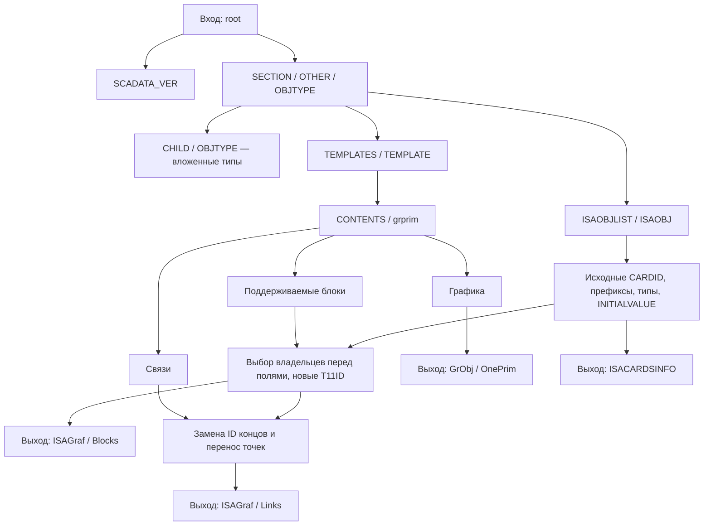

Алгоритм экземпляра: разрешить точный `TemplateRef`, нормализовать базовое имя, получить используемые карточки, создать соответствие старых и новых ID, упорядочить блоки, переписать ссылки, перенести геометрию, собрать типы и шрифты. Имя карточки образуется из базового имени и библиотечного `EffectivePrefix`. Поле объекта получает `Info=имяКарточки + T11Text`, если `T11Text` начинается с точки.

Каждый сигнал создаётся со своим соответствием **исходных** ID; одинаковые исходные номера в двух экземплярах не конфликтуют. **Выходные** диапазоны общие для всего документа. При объединении POU проверяются уникальность имён карточек без учёта регистра, POU ID, POU NAME, POUNum и непротиворечивость словарей типов/шрифтов. Несовместимые значения `Common` объединять нельзя. Карточки обычных библиотечных экземпляров получают `IsRetain=1`; специализированные AO/СКЗ и добавленные физические карточки используют `-1` по своим профилям. Это различие сохраняется, семантика значений требует контракта целевой системы.

В свободной форме количество сигналов в POU задаётся списком пользователя. При автоматическом размещении начало — ориентировочно `X=300`, `Y=100` с поправкой на отрицательные координаты шаблона; следующий сигнал размещается ниже предыдущего с зазором 20. Явные смещения сохраняются в допустимых границах. Геометрия исходной схемы переносится, логика шаблона не синтезируется заново.

Единственная явно запрограммированная корректировка сигнатуры основного генератора относится к шаблону `19963`, типу `18513`, `AD3_HLB`: `CO` увеличивается до 17 по принятому эталону. Для других расхождений сигнатур сохраняются значения выбранного шаблона и выдаётся предупреждение. Это частный профиль, требующий версии и подтверждающего эталона при развитии библиотеки (`Q-XML-003`).

Источники: [library/model.go](../internal/library/model.go), [generator.go](../internal/generator/generator.go), [document.go](../internal/generator/document.go), [ordering.go](../internal/generator/ordering.go).

### 5.1. Опциональная физическая часть основного FBD

Это отдельный профиль основной генерации. Его адреса `_IO_IU…`/`_IO_QU…` и поля `ValueDINT`, `Status`, `Value` не следует переносить в СКЗ CPU850, где используются другие адреса и ST.

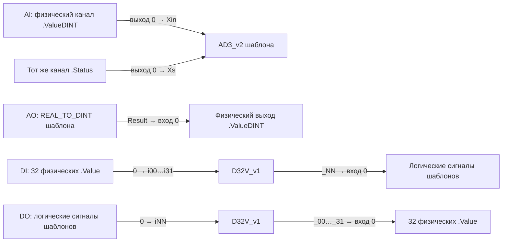

| Профиль | Вместимость модуля | Требуемая свободная точка шаблона | Добавление к шаблонам |
|---|---:|---|---|
| AI | 16 | Один `AD3_v2`, тип `17480`, свободны `Xin` и `Xs` | На заданный сигнал 2 блока, 2 связи, 1 физическая карточка |
| AO | 4 | Один `REAL_TO_DINT`, тип `791`, свободен `Result` | На заданный сигнал 1 блок, 1 связь, 1 физическая карточка |
| DI | 32 | Одна карточная переменная с `CI=1`, `CO=1`, свободен вход `0` | На модуль D32V, 32 физических блока, 32 физических связи; по связи к заданному сигналу |
| DO | 32 | Одна карточная переменная с `CI=1`, `CO=1`, свободен выход `0` | На модуль D32V, 32 физических блока, 32 физических связи; по связи от заданного сигнала |

Для цифрового модуля добавляется 33 карточки: одна D32V и 32 физических. Номер канала здесь — позиция сигнала в списке модуля с нуля. У аналоговых сигналов физические `ValueDINT` и `Status` принадлежат одной карточке; у цифровых формируется полный набор 32 физических каналов.

Требуется ровно одна подходящая незанятая точка шаблона. Неоднозначность останавливает генерацию. По умолчанию привязочный префикс — `_IO_IU<id>` для входов и `_IO_QU<id>` для выходов; его можно задать явно. Имя цифрового экземпляра по умолчанию `_IO_<AI|AO|DI|DO>_<id>`, фактически оно используется при создании D32V для DI/DO. Совместимость префиксов с конкретной конфигурацией оборудования требует подтверждения пользователя.

Источники: [io_profiles.go](../internal/generator/io_profiles.go), [io.go](../internal/generator/io.go), [io_test.go](../internal/generator/io_test.go).

## 6. AO FBD из TXT

Этот профиль воспроизводит программные вызовы `AN_v1` по принятому экспорту. Каждый модуль карты имеет четыре позиции. Для каждого неповторного тега создаётся один вызов и одна карточка; повторный вызов того же объекта в пределах ПЛК пропускается. Позиция остаётся пустой, координаты других каналов не сдвигаются.

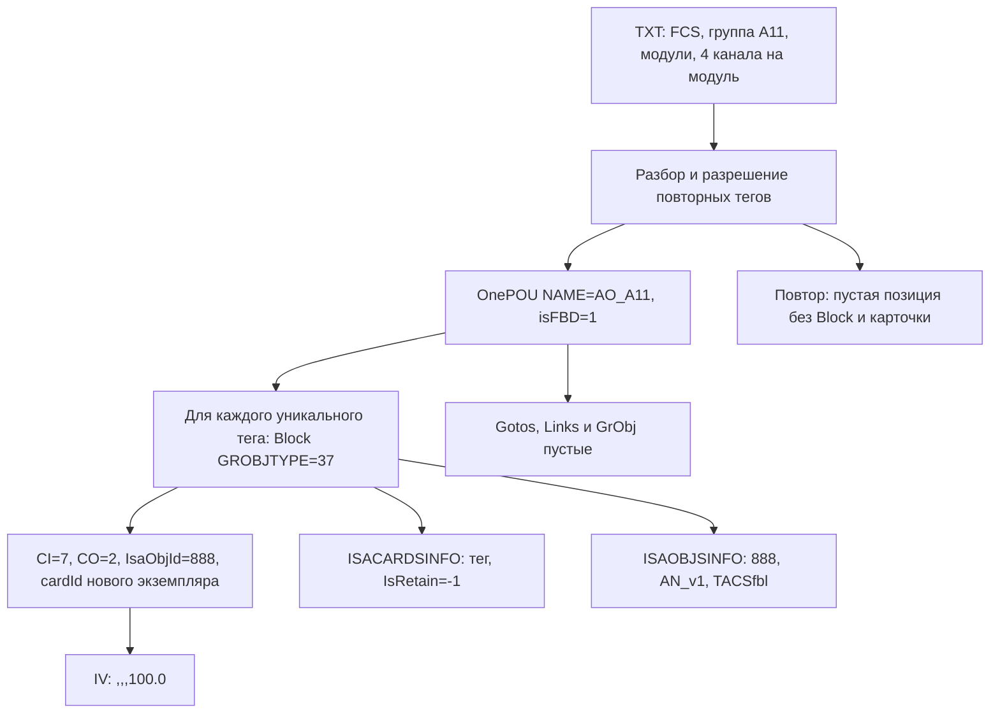

Физических адресов и блока `REAL_TO_DINT` этот режим не создаёт. Профиль FBD допускает только диапазон `0..100`, совпадающий с эталоном. Уникальность относится к экземпляру тега, а не к каждому физическому выходу. Поэтому статистика `SignalCount` включает все позиции карты, а `Blocks`/`Cards` — только созданные вызовы.

Координаты: `X=500`, `Y=50+190×(индексМодуля×4+номерКанала)`, размер вызова `100×160`. POU сохраняется даже тогда, когда все её позиции оказались повторными и исполняемых блоков в ней нет. Идентичные имена в разных ПЛК независимы, поскольку создаются разные документы.

Источники: [ao_mapping.go](../internal/generator/ao_mapping.go), [ao_mapping_test.go](../internal/generator/ao_mapping_test.go).

## 7. ST: общее дерево и профиль AO

У ST применяется отдельная структура XML. Пустые графические секции сюда не добавляются. Корневые дети — только `Common`, `POUS`; ребёнок `OnePOU` — `STCODE`.

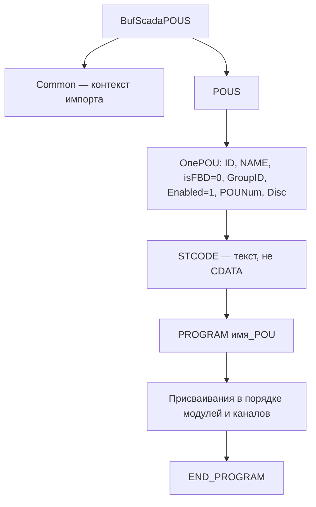

Пример AO ниже показывает смысл кода и структуру. Это **неполный учебный XML**, остальные обязательные атрибуты контекста опущены.

```xml
<BufScadaPOUS>
  <Common VER="29" ControllerTypeName="TENIX-CPU715"/>
  <POUS>
    <OnePOU ID="701" NAME="AO_A11_channels" isFBD="0" GroupID="19498"
            Enabled="1" POUNum="36" Disc="">
      <STCODE>PROGRAM AO_A11_channels

_IO_QU24_0.ValueDINT := REAL_TO_DINT(_TAG.OUT, 0.0, 100.0);

END_PROGRAM</STCODE>
    </OnePOU>
  </POUS>
</BufScadaPOUS>
```

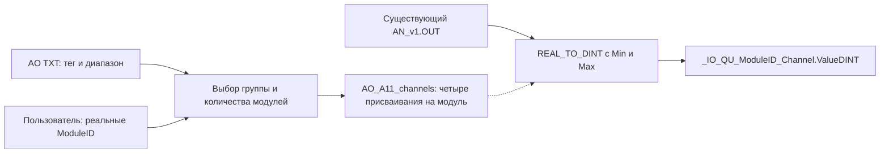

В последней диаграмме подпись физического адреса является схемой имени; буквальные подчёркивания вокруг `ModuleID` в файл не вставляются. Точная формула: `_IO_QU<ModuleID>_<Channel>.ValueDINT`.

Количество модулей AO ST задаёт пользователь, не меньше числа исходных. Дополнительные модули идут после максимального номера исходного модуля; существующие пропуски в нумерации не заполняются. Каждый новый модуль получает четыре резервных тега `_<FCS>_<ModuleName>_<Channel>` и диапазон `0.0..100.0`. Для каждого модуля требуется физический ID. Повторные теги сохраняются во всех физических присваиваниях; это необходимо для нескольких выходов от одного объекта.

ST не создаёт экземпляры `AN_v1`, карточки, FBD-блоки или библиотечные определения функции. Их наличие в целевом проекте — внешняя зависимость. ST использует только диапазон POU ID; T11/Card не расходуются.

Источники: [ao_st.go](../internal/generator/ao_st.go), [ao_st_test.go](../internal/generator/ao_st_test.go).

## 8. СКЗ AI FBD: один модуль — одна POU

Зафиксированное решение пользователя: `A1_00`, `A1_01` и следующие модули располагаются в **разных** POU. Текущий код реализует `AI_A1_00`, `AI_A1_01` и далее. В одной POU находится один модуль и до 16 его перечисленных каналов. Если в исходном модуле перечислено четыре канала, он не дополняется до 16 автоматически.

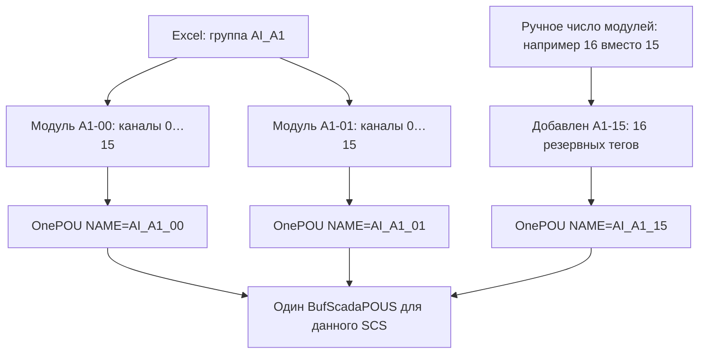

На один уникальный AI-тег профиль создаёт семь блоков и две графические подписи. Фрагмент основан на `SOGO_AI_fbd.xml`; физические входы остаются в ST по принятому решению пользователя.

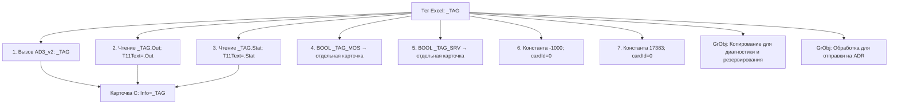

Стрелки этой схемы показывают происхождение и ссылки на карточки, **не FBD-линии**. В данном AI-профиле раздел `Links` пустой. Названия графических подписей перенесены из эталона и сами по себе не означают, что генератор построил алгоритм резервирования или отправки ADR.

| Элемент фрагмента | `GROBJTYPE` | `IsaObjId` | `CI/CO` | `Commented` | Карточка |
|---|---:|---:|---|---|---|
| Вызов `AD3_v2` | 37 | 17480 | 19/3 | false | Основной тег |
| `.Out`, `.Stat` | 31 | 17480 | 1/1 | true | Та же, что у вызова |
| `_MOS`, `_SRV` | 31 | -9 | 1/1 | false | По одной отдельной BOOL |
| `-1000`, `17383` | 34 | -100 | 0/1 | true | 0 |

`ISAOBJSINFO` содержит `17480 / AD3_v2 / TACSfbl`. Три карточки на сигнал имеют `IsRetain=-1`; встроенные BOOL и константы не требуют собственной записи типа в этом словаре. У BOOL `IV=FALSE`. У вызова и ссылок `.Out/.Stat` сохраняется одна и та же строка начального состояния профиля:

```text
2(0),-1000,17383,-1000.0,6(0.0),17383.0,0.0,T#0ms,2(FALSE),0.0,FALSE,0,0.0,0,0,0.0,3(FALSE),0.0,0,T#0ms,3(0.0),D#1970-01-01,FALSE,0
```

Значения `-1000/17383` и эта строка сохраняются буквально; полевой смысл каждого элемента ещё не формализован (`Q-XML-004`). Профиль не подставляет в них инженерные диапазоны из внешней БД без отдельного принятого правила.

Размещение — два столбца, восемь рядов. Центральные вызовы имеют `X=710` для чётного канала и `X=1470` для нечётного; `Y` рядов: `60, 580, 1110, 1640, 2160, 2670, 3200, 3720`. Размер вызова `100×400`. В каждой новой модульной POU координаты начинаются заново. Поэтому разделение не создаёт длинную общую страницу из нескольких модулей.

Для полного модуля: 16 вызовов, 112 блоков всего, 32 графических примитива, 48 карточек, 0 связей, 144 позиции T11. Для 16 полных модулей: 16 POU, 256 сигналов, 1792 блока, 512 примитивов, 768 карточек. `AI_A1_15` должен присутствовать при заданном количестве 16 и исходных модулях `A1-00…A1-14`.

Источники: [skz.go](../internal/generator/skz.go), [skz_test.go](../internal/generator/skz_test.go), [нативный FBD-эталон](../internal/generator/testdata/SOGO_AI_fbd.xml).

## 9. СКЗ DO FBD: логические теги во входы D32V

Для DO сохраняется одна POU на исходную группу, например `DO_A3`. В ней создаются вызовы всех выбранных модулей этой группы. Имя экземпляра модуля: `_<SCS>_<обозначение с подчёркиванием>`, например `_3000_G_SC_B01_A3_03`.

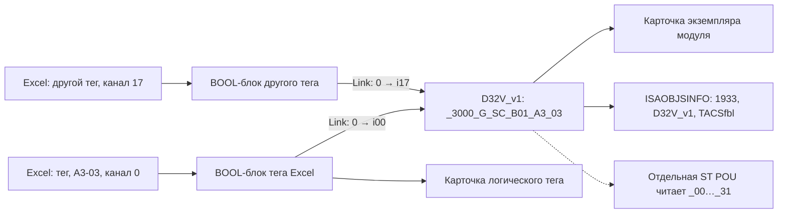

У D32V: `GROBJTYPE=37`, `CI=34`, `CO=33`, `IsaObjId=1933`, `IV` пустой. У переменной: `GROBJTYPE=31`, `CI=1`, `CO=1`, `IsaObjId=-9`, `IV=FALSE`. `Commented=false`; карточки `IsRetain=-1`.

Один логический тег может питать несколько физических каналов: создаются несколько графических ссылок и линий, но карточка тега в XML общая. Вход `iNN` одного D32V нельзя подключить повторно. Дополнительный резервный модуль получает D32V с 32 позициями для ST; отдельные BOOL-теги и линии для его синтетических резервов не создаются. Резерв, явно указанный исходной строкой Excel, сохраняет свою логическую привязку.

Обозначим `M` — число модулей, `A` — число исходных логических назначений, `U` — число уникальных логических тегов. Тогда блоков `M+A`, связей `A`, карточек `M+U`, расход T11 `M+2A`. Синтетические резервные позиции дополнительных модулей в `A` не входят. На предоставленной полной DO-карте без добавлений: 8 модулей, 144 назначения, 36 тегов; 152 блока, 144 связи, 44 карточки.

Файл пользователя `SOGO_DO_fbd.xml` оказался ST-экспортом, совпадающим с `SOGO_DO.xml`. Подтверждённый отдельный нативный DO FBD эталон нужен для проверки полного импортного профиля (`Q-XML-005`); существующий генератор использует принятый D32V-профиль и явную привязку к тегам Excel.

## 10. СКЗ ST AI и DO

И AI, и DO используют дерево из раздела 7. ST группируется по префиксу, а не по отдельному AI-модулю. Поэтому 16 POU AI FBD группы A1 соответствуют одной `AI_A1_channels` с физическими присваиваниями всех 16 модулей.

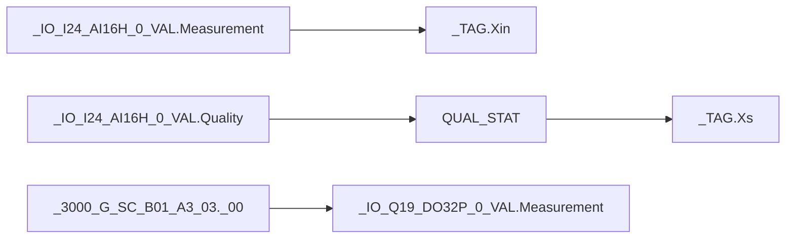

Точные формулы ST:

```iecst
(* AI: две строки на перечисленный канал *)
_TAG.Xin := _IO_I24_AI16H_0_VAL.Measurement;
_TAG.Xs := QUAL_STAT(_IO_I24_AI16H_0_VAL.Quality);

(* DO: одна строка на перечисленный канал *)
_IO_Q19_DO32P_0_VAL.Measurement := _3000_G_SC_B01_A3_03._00;
```

Здесь `24` и `19` — примеры введённых пользователем аппаратных ID, `0` — номер канала. Поле D32V дополнено ведущим нулём (`_00…_31`), а номер физического канала — десятичное число без такого дополнения. DO берёт значение **из D32V._NN**, как `SOGO_DO.xml`, по прямому решению пользователя; исходный логический тег Excel используется на FBD-стороне.

Существующие разреженные модули сохраняют только перечисленные в Excel каналы. Дополнительный AI-модуль получает 16 каналов, дополнительный DO — 32. AI создаёт два присваивания на канал; DO одно. Для AI существуют объекты AD3_v2, для DO — объекты D32V_v1, для обработки качества требуется `QUAL_STAT` в `TenixRtLib`. XML ST не содержит определений этих зависимостей.

Правило ручного количества общее для СКЗ ST/FBD: не меньше исходного количества, дополнения после максимального номера, исходные отверстия не заполняются. Имя добавленного AI резерва — `_<SCS>_<Module>_<Channel>`, например `_3000_G_SC_B01_A1_15_0`. Реальные ModuleID вводятся для каждого модуля в ST; FBD их не использует. После изменения количества необходимо создать новые файлы обоих режимов: ранее сохранённый XML неизменяем.

Пределы реализации СКЗ: максимум 4096 каналов и 4096 модулей в запросе, максимум 128 результирующих POU, номер модуля до 4095. Лимит 128 учитывает разделение AI FBD по модулю. Эти числа являются ограничениями программы, а не подтверждёнными возможностями оборудования. Парсер принимает обозначение `A<1…6 цифр>-<1…4 цифры>` либо разделитель `_`; номер крейта должен быть положительным, номер модуля — 0…4095. Нормализованное имя содержит минимум две цифры номера, например `A1-01` и `A1-100`.

## 11. Контекст импорта и проверка результата

Профильные значения по умолчанию ниже перенесены из локальных эталонов. Их нельзя считать универсальными идентификаторами ПЛК 715/850 или других проектов. Пользователь задаёт контекст назначения перед экспортом.

| Профиль | `VER` | `ControllerTypeName` | `ControllerID` | `ResuorceID` | `GroupID` | Первый `POUNum` |
|---|---:|---|---:|---:|---:|---:|
| AO TXT FBD/ST | 29 | TENIX-CPU715 | 189300 | 637 | 19498 | 36 |
| СКЗ AI ST | 29 | TENIX-CPU850 | 189311 | 647 | 19912 | 4 |
| СКЗ AI FBD | 29 | TENIX-CPU850 | 189311 | 647 | 19912 | 8 |
| СКЗ DO ST/FBD | 29 | TENIX-CPU850 | 189311 | 647 | 19913 | 47 |

Внутри документа последующие POU получают следующие номера; `POU ID` и `POUNum` увеличиваются независимо. Указанные стартовые значения не гарантируют отсутствие совпадений с уже импортированными файлами. Особенно DO ST/FBD используют один стартовый номер по умолчанию. Политика согласования номеров и очередности выполнения требует ответа `Q-XML-002`.

Что проверяет код: соответствие разобранной XML-модели ожидаемой, диапазоны ID, ссылки на блоки и карточки, уникальность, число объектов/строк, профильные сигнатуры, порядок владельца и полей, допустимые концы связей, состав дополнительных модулей. Для СКЗ AI тест сравнивает семантику нативного фрагмента и геометрию с эталоном; для ST проверяется текст присваиваний.

Что требуется подтвердить в SCADA: разрешение библиотек, импорт в нужный контроллер/ресурс/группу, привязку объектов после импорта, совместимость начальных значений, компиляцию ST/FBD, порядок выполнения и поведение аппаратных каналов. Эти проверки не выполняются Go-тестами. Повторный XML-экспорт из целевой SCADA и протокол наблюдаемого результата должны сопровождать эталон. Экспорт подтверждает только представленные в нём свойства; он не доказывает компиляцию или выполнение. Состав доступной выгрузки и недоступные сведения фиксируются явно, а наблюдения в протокол вносит инженер. Прямой программный доступ к состоянию SCADA не предполагается.

Для случая «пропал модуль» сравниваются четыре списка: модули исходной карты; эффективный план после ручного количества; `POUS/OnePOU/@NAME` **нового** XML; список в окне импорта. Для AI A1 с количеством 16 должен существовать `AI_A1_15`; в ST проверяется комментарий/адреса модуля A1_15 и все 32 AI-присваивания его 16 каналов. Это различает ошибку плана, ошибку сборки, импорт старого файла и реакцию импортёра без догадок.

Проверки реализованы в [document_test.go](../internal/generator/document_test.go), [ao_mapping_test.go](../internal/generator/ao_mapping_test.go), [ao_st_test.go](../internal/generator/ao_st_test.go), [skz_test.go](../internal/generator/skz_test.go), [serialize_test.go](../internal/generator/serialize_test.go). Наличие теста — указатель на проверяемое правило; результат конкретного запуска фиксируется отдельно в документации задачи.

## 12. Обязательные вопросы по XML

Ответы в этом разделе заполняются в документации. Для каждого ответа необходимы автор, дата, версия целевой системы и ссылка на подтверждающий файл/экспорт либо утверждённое правило. Неизвестное значение не подменяется переносом случайного значения из эталона.

### Q-XML-001 — Версия и контракт импортёра

- Не хватает: точного продукта SCADA, версии/сборки, версии библиотек и официального либо подтверждённого экспортами контракта `BufScadaPOUS`/`BufScada`.
- Почему влияет: определяет допустимые типы, обязательные секции, лексические правила и совместимость начальных значений.
- Требуемые данные: паспорт среды, минимальные успешные FBD/ST/UI экспорты, результат их повторного импорта и экспорта.
- Ответ: **[ТРЕБУЕТСЯ ИНФОРМАЦИЯ]**.
- Затронутая подзадача: все XML-профили, управление версиями профилей.

### Q-XML-002 — ID, номера POU и порядок выполнения

- Не хватает: правил назначения/перенумерации T11ID, CardID, POU ID, POUNum, GroupID и порядка исполнения при совместном импорте ST/FBD.
- Почему влияет: локальный allocator не знает ID удалённого проекта или другого устройства; отдельные XML могут содержать пересекающиеся POUNum.
- Требуемые данные: экспорт существующего целевого проекта, допустимые диапазоны, поведение при коллизиях, утверждённая последовательность AI ST/FBD и DO FBD/ST.
- Ответ: **[ТРЕБУЕТСЯ ИНФОРМАЦИЯ]**.
- Затронутая подзадача: централизованный контекст генерации и импорт нескольких артефактов.

### Q-XML-003 — Типы и сигнатуры библиотечных блоков

- Не хватает: версионируемой таблицы `IsaObjId ↔ тип ↔ библиотека ↔ CI/CO ↔ контакты`, семантики `IsRetain=1/-1` и процедуры согласования частных корректировок, включая AD3_HLB.
- Почему влияет: одинаковое имя типа при разных версиях не гарантирует те же контакты и двоичное представление `IV`.
- Требуемые данные: библиотечные экспорты и карточки типов AD3_v2, AN_v1, D32V_v1, AD3_HLB, REAL_TO_DINT, QUAL_STAT с версиями.
- Ответ: **[ТРЕБУЕТСЯ ИНФОРМАЦИЯ]**.
- Затронутая подзадача: каталог профилей генерации и проверка совместимости.

### Q-XML-004 — Состояние и вспомогательные элементы AI

- Не хватает: поэлементной расшифровки AD3 `IV`, назначения `_MOS/_SRV`, оснований для `Commented=true` у `.Out/.Stat` и констант, применимости диапазона `-1000..17383`.
- Почему влияет: графический перенос принят; дальнейшая автоматизация настроек или добавление логики без этой информации неоднозначны.
- Требуемые данные: описание полей AD3, утверждённая схема обработки/резервирования/ADR и пример её выполнения. Уже принятое правило «привязка к тегам Excel, физика в ST» сохраняется.
- Ответ: **[ТРЕБУЕТСЯ ИНФОРМАЦИЯ]**.
- Затронутая подзадача: развитие AI FBD и настройки AD3 из БД.

### Q-XML-005 — Нативный пример DO FBD

- Не хватает: реального экспорта DO FBD для CPU850 с привязанными сигналами и протоколом импорта; файл с суффиксом `_fbd` сейчас содержит ST.
- Почему влияет: невозможно подтвердить все импортные особенности DO по файлу другого формата.
- Требуемые данные: `BufScadaPOUS` с `isFBD=1`, хотя бы один D32V, два связанных логических тега, повторный тег на двух каналах и дополнительный резервный модуль.
- Ответ: **[ТРЕБУЕТСЯ ИНФОРМАЦИЯ]**.
- Затронутая подзадача: эталон и приёмка СКЗ DO FBD.

### Q-XML-006 — Физические адреса и качество канала

- Не хватает: авторитетной аппаратной конфигурации для сопоставления обозначений A1-00 и ModuleID, профиля типов каналов и семантики качества.
- Почему влияет: пользовательские ID и точная строка адреса определяют, какой аппаратный канал читает или записывает ST/FBD.
- Требуемые данные: экспорт конфигурации CPU715/850 с модулями, адресами и каналами; описание `QUAL_STAT`, поведения при плохом качестве и отсутствующем модуле.
- Ответ: **[ТРЕБУЕТСЯ ИНФОРМАЦИЯ]**.
- Затронутая подзадача: данные аппаратуры из PostgreSQL и проверка физических назначений.

### Q-XML-007 — Новые профили СКЗ AO/DI

- Не хватает: входных карт, эталонов и правил выполнения СКЗ AO/DI. Текущий СКЗ-парсер поддерживает AI/DO; наличие AO/DI в другом режиме не создаёт эквивалентный CPU850-профиль.
- Почему влияет: расширение полного набора I/O требует новых формул ST, типов и FBD-привязок.
- Требуемые данные: реальные карты каждого типа, подтверждённые ST/FBD экспорты и связь с технологическими объектами.
- Ответ: **[ТРЕБУЕТСЯ ИНФОРМАЦИЯ]**.
- Затронутая подзадача: полнота функций генерации для целевой системы.

### Q-XML-008 — Имена, резервы и неполные модули

- Не хватает: общего контракта имён из БД, границ реальной нумерации корзин/слотов, правил резервов внутри уже существующего неполного модуля и владения тегами main/reserve.
- Почему влияет: текущие правила дополняют новые модули, сохраняют разреженные исходные и не считают любой тег `_reserve` свободным каналом.
- Требуемые данные: словарь имён, инвентарная модель ПЛК, примеры неполных модулей и различение аппаратного/алгоритмического резервирования.
- Ответ: **[ТРЕБУЕТСЯ ИНФОРМАЦИЯ]**.
- Затронутая подзадача: нормализация данных и согласование ST/FBD/XLS/UI.

### Q-XML-009 — Зависимости перед импортом

- Не хватает: полного списка создаваемых и уже существующих объектов, функции/библиотеки, связи технологического XLS с карточками POU и порядка загрузки артефактов.
- Почему влияет: ST содержит обращения к объектам, но не их определения; один файл может успешно разбираться при отсутствии необходимых объектов в проекте.
- Требуемые данные: протокол создания нового ПЛК с нуля и обновления существующего; перечень обязательных библиотек и технологических объектов.
- Ответ: **[ТРЕБУЕТСЯ ИНФОРМАЦИЯ]**.
- Затронутая подзадача: единый план выпуска и проверки комплекта файлов.

### Q-XML-010 — Политика повторного импорта

- Не хватает: правил создания, обновления, замены и удаления POU/карточек при повторной генерации, включая уменьшение состава после изменения исходных данных.
- Почему влияет: сейчас создаётся новый файл; само по себе это не удаляет старый модуль или объект из SCADA.
- Требуемые данные: поведение импортёра при совпадении имени/ID, примеры обновления одного модуля, ожидаемый diff и принятый порядок применения.
- Ответ: **[ТРЕБУЕТСЯ ИНФОРМАЦИЯ]**.
- Затронутая подзадача: обновление проектов и повторяемость операций orchestrator/server.

### Q-XML-011 — Происхождение и согласованность артефактов

- Не хватает: контракта набора файлов, который связывает одну ревизию данных, ручное количество/ID, профиль, контекст назначения и результаты ST/FBD/UI/XLS.
- Почему влияет: прежний XML остаётся прежним после изменения UI; нужен способ доказать, что человек импортирует файл нужной конфигурации.
- Требуемые данные: состав manifest/отчёта, идентификатор ревизии БД, правила хранения и выбора актуального комплекта, политика ручных исправлений.
- Ответ: **[ТРЕБУЕТСЯ ИНФОРМАЦИЯ]**.
- Затронутая подзадача: обмен с orchestrator и трассируемость генерации.

### Q-XML-012 — Приёмочные проверки SCADA и аппаратуры

- Не хватает: утверждённой матрицы проверки импорта, компиляции и выполнения для каждого семейства с ответственным и фиксируемым результатом.
- Почему влияет: внутренние тесты проверяют генератор, но не доказывают реакцию импортёра, цикл ПЛК и отображение реального сигнала.
- Требуемые данные: контрольные проекты и стенд, ожидаемые значения входов/выходов, результат чтения качества, лог импорта/компиляции, повторные экспорты и критерий успешной привязки.
- Ответ: **[ТРЕБУЕТСЯ ИНФОРМАЦИЯ]**.
- Затронутая подзадача: завершённость каждого изменения профиля и комплекта выпуска.
