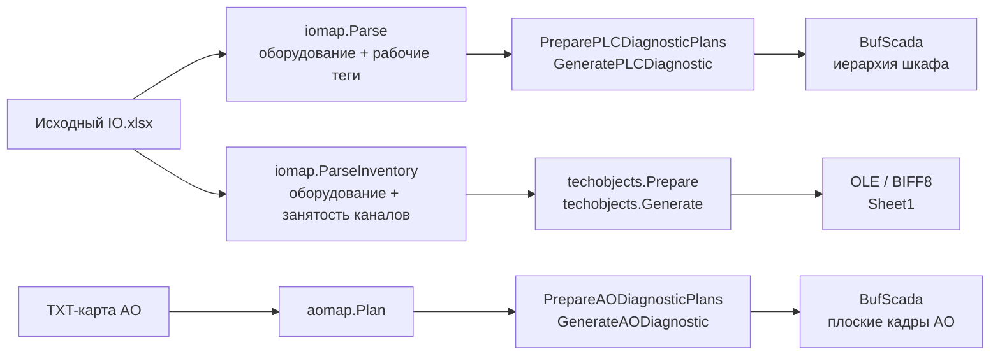
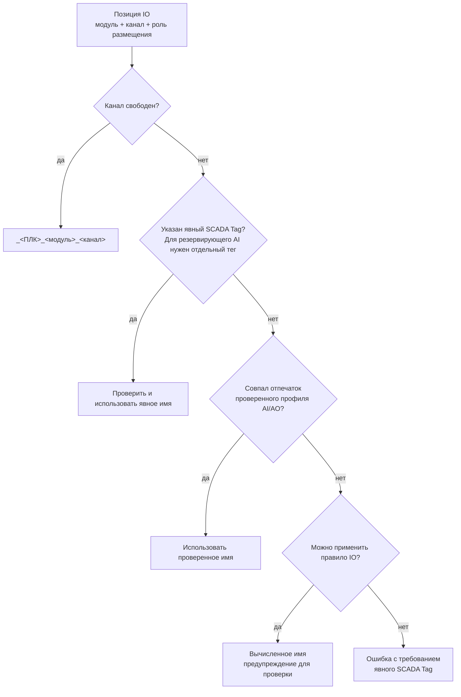
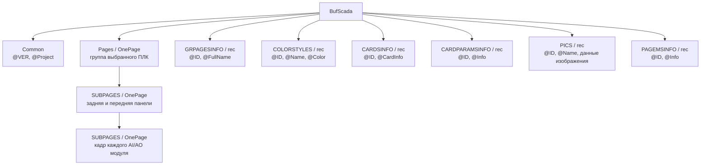
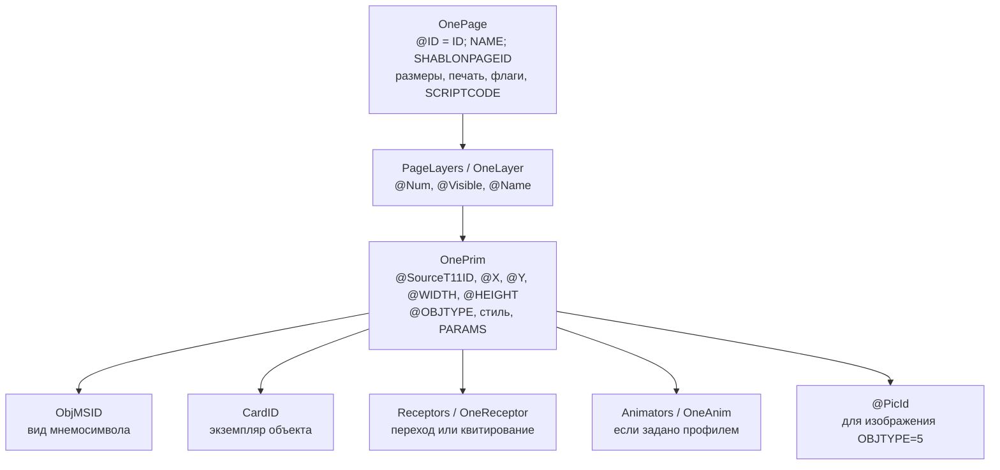
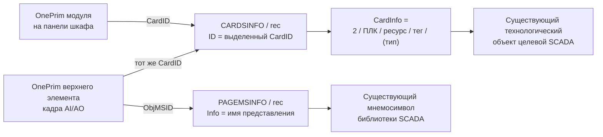
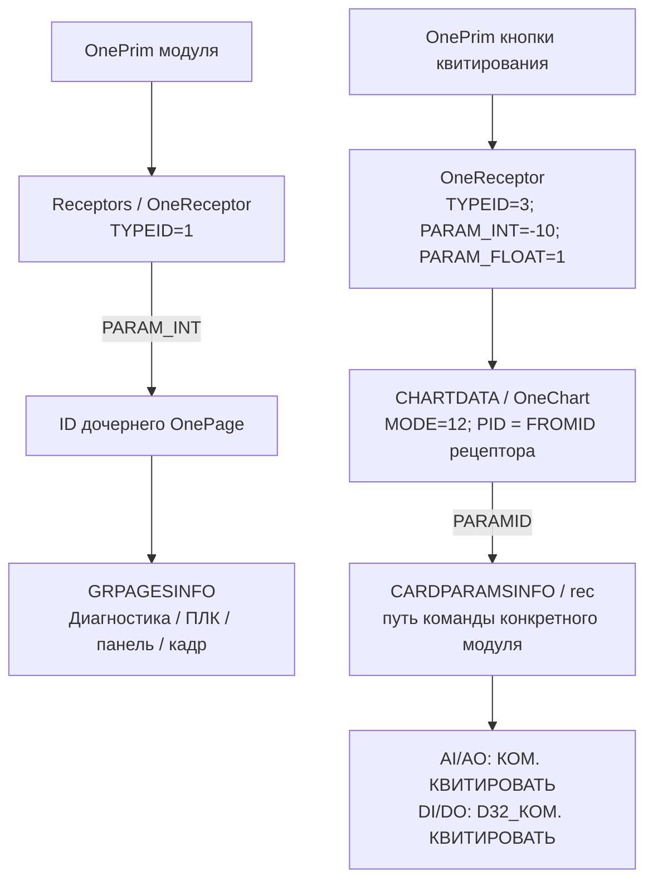
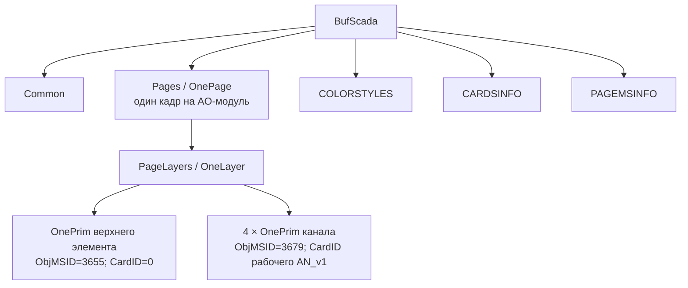
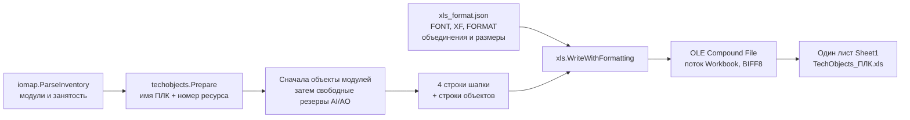
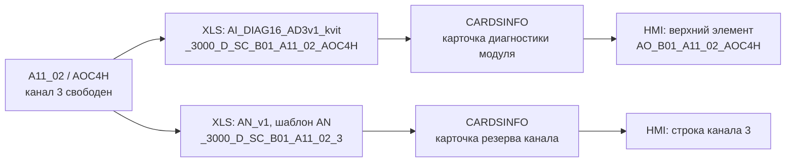

# Операторский интерфейс и технологические объекты XLS

Статус: описание фактического кода на 25.09.2026; открытые вопросы требуют заполнения. Описанная структура XML подтверждается сериализаторами и проверками ссылок в репозитории. Совместимость с конкретной установкой SCADA подтверждается отдельным протоколом импорта.

Цель этой части проекта — получать из согласованной модели оборудования операторские представления и необходимые технологические объекты. Сейчас реализованы диагностические кадры ПЛК и отдельная выгрузка объектов модулей/резервов. Технологические мнемосхемы процессов, журналы, тренды, права операторов и полный проект SCADA не представлены здесь как уже реализованная генерация.

**Уточнение владельца:** целевая SCADA закрыта, единственный способ взаимодействия — экспорт/импорт XML ([ADR-0003](decisions/ADR-0003-scada-xml-boundary.md)). Это определяет границу HMI-обмена. XLS ниже описан как существующий отдельный результат генератора; его получатель и дальнейший путь технологических объектов в SCADA ещё не установлены (Q-SCOPE-005, Q-XLS-002). Документирование XLS не утверждает его прямой импорт в SCADA или наличие конвертера в XML.

Связанные материалы: [оглавление документации](README.md), [действующая семантика IO](../DIAGNOSTIC_IO_SEMANTICS.md), [руководство приложения](../README.md).

## 1. Три самостоятельных результата

| Режим | Вход | Единица разбиения результата | Содержание | Создаёт POU |
|---|---|---|---|---|
| Полная диагностика ПЛК | Исходная IO-книга `.xlsx` | Один XML на выбранный ПЛК | Группа ПЛК, две панели шкафа, кадры AI/AO, привязки и команды | Нет |
| Прежняя диагностика AO | TXT-карта AO; сохранён совместимый API | Один XML на выбранный ПЛК | Плоский список кадров AO, четыре строки на модуль | Нет |
| Технологические объекты | Исходная IO-книга `.xlsx` | Один `.xls` на выбранный ПЛК | Все объекты модулей, затем отдельные свободные резервы AI/AO | Нет |

Генерация XLS запускается отдельно и не вызывает генерацию XML. Оба XML-профиля имеют корень `BufScada`; программный XML FBD/ST имеет другой контракт. Кадр операторского интерфейса и POU — разные сущности с разными счётчиками ID.



Источники: [обработчики диагностики](../internal/appserver/plc_diagnostic.go), [прежний обработчик AO](../internal/appserver/ao_diagnostic.go), [обработчики XLS](../internal/appserver/techobjects.go).

## 2. Как IO превращается в оборудование

### 2.1. Требуемые данные и происхождение решений

| Данные IO | Назначение | Что не следует из этих данных |
|---|---|---|
| `FCS`, `Control cabinet` | Логическая принадлежность и физический шкаф; ключ предпросмотра `FCS:шкаф` | Версия SCADA, CPU, библиотечные типы |
| `Main module`, `Redundand module` / `Redundant module` | Основное и резервирующее размещение | Свободный резерв не определяется наличием слова «резервирующий» |
| `ModuleType`, `Channel` | Тип модуля и точный индекс физического канала | Каналы не перенумеровываются после пропусков |
| `Loop`, `Tag No` | Обязательные столбцы исходного формата, данные сигнала | Произвольные инженерные имена не гарантированно восстанавливаются |
| `Loop No`, `TYPNO`, `LL/L/H/HH` | Дополнительные входы правил аналоговых имён | Не заменяют явное решение инженера в неоднозначном случае |
| `SCADA Tag`, `SCADA Reserve Tag` | Явные имена рабочих объектов основного/резервирующего размещения | Не являются указанием создать свободный резерв |
| `Description` / `Назначение`, `Service` | Тексты каналов D32V в XLS | Не определяют автоматически тексты всех будущих экранов |

Заголовок ищется в первых 30 строках. При нескольких подходящих таблицах, дублирующихся значимых столбцах или повторной занятости физического канала загрузка отклоняется. Вход — исходный IO; таблицы перекладок AI/AO и книги СКЗ имеют другой контракт.

Состав модулей получается из реальных строк IO. Для обнаруженного модуля создаётся полный массив его каналов: AI16H — 16, AOC4H — 4, DI32/DO32P — 32. Неописанные позиции этого модуля становятся свободными резервами. Целый модуль, который вообще отсутствует в IO, этим маршрутом не добавляется.

Резервирующее размещение действующего сигнала остаётся действующим каналом. Для AI возможны разные рабочие теги `_main` и `_reserve`; AO обычно ссылается на один рабочий объект `AN_v1` из двух физических модулей. Свободный резерв имеет имя `_<ПЛК>_<модуль>_<канал>`.

### 2.2. Последовательность разрешения рабочего имени



Профиль проверенных имён включает адрес, исходный FCS, шкаф, тип, основное/резервное размещение, канал, поля сигнала, пороги и роль размещения. Перестановка строк сама по себе не меняет имя; содержательное изменение отключает устаревшее соответствие. Профиль не задаёт состав оборудования.

Владельца крейта код согласует по строгому большинству строк того же шкафа/крейта. Исправления выполняются в памяти и попадают в предупреждения; неоднозначность даёт ошибку. При будущем переходе на БД нужна явно утверждённая политика для этого исправления — [Q-HMI-003](#q-hmi-003).

Подробности конкретных преобразований AI/AO сохранены в [DIAGNOSTIC_IO_SEMANTICS.md](../DIAGNOSTIC_IO_SEMANTICS.md); реализация — [parser.go](../internal/iomap/parser.go).

## 3. Структура полного XML диагностики

### 3.1. Документ и таблицы зависимостей



`PAGEMSINFO` содержит именованные зависимости от библиотечных мнемосимволов, а не определения этих мнемосимволов. Три растровых изображения крейта действительно вложены в `PICS`. Служебный шаблон не вложен: его имя и ID находятся в `GRPAGESINFO`.

Минимальная смысловая иерархия одного шкафа:

```text
BufScada
├─ Common VER="29" Project="..."
├─ Pages
│  └─ OnePage: 3000_D_SC_B01
│     ├─ PageLayers / OneLayer
│     └─ SUBPAGES
│        ├─ OnePage: Шкаф РСУ 3000_D_SC_B01. Задняя панель
│        │  ├─ PageLayers / OneLayer / OnePrim [крейты, модули, управление]
│        │  └─ SUBPAGES / OnePage [кадры AI/AO этой панели]
│        └─ OnePage: Шкаф РСУ 3000_D_SC_B01. Передняя панель
│           ├─ PageLayers / OneLayer / OnePrim
│           └─ SUBPAGES / OnePage
├─ GRPAGESINFO
├─ COLORSTYLES
├─ CARDSINFO
├─ CARDPARAMSINFO
├─ PICS
└─ PAGEMSINFO
```

Названия и XML-вложенность заданы в [plc_diagnostic_types.go](../internal/generator/plc_diagnostic_types.go). В файле задняя панель перечислена раньше передней, хотя при выделении ID передняя создаётся первой. Номер в порядке сериализации нельзя использовать вместо ссылки по ID.

### 3.2. Из чего состоит страница

У `OnePage` ID записан дважды: атрибут `@ID` и дочерний `<ID>` должны совпадать. Поле `<NAME>` задаёт имя; `<SHABLONPAGEID>` — внешний шаблон или `0`; `<WIDTH>` / `<HEIGHT>` — размер; `<PageLayers>` содержит один слой.



`OBJTYPE=8` — размещённый мнемосимвол; `OBJTYPE=5` — изображение; кнопка квитирования берётся из профиля с `OBJTYPE=14`. Это значения конкретного нативного диалекта, а не универсальная нумерация графических объектов.

## 4. Как разрешается привязка объекта при импорте

У одного графического элемента две разные связи: представление через `ObjMSID` и экземпляр через `CardID`. Корректный вид таблицы на экране ещё не доказывает, что экземпляр найден.



Пример для AO-модуля `A11_02` ПЛК `3000_D_SC_B01`, ресурс `1`:

```xml
<!-- Смысловой фрагмент: ID 91001 здесь условный, генератор выделяет новый. -->
<CARDSINFO>
  <rec ID="91001" CardInfo="2/3000_D_SC_B01/1/_3000_D_SC_B01_A11_02_AOC4H/(AI_DIAG16_AD3v1_kvit)" />
</CARDSINFO>
<!-- Внутри OnePrim панели и верхнего OnePrim дочернего кадра: -->
<CardID>91001</CardID>
```

На панели AO использует `ObjMSID=3634`, верхний элемент его кадра — `ObjMSID=3655`. Оба представляют один диагностический объект модуля. Четыре строки ниже используют `ObjMSID=3679` и отдельные карточки рабочих/резервных объектов `AN_v1`.

Для AI аналогично: модуль `ObjMSID=3625`, верхний элемент `3654`, карточка `_<ПЛК>_<модуль>_AI16H` типа `AI_DIAG16_AD3v1_kvit`; строки используют `4730/4731` и объекты `AD3_v2`.

Принятое исправление: в полной диагностике верхний AI/AO элемент получает `moduleCard`, совпадающий с карточкой модуля на шкафной панели. `CardID=0` для этих мнемосимволов отклоняется проверкой ссылок. Это проверяет [TestPLCDiagnosticFrameHeadersBindModuleDiagnostics](../internal/generator/plc_diagnostic_test.go).

`ResourceNumber=1` — сегмент символьного пути объекта. Он не равен по смыслу транспортному `ResuorceID` программного XML и не является физическим `ModuleID` оборудования.

## 5. Размещение, переходы и команды

### 5.1. Геометрия принятого профиля

| Элемент | Правило текущей реализации |
|---|---|
| Корневая группа ПЛК | Размер 1920 × 960 |
| Передняя/задняя панель | Ширина 1920; высота минимум 960, увеличивается по крейтам |
| Панель крейта | Число в имени `A…` по модулю 10: 0/1 — передняя, 2…9 — задняя |
| Порядок крейтов | Числовой: A2 раньше A10; вертикальный порядок отдельный на каждой панели |
| Начало крейта | `Y = 90 + 440 × порядок_на_панели` |
| IO-модуль | `X = 95 + 63 × слот`; ширина 63; слот 00…15 |
| CPU | TENIX-CPU715, ширина 126, позиции 00/01 первого по номеру крейта |
| Кадр AI16H | 1200 × 448; верхний элемент + 16 строк |
| Кадр AOC4H | 1200 × 152; верхний элемент + 4 строки |
| Строка канала | X=70, ширина 1080, высота 24 |
| Y строки AO | `54 + 24 × канал` |
| Y строки AI | `54 + 24 × канал + 2 × floor(канал / 4)` |
| DI32/DO32P | Мнемосимвол D32V на шкафной панели; отдельных дочерних кадров нет |

Формула панели использует последнюю десятичную цифру номера крейта: A10/A11 спереди, A12…A19 сзади. Это правило образца; IO не содержит достоверной общей модели компоновки произвольного шкафа.

Имена дочерних кадров: `AI_<часть ПЛК после _SC_>_<модуль>_AI16H` и `AO_<часть ПЛК после _SC_>_<модуль>_AOC4H`. Суффиксы ПЛК `B07_1` и `B07_2` сохраняются. Например, `AO_B01_A11_02_AOC4H` — кадр, а не POU.

### 5.2. Внутренние ссылки



Кнопка панели перечисляет команды её реальных модулей. CPU не добавляется к списку квитирования IO. Переход на другую панель направлен на вновь созданный ID, а не на номер страницы исходного образца.

Внешние зависимости: `4705 → Диагностика`, `6580 → Служебные шаблоны\Шаблон диагностики контроллеров_PS`. Навигацию к другим ПЛК обеспечивает существующий служебный шаблон. Генератор не создаёт полный глобальный навигатор проекта.

## 6. Транспортные ID, проверки и границы совместимости

| Пространство ID | Для чего расходуется |
|---|---|
| `NextPage` | Группа ПЛК, две панели, дочерние кадры AI/AO |
| `NextT11` | Графические примитивы, рецепторы, команды `OneChart`, записи параметров квитирования |
| `NextCard` | Уникальные ссылки на технологические объекты и CPU |
| `NextPOU` | При генерации HMI не расходуется |

Сначала строится отдельный план выбранного ПЛК, рассчитываются объёмы ID, затем выполняются резервирование, сериализация и повторная проверка. Карточки одного символьного пути дедуплицируются внутри результата; физические диагностические строки сохраняются, даже если две строки используют один рабочий тег AO.

Проверяются совпадение ID атрибута/элемента, уникальность ID, пути `GRPAGESINFO`, разрешимость `CardID`, `ObjMSID`, `PicId`, внутренних переходов и параметров команд, соответствие `OneChart.PID` родительскому рецептору, отсутствие привязок к чужому ПЛК. Код проверки: [plc_diagnostic_validate.go](../internal/generator/plc_diagnostic_validate.go).

Текущие ограничения полной диагностики: 1…128 выбранных ПЛК, до 64 крейтов и 1024 модулей на ПЛК, до 4096 модулей на запрос; слот 00…15; позиция панели 0…31; только AI16H/AOC4H/DI32/DO32P. Модуль в 00/01 первого крейта конфликтует с CPU и отклоняется.

Профиль HMI фиксирует TENIX-CPU715. Поддержка СКЗ CPU850 в генерации FBD/ST сама по себе не добавляет профиль CPU850 в диагностику шкафа. Ручной `ModuleCount` СКЗ не передаётся автоматически в IO-диагностику или XLS. Требуется единая согласованная модель оборудования — [Q-HMI-002](#q-hmi-002), [Q-HMI-008](#q-hmi-008).

Ресурс [plc_diagnostic_profile.xml.gz](../internal/generator/assets/plc_diagnostic_profile.xml.gz) встроен в EXE. Он содержит картинки, цвета, именованные мнемосимволы и внешний вид управляющих элементов; исходные привязки и рецепторы удалены и строятся заново. См. [описание происхождения профиля](../internal/generator/assets/README.md).

XML использует нативный сериализатор проекта: UTF-8, BOM, компактную форму, CRLF и самозакрывающиеся пустые элементы. Сохранённые ID зависимостей сопровождаются именами. Эти свойства не заменяют испытание импорта в конкретной версии редактора SCADA.

## 7. Сохранённый API плоской диагностики AO

Endpoint `POST /api/temporary/ao/generate-diagnostic` принимает прежнюю TXT-карту. В текущем пользовательском интерфейсе вместо него используется полная диагностика Excel IO; API остаётся для совместимости.



Здесь отсутствуют `SUBPAGES`, `GRPAGESINFO`, `PICS`, команды квитирования шкафа и объекты модульной диагностики. Один модуль даёт один кадр, пять примитивов и четыре строки каналов; число карточек равно числу уникальных рабочих/резервных тегов.

**Выявленное различие профилей:** [ao_diagnostic.go](../internal/generator/ao_diagnostic.go) всё ещё создаёт верхний элемент с `CardID=0` и проверяет именно это значение. Исправление привязки верхнего элемента реализовано в полном IO-профиле, описанном в разделе 4. Нельзя утверждать, что прежний endpoint уже обладает тем же поведением. Требование к его дальнейшей поддержке записано как [Q-HMI-004](#q-hmi-004).

## 8. Структура независимого XLS

### 8.1. Создание файла



Файл — бинарный Excel 97–2003, а не переименованный CSV/XML. Реализация [internal/xls](../internal/xls/xls.go) не требует установленного Excel. Значения объектов, включая строковые `0` и `1`, записываются текстовыми ячейками; числа в служебных полях не следует автоматически преобразовывать редактором.

Пакет [techobjects](../internal/techobjects/techobjects.go) не выделяет транспортные ID и не требует библиотек FBD. `ParseInventory` не вычисляет имена действующих аналоговых объектов: для этого результата нужны модуль и признак занятости канала. Рабочие объекты AD3_v2/AN_v1 сюда целиком не экспортируются.

### 8.2. Шапка — часть контракта импорта

```text
        A       B         C ................................ T      U          V           W          X ... CV
1–2   [ Cлужебные ]       [           ОБЩЕЕ СВ-ВО            ]   [D32_Вых] [D32 группы] [AI группы] [пустая полоса]
 3      №     Статус       Раздел, Марка, Тип объекта, ...       События    События     События
 4      -       -         Mode, MARKA, OBJTYPE, ...             TEXTING    TEXTING     TEXTING
 5+     пусто   пусто      TEHOBJ, <марка>, <тип>, ...           <тексты>   <тексты>    <тексты>
```

Объединения: `A1:B2`, `C1:T2`, `U1:U2`, `V1:V2`, `W1:W2`, `X1:CV2`. Всего сохраняется 100 столбцов; значимые поля находятся в A…W. Во второй строке внутри объединённых диапазонов сохраняются скрытые значения групп, необходимые для импорта; их нельзя очищать ради внешнего оформления.

Точные названия групп U/V/W: `[]D32_Вых`, `[]D32_Отекстовка групп`, `[]AI_DIAG_Отекстовка групп`. В `Cлужебные` первая буква — латинская `C`, как в исходном экспорте.

Высоты строк 1…4: 255, 255, 600, 225 twips; ширина столбцов по умолчанию 8. Шапка использует выравнивание, переносы и границы образца; строка кодов серая, Arial 8, остальные строки Arial 10. Данные оформления встроены; [описание и SHA-256 образца](../internal/techobjects/assets/README.md).

| Столбец | Код строки 4 | Значение строки объекта |
|---|---|---|
| A | `-` | Пусто |
| B | `-` | Пусто |
| C | `Mode` | `TEHOBJ` |
| D | `MARKA` | Уникальная марка объекта |
| E | `OBJTYPE` | Имя типа |
| F | `NAME` | Наименование по правилу вида объекта |
| G | `DISC` | Пусто |
| H | `OBJSIGN` | Имя модуля для модульного объекта; для резервов пусто |
| I | `OBJNUMBER` | `0` |
| J | `PLC_VARNAME` | Пусто |
| K | `ARH_PER` | `0` |
| L | `KKS` | Пусто |
| M | `OBJDPARAM` | Пусто |
| N | `SREZCONTROL` | `1` |
| O | `USERGROUP` | `[ВСЕ]` |
| P | `EVGROUP` | `[Все]\[Все технологические]` |
| Q | `PLCNAME` | Выбранное имя ПЛК |
| R | `PLC_ADRESS` | `0`; написание кода сохранено из образца |
| S | `PLC_GR` | Номер ресурса текстом; по умолчанию `1` |
| T | `TEMPLATE` | Имя шаблона; отличается от имени типа для AO |
| U | `TEXTING` | События отдельных каналов D32V |
| V | `TEXTING` | События групп D32V |
| W | `TEXTING` | События групп диагностики AI/AO |

## 9. Объекты и свободные резервы

| Вид | `OBJTYPE` | `TEMPLATE` | `MARKA` |
|---|---|---|---|
| Модуль AI16H | `AI_DIAG16_AD3v1_kvit` | `AIDIAG16_kvit` | `_<ПЛК>_<модуль>_AI16H` |
| Модуль AOC4H | `AI_DIAG16_AD3v1_kvit` | `AIDIAG16_kvit` | `_<ПЛК>_<модуль>_AOC4H` |
| Модуль DI32/DO32P | `D32V` | `D32V` | `_<ПЛК>_<модуль>` |
| Свободный канал AI | `AD3_v2` | `AD3_v2` | `_<ПЛК>_<модуль>_<канал>` |
| Свободный канал AO | `AN_v1` | **`AN`** | `_<ПЛК>_<модуль>_<канал>` |

Принятые пользователем решения: отдельные резервные объекты создаются только для AI/AO; для AO тип `AN_v1` использует шаблон `AN`. Каналы DI/DO, включая свободные, принадлежат объекту D32V. Объекты CPU этим XLS не создаются.

Модульные объекты идут первыми в числовом порядке крейт/слот; после них — резервы AI/AO в том же порядке модулей и по номеру канала. Для всех объектов выполняется проверка уникальности марки без учёта регистра.

Имена `NAME`: для AI/AO — `Диагностика AI/AO <тип модуля>`; для D32V — `_<ПЛК>_IO_<тип модуля>_<модуль>`; для свободного резерва — его марка. При переименовании ПЛК пересчитываются эти имена, марки и `PLCNAME`; входной файл не меняется.

### 9.1. Тексты событий

Формат одной записи: `n<маска>:<подпись>:не вывод::не вывод`. Несколько записей находятся в одной ячейке через перевод строки. Двоеточия в исходной подписи заменяются на ` — `, пробельные последовательности нормализуются, чтобы описание не создало лишние поля событий.

Для D32V столбец U содержит 32 записи с маской `1 << канал` в знаковом 32-битном представлении; для канала 31 значение отрицательное. Действующий канал подписывается `Tag No + описание + (0->1)`; свободный — `<марка модуля>.i<номер>`. В столбце V четыре группы по восемь каналов: целиком свободная группа — `Резерв`, иначе `<модуль через дефис>.<номер группы>`.

Для AI столбец W содержит четыре группы с масками `16`, `64`, `2048`, `4096`. Для AO — одну группу с маской `16`. Подпись AO объединяет фактически связанную пару одного крейта, например `A11-00(01).0`; соседний резервирующий модуль по номеру слота не выдумывается. Сам смысл выбранных масок требует библиотечного описания — [Q-XLS-003](#q-xls-003).

### 9.2. Сквозной пример

Условный AO-модуль `A11_02` имеет занятые каналы 0…2 и свободный канал 3. При выбранных ПЛК `3000_D_SC_B01` и ресурсе `1` XLS содержит модуль `_3000_D_SC_B01_A11_02_AOC4H` и резерв `_3000_D_SC_B01_A11_02_3`. Верхний элемент HMI обращается к первому объекту, строка канала 3 — ко второму. Рабочие объекты каналов 0…2 должны существовать из отдельного процесса создания технологических объектов/программной части.



## 10. Что нужно проверять при изменении этой части

1. Сверить состав выбранного ПЛК: модули по типам, физические каналы, свободные и резервирующие размещения должны иметь разный смысл.
2. Зафиксировать одинаковые имя ПЛК, номер ресурса и марки в XLS и `CARDSINFO` соответствующего XML; ручное переименование в одном результате не обновляет другой.
3. Проверить отдельно верхний элемент AI, верхний элемент AO, рабочую строку и свободный резерв. Вид мнемосимвола и привязка экземпляра проверяются независимо.
4. Проверить переходы между панелями и на дочерние кадры; команды квитирования должны обращаться только к модулям своей панели.
5. Для XLS проверить четыре строки шапки, объединённые диапазоны, скрытые значения, код `AN` и отсутствие отдельных DI/DO резервов.
6. Сохранить протокол фактического импорта: версия приложения/SCADA/библиотек, входные файлы, настройки, хэши результатов, ошибки импортера и итоговые привязки.

Автоматические проверки уже представлены в [plc_diagnostic_test.go](../internal/generator/plc_diagnostic_test.go), [ao_diagnostic_test.go](../internal/generator/ao_diagnostic_test.go), [techobjects_test.go](../internal/techobjects/techobjects_test.go), [format_test.go](../internal/techobjects/format_test.go), [тестах BIFF8](../internal/xls/xls_test.go). Эта документационная задача не является новым испытанием импорта.

Для XLS предел — 65 532 объекта на листе плюс четыре строки шапки; имя ПЛК до 100 латинских букв/цифр/подчёркиваний; ресурс 1…2147483647. Все выбранные XLS формируются и проверяются перед записью; при ошибке записи пакет пытается удалить созданные им файлы. Существующий результат не перезаписывается, имя получает свободный суффикс.

## 11. Открытые вопросы: информация обязательна

Вопрос считается закрытым после заполнения ответа, ссылки на подтверждающий образец/решение и критериев проверки. Догадка генератора не заменяет ответ. Для каждого пункта ниже статус — **[ТРЕБУЕТСЯ ОТВЕТ]**; он ограничивает указанную подзадачу, а не автоматически останавливает всю текущую работу.

### Q-HMI-001

**Вопрос:** какие операторские экраны, кроме диагностики ПЛК, входят в продукт: технологические мнемосхемы, faceplate, тренды, журналы, навигация, права? **Пробел:** состав результата общего операторского интерфейса не описан. **Блокирует:** декомпозицию полного HMI-генератора и критерии готовности. **Требуемое подтверждение:** перечень экранов, сценарии оператора, по одному нативному экспорту каждого типа. **Ответ / источник / проверка:** _заполнить_. **Статус:** [ТРЕБУЕТСЯ ОТВЕТ].

### Q-HMI-002

**Вопрос:** нужна ли диагностика шкафов PLC850 и какие у неё CPU, крейты, модули, размеры и мнемосимволы? **Пробел:** текущий профиль HMI фиксирован для CPU715; примеры СКЗ подтверждают только программные ST/FBD. **Блокирует:** заявление о поддержке операторского интерфейса CPU850. **Требуемое подтверждение:** нативный XML диагностики шкафа CPU850, библиотека символов, схема компоновки. **Ответ / источник / проверка:** _заполнить_. **Статус:** [ТРЕБУЕТСЯ ОТВЕТ].

### Q-HMI-003

**Вопрос:** какой источник окончательно определяет владельца крейта и размещение на передней/задней панели при работе с БД? **Пробел:** большинство строк и номер крейта сейчас заменяют недостающие инженерные данные. **Блокирует:** перенос IO-правил в серверный контракт без скрытых исправлений. **Требуемое подтверждение:** поля модели оборудования, правила конфликтов, полномочия на исправление, пример неоднозначного шкафа. **Ответ / источник / проверка:** _заполнить_. **Статус:** [ТРЕБУЕТСЯ ОТВЕТ].

### Q-HMI-004

**Вопрос:** требуется ли привести сохранённый TXT endpoint AO к привязке верхнего элемента через модульный объект или выводить его из эксплуатации? **Пробел:** его `CardID=0` отличается от принятого исправления полного IO-профиля. **Блокирует:** единое обещание корректной привязки во всех AO-режимах. **Требуемое подтверждение:** перечень реальных клиентов старого API, желаемая совместимость, импортный пример. **Ответ / источник / проверка:** _заполнить_. **Статус:** [ТРЕБУЕТСЯ ОТВЕТ].

### Q-HMI-005

**Вопрос:** какие точные версии SCADA, библиотек и служебных шаблонов являются целевыми? **Пробел:** `VER=29` и имена зависимостей происходят из примеров, матрицы совместимости нет. **Блокирует:** проверяемое утверждение о поддержке разных установок. **Требуемое подтверждение:** версия/сборка редактора, экспорты и хэши библиотек, эталоны импорта. **Ответ / источник / проверка:** _заполнить_. **Статус:** [ТРЕБУЕТСЯ ОТВЕТ].

### Q-HMI-006

**Вопрос:** где и кем создаются рабочие технологические объекты, CPU-объект и внешние HMI-шаблоны; каков порядок импорта? **Пробел:** диагностика только ссылается на них, XLS создаёт ограниченный набор объектов. **Блокирует:** полностью воспроизводимое развёртывание нового проекта. **Требуемое подтверждение:** карта артефактов и владельцев, чистый тестовый проект, порядок действий импортера. **Ответ / источник / проверка:** _заполнить_. **Статус:** [ТРЕБУЕТСЯ ОТВЕТ].

### Q-HMI-007

**Вопрос:** как утверждаются технологические имена и изменения уже существующих тегов? **Пробел:** явные поля, проверенный профиль и эвристика IO сосуществуют; правил согласования изменения имени в БД/POU/HMI нет. **Блокирует:** безопасное переименование и повторная генерация согласованного проекта. **Требуемое подтверждение:** норматив имён, идентификатор объекта вне его марки, пример переименования и критерий отсутствия потерянных ссылок. **Ответ / источник / проверка:** _заполнить_. **Статус:** [ТРЕБУЕТСЯ ОТВЕТ].

### Q-HMI-008

**Вопрос:** должны ли вручную добавленные модули СКЗ автоматически попадать в XLS и диагностику, и где хранится их утверждённый состав? **Пробел:** `ModuleCount` программного маршрута и IO-инвентаризация сейчас независимы. **Блокирует:** одинаковый состав оборудования во всех артефактах одного выпуска. **Требуемое подтверждение:** единая модель конфигурации, адреса/типы добавленных модулей, правила свободных каналов, сквозной пример A1_15. **Ответ / источник / проверка:** _заполнить_. **Статус:** [ТРЕБУЕТСЯ ОТВЕТ].

### Q-HMI-009

**Вопрос:** каковы требуемые права, поведение и подтверждения для квитирования и других операторских команд? **Пробел:** код воспроизводит команды и флаги исходного профиля, но эксплуатационные требования не описаны. **Блокирует:** расширение управляющих HMI-действий и приёмка поведения оператором. **Требуемое подтверждение:** роли, сценарии, перечень команд, ожидаемый отклик и обработка недоступности ПЛК. **Ответ / источник / проверка:** _заполнить_. **Статус:** [ТРЕБУЕТСЯ ОТВЕТ].

### Q-XLS-001

**Вопрос:** должна ли таблица технологических объектов в будущем включать рабочие сигналы, CPU и другие типы помимо модулей/свободных резервов? **Пробел:** текущий принятый объём ограничен; название «технологические объекты» само по себе не задаёт полный экспорт БД. **Блокирует:** расширение состава строк и их обязательных свойств. **Требуемое подтверждение:** список типов, нативные строки каждого типа, правила создания и обновления. **Ответ / источник / проверка:** _заполнить_. **Статус:** [ТРЕБУЕТСЯ ОТВЕТ].

### Q-XLS-002

**Вопрос:** после определения получателя XLS в Q-SCOPE-005 подтверждена ли обработка им исправленной четырёхстрочной шапки и что происходит при повторной передаче существующей марки? **Пробел:** получатель XLS при границе SCADA «только XML» не определён; бинарная/структурная проверка не определяет политику слияния, замены или дублирования объектов. **Блокирует:** регламент приёмки и повторных выпусков XLS. **Требуемое подтверждение:** название и версия потребителя, его роль в цепочке, протокол обработки исправленного файла и повторной передачи с изменённым свойством. **Ответ / источник / проверка:** _заполнить_; принятое ограничение SCADA — [ADR-0003](decisions/ADR-0003-scada-xml-boundary.md). **Статус:** [ТРЕБУЕТСЯ ОТВЕТ].

### Q-XLS-003

**Вопрос:** что означают маски и поля `TEXTING`, особенно AI `16/64/2048/4096`, AO `16`, знак маски канала 31 и значение «не вывод»? **Пробел:** код воспроизводит профиль, полной семантики событий библиотеки нет. **Блокирует:** изменение аварийных текстов, группировки, состояния вывода и новые типы модулей. **Требуемое подтверждение:** описание параметров AD3/D32V/диагностики, таблица битов, контрольные события. **Ответ / источник / проверка:** _заполнить_. **Статус:** [ТРЕБУЕТСЯ ОТВЕТ].

### Q-XLS-004

**Вопрос:** какие значения ресурса, классификатора, группы событий, архивирования, KKS и адресов должна предоставлять БД? **Пробел:** ряд столбцов сейчас пуст или заполнен константами образца. **Блокирует:** отображение общепроектных свойств без потери контекста. **Требуемое подтверждение:** словарь свойств, обязательность, допустимые значения, приоритет ручных правок. **Ответ / источник / проверка:** _заполнить_. **Статус:** [ТРЕБУЕТСЯ ОТВЕТ].

### Q-XLS-005

**Вопрос:** чем определяется свободный канал в серверной модели, как отличить его от временно отключённого, ещё не описанного и резервирующего рабочего канала? **Пробел:** IO использует заполнение `Tag No`/явного тега и пропуски позиций; этого недостаточно для всех стадий жизненного цикла. **Блокирует:** автоматическое создание/удаление резервных объектов по данным БД. **Требуемое подтверждение:** состояния канала, переходы состояний, пример замены резерва рабочим сигналом. **Ответ / источник / проверка:** _заполнить_. **Статус:** [ТРЕБУЕТСЯ ОТВЕТ].
