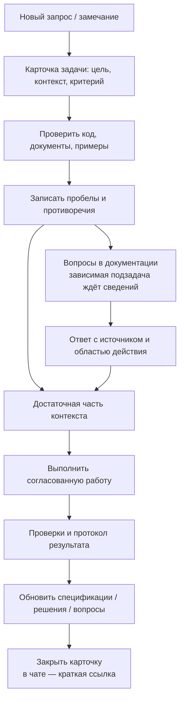
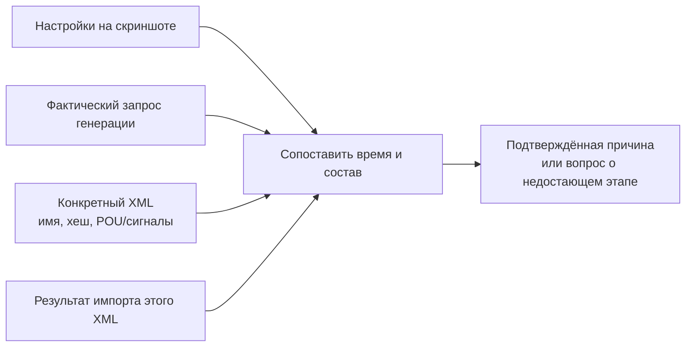

# 07. Документация как рабочий интерфейс проекта

Дата: 25.09.2026. **Принято владельцем:** все задачи в первую очередь требуют ответа в документации, а не в сессии чата. Правило закреплено в [AGENTS.md](../AGENTS.md) и [ADR-0001](decisions/ADR-0001-documentation-first.md).

## 1. Что считается результатом задачи

Результат — обновлённая карточка задачи со ссылками на спецификации, решения, вопросы, проверки и артефакты. Сообщение в чате не заменяет эту запись. Программный агент и человек должны иметь возможность продолжить работу с нового устройства, прочитав документы, без восстановления всей беседы по памяти.

Документация не должна становиться формальным препятствием: обратимые действия исследования и согласованная реализация продолжаются без повторных запросов разрешения. Блокируется только та подзадача, для которой объективно отсутствует необходимое инженерное решение.

Работа учитывает [ADR-0003](decisions/ADR-0003-scada-xml-boundary.md): закрытая SCADA предоставляет только экспорт/импорт XML. Контекст её проекта получают из переданных файлов в пределах доступного экспорта; исполнитель и автоматизация файловых действий требуют Q-OPS-004. API и состояния собственного приложения не подтверждают действия в SCADA.

## 2. Последовательность работы

| Шаг | Что записать | Готовность шага |
|---|---|---|
| 1. Постановка | Дословный смысл запроса, наблюдаемая проблема, ожидаемое поведение | Нет подмены задачи предположением |
| 2. Контекст | Профиль, входы, состав, версии, настройки, уже принятые ответы | Можно объяснить, откуда взяты данные |
| 3. Исследование | Что найдено в коде/артефактах; отдельные гипотезы | Наблюдение не выдано за доказанную причину |
| 4. Вопросы | ID, недостающие сведения, зависимость, ожидаемый ответ | Неизвестное не скрыто в коде или тексте |
| 5. Решение | Правило и его область действия; изменяемые документы/файлы | Согласованные требования соблюдены |
| 6. Реализация | Что изменено и почему; либо почему изменение не требуется | Артефакт или конкретный результат подготовлен |
| 7. Проверка | Сценарии, команды/шаги, результат, ограничения | Есть доказательство заявленного уровня готовности |
| 8. Передача | Итог, ссылки, открытые вопросы и следующий шаг | Документ самодостаточен |

## 3. Карточка задачи и её состояния

Файлы: `docs/tasks/TASK-NNNN-краткое-имя.md`, шаблон — [templates/task.md](templates/task.md). Следующий номер выбирается после существующих карточек; номер не переиспользуется.

| Состояние | Значение |
|---|---|
| Черновик | Намерение записано, контекст ещё собирается |
| Контекст уточняется | Есть перечисленные обязательные вопросы |
| Готова к выполнению | Для выбранной подзадачи контекст достаточен |
| В работе | Исследование/реализация выполняются |
| На проверке | Результат создан, заявленные проверки ещё не завершены |
| Выполнена | Критерии данной задачи выполнены и отражены в документах |
| Выполнена структурно; импорт ожидается | Код/файлы проверены, но проверка в SCADA не выполнена |
| Ожидает информации | Названы конкретные вопросы, без которых следующий зависимый шаг невозможен |

Состояние карточки относится к результату именно этой задачи. Создание документационной базы может быть выполнено при открытых вопросах о будущей интеграции. Задачу «поддержать импорт в SCADA версии X» нельзя закрыть только успешным XML-парсером.

## 4. Порядок записи вопросов и ответов

- Общие вопросы о цели, данных, интеграции и окружении — [глава 06](06-open-questions.md).
- Вопросы текущего приложения — Q-APP в [главе 02](02-current-implementation.md).
- FBD/ST/XML — Q-XML в [главе 04](04-xml-formats.md).
- HMI и XLS — Q-HMI/Q-XLS в [главе 05](05-operator-interface-and-xls.md).
- Частный вопрос новой задачи может иметь ID `Q-TASK-NNNN-01`; его источник — карточка задачи. При повторении в нескольких задачах вопрос переносится в общий реестр со ссылкой со старого ID.

Вопрос должен требовать проверяемую информацию. «Уточнить БД» недостаточно; «показать таблицы/ключи, связывающие ПЛК, модуль и канал, и пример записей» позволяет продолжить реализацию после ответа.

Ответ, пришедший в чате, переносится в документ с указанием источника «ответ владельца в задаче …». Если дата прежнего ответа неизвестна, записывается дата фиксации и явно отмечается отсутствие исходной даты. Не следует выдумывать автора, номер версии, согласование или результаты испытаний.

## 5. Уровни доказательства и конфликты

| Утверждение | Допустимое доказательство | Чего оно не доказывает |
|---|---|---|
| Параметр передан в запросе | Сохранённый payload или воспроизводимый сценарий | Что тот же параметр был в другом старом запросе |
| Элемент есть в файле | Разбор конкретного XML/XLS и его идентичность | Что он успешно импортирован |
| Структура корректна | Валидатор, ссылки, состав, тест | Выполнение логики/поведение HMI в целевой среде |
| Импорт успешен | Версия SCADA, конкретный файл, действия и наблюдения | Совместимость всех профилей и будущих версий |
| Состав/привязка сохранены в SCADA | Повторный XML-экспорт с происхождением и областью проекта; протокол сопоставления | Свойства вне выгрузки, компиляцию, исполнение или отсутствие более поздних изменений |
| Ошибка вызвана фактором X | Воспроизводимое сравнение или изолированное изменение | Причину других похожих ошибок |

При конфликте пользовательского ожидания и текущего кода записываются оба: **требуемое** и **наблюдаемое**. Код не считается правильным только потому, что он существует; пользовательское ожидание не считается реализованным только потому, что оно принято.

## 6. Контекст генерации: обязательная запись

Для задачи генерации использовать [templates/context.md](templates/context.md). Минимально нужны:

1. Требуемые артефакты и целевые ПЛК/ресурсы.
2. Версии SCADA, библиотек и профиль CPU либо открытые вопросы о них.
3. Входные файлы/DB-снимок и их идентичность; для XML-экспорта SCADA — дата, среда, область проекта и отсутствующие сведения.
4. Выбранные группы, итоговое число модулей, каналы, ручные добавления, правила резервов.
5. Физические ModuleID для ST и их источник; транспортные ID отдельно.
6. Контекст импорта: имена, GroupID, первый POUNum и внешние зависимости.
7. Применённые решения и неразрешённые вопросы.
8. Итоговый файл, состав, связь с входом, проверки и статус импорта; для внешнего результата — повторный XML-экспорт и протокол инженера либо явное указание недоступных доказательств.

Отсутствующие поля помечаются `[ТРЕБУЕТСЯ]`, а не заполняются образцовыми числами из другого проекта.

## 7. Разбор ошибок по артефактам

Для замечания «модуль/сигнал пропал» следует записать отдельно:

В проекте уже наблюдалась ситуация: сохранённые FBD имели 15 модулей/240 каналов, а более поздний ST — 16 модулей/256 каналов. Это подтверждало различие артефактов, но не доказывало, какое число было в прежнем FBD-запросе. Повторная генерация при `moduleCount=16` дала `AI_A1_15`. Такой разбор нужно сохранять в карточке, не приписывая пользователю или коду неподтверждённую причину.

Предпросмотр, текущая форма и старый скачанный файл — разные состояния. После изменения параметров новый результат требует новой генерации. Согласование общего выпуска и автоматической проверки старых результатов остаётся Q-GEN-001/Q-CTX-004.

## 8. Изменение спецификаций и решений

Решение оформляется ADR, когда меняется общая политика или устраняется неоднозначность, важная для следующих задач. Формат: контекст → принятое правило → область действия → последствия → доказательства/вопросы. Отменённые решения не стираются; новое решение ссылается на прежнее.

При изменении генератора обновляются:

| Что изменилось | Какие документы обновить |
|---|---|
| Новый XML-узел/тип/привязка | Глава 04 или 05, соответствующая визуальная схема, карточка задачи |
| Группировка POU/модулей | Главы 01/04, текущая реализация, счётчики/примеры, решение |
| Состав HMI/XLS | Глава 05, зависимости объектов, правила резервов |
| Контракт API/БД/контекста | Главы 02/03/06, схема обмена и заполненный пример |
| Подтверждение в SCADA | Протокол импорта, статус совместимости, связанные вопросы |
| Ошибка только в ранее созданном файле | Карточка разбирательства, новый артефакт и доказательства; не заявлять несуществующее изменение кода |

## 9. Трассировка и критерий завершения

Цепочка записи: `запрос → R-ID → TASK-ID → Q-ID/ADR → правило/код → проверка → артефакт → протокол импорта`.

Перед завершением проверяются связанные, а не все возможные документы:

- запрос и фактический результат совпадают по области;
- новые неизвестные сведения записаны, прежние ответы сохранены;
- ссылки ведут к существующим файлам, схемы соответствуют описанному состоянию;
- результат можно воспроизвести по указанным входам и параметрам;
- ограничения проверки названы явно;
- «реализовано», «структурно проверено» и «импортировано» не смешаны;
- в чат передана краткая ссылка на самодостаточный документ.

## 10. Следующая итерация контекста

По требованию владельца в [TASK-0003](tasks/TASK-0003-git-current-version.md) документация версионируется вместе с проектом: весь `docs/`, включая `overview.html`, карточки задач, шаблоны и решения, а также корневые правила и семантические документы. Не добавлять их в исключения Git. Перед коммитом проверять фактический индекс: отсутствие исключающего правила само по себе ещё не означает, что файл включён в коммит.

Следующий документ целесообразно посвятить ответам Q-SCOPE/Q-INT/Q-DB и таблице сопоставления полей. Это предложение порядка работы, не автоматически поставленная задача реализации интеграции. Пользователь может выбрать другой приоритет; принятое изменение фиксируется в соответствующей карточке.
