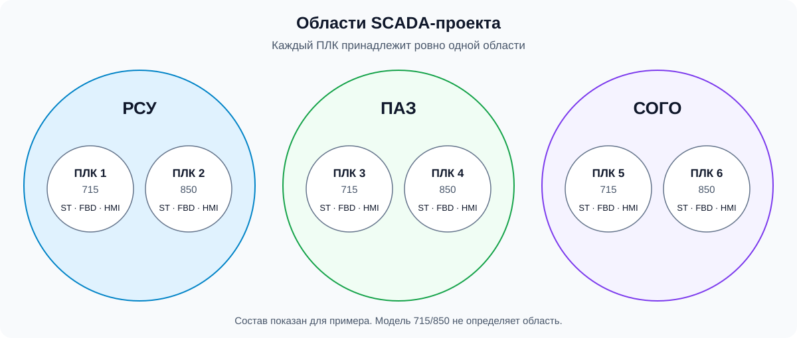

# 11. Области проекта и экземпляры ПЛК

**Принято владельцем 29.09.2026**, [ADR-0010](decisions/ADR-0010-host-context-and-plc-domains.md). РСУ, ПАЗ и СОГО — главные строго непересекающиеся множества. Каждый ПЛК находится внутри ровно одной области. Его модель — 715 либо 850 — не определяет область.

Большие круги — области работы ПЛК; малые — отдельные экземпляры. Показанные пары 715/850 иллюстрируют независимость модели от области, а не фактический состав или обязательное число ПЛК. Области не пересекаются, один физический ПЛК не повторяется в разных областях. ST/FBD/HMI внутри каждого ПЛК принадлежат этому экземпляру независимо от элементов другого ПЛК; схема не задаёт число файлов каждого вида.

Для любого экземпляра `p` в рабочем проекте выполняется: `p` принадлежит ровно одному из множеств РСУ, ПАЗ, СОГО. Их попарные пересечения пусты. Пример владельца: РСУ содержит PLC715 и PLC850, каждый независимо содержит ST, FBD и HMI.

## Связь с Host

Host-client — поставляемое приложение, которое оркестрирует приложения и данные между сервером и модулями. Модуль запрашивает данные у Host-client; Host-client использует авторизацию и доступ к PostgreSQL через Host-server. Сервер отвечает за хранение и маршрутизацию IO-листов всего проекта. Предметные настройки выходных данных принадлежат самому модулю.

IO-листы на сервере представлены только структурированными записями БД. В первой версии модули только получают данные, без загрузки версий и изменения записей. Эта граница не запрещает запись Host в контекст вопросов и результатов.

Host читает и записывает два раздельных вида контекста: Markdown/SDD приложений и рабочий инженерный проект. Вопросы и результаты могут формировать приложения, ИИ и пользователь. Механизм записи, права и версии остаются частью проектируемого контракта, [глава 03](03-target-architecture.md).

## Граница с текущей реализацией

Это предметная модель, не готовая схема БД и не реализованный контракт интеграции. Идентификаторы и формат IO-листов ещё требуют сопоставления. [Матрица генераторов](08-controller-profiles.md) описывает фактическую поддержку: HMI850 и DI715 могут не иметь реализованного или проверенного профиля, хотя эти элементы существуют в предметной модели.

Отсутствие AO в ранее согласованной ПАЗ относится к этому конкретному составу ([ADR-0005](decisions/ADR-0005-paz850-no-ao.md)), не ко всем ПЛК850. Требования `native850` относятся к отдельному профилю ([ADR-0008](decisions/ADR-0008-do-paz-native-fbd.md)); их нельзя автоматически распространить на любой ПЛК850.

## Ответ на уточнение

| ID | Требовавшиеся сведения / зависимость | Ответ и источник |
|---|---|---|
| Q-SPEC-002-01 | Иерархия областей и возможность одного ПЛК принадлежать нескольким областям; модель состава и выбор профиля | **ОТВЕЧЕН, владелец, 29.09.2026:** «ПЛК всегда относится только к одной области»; РСУ/ПАЗ/СОГО — «главные строго! НЕ пересекающиеся множества внутри каждого из которых находятся ПЛК». Отражено кругами Эйлера; идентификаторы БД этим ответом не заданы. |
