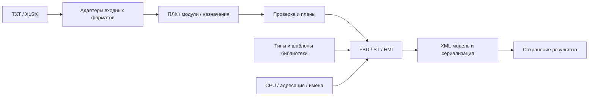

# Ответственность исходников

Карта сверена с исходниками 30.09.2026. Обязательные правила: [CODE-001, CODE-001-T, CODE-002 и CODE-003](../.specify/memory/rules.md). Текущее исправление владельцев API и контрактов — [пакет 007](../specs/007-subject-apis/spec.md); прежняя реорганизация сохранена в [004](../specs/004-semantic-layout/spec.md). Наличие каталога само по себе не подтверждает разделение содержимого. Графическая файловая карта поставляется в web-документации Host.

## Запуск и HTTP

| Каталог | Ответственность |
|---|---|
| `cmd/schemegen` | Запуск процесса, корень данных, открытие браузера и завершение HTTP |
| `internal/config` | Контракт настроек, начальные значения и чтение конфигурации отдельными файлами |
| `internal/appserver` | Создание предметных сервисов и таблица маршрутов; без парсинга таблиц и алгоритмов генерации |
| `internal/httpapi/catalog`, `workspace` | Каталог/импорт библиотеки; фактическая конфигурация приложения, без зависимости от алгоритмов генерации |
| `internal/integration/hostclient`, `internal/httpapi/host` | Обнаружение оркестратора через env, ограниченное чтение текущего соединения и его HTTP-представление; без передачи серверного токена |
| `internal/httpapi/fbd` | Библиотечные запросы FBD, их проверка и планирование; отказ прежнего AO FBD |
| `internal/httpapi/st`, `st/moduleassignment` | ST из AO-карты и назначений модулей; отдельные фазы чтения запроса, плана и выделения ID |
| `internal/httpapi/hmi` | Диагностические XML по AO-карте и IO-инвентаризации |
| `internal/httpapi/io/ao`, `io/modulemapping`, `io/source` | Предварительный разбор соответствующего источника; без алгоритмов выпуска FBD/ST |
| `internal/httpapi/io/upload`, `io/context` | Общие ограничения загрузки и декодирование переданного контекста |
| `internal/httpapi/techobjects` | Подготовка технологических объектов и выпуск XLS |
| `internal/httpapi/output` | Имена, атомарная запись, откат файлов партии, список и скачивание результатов |
| `internal/httpapi/transport`, `limits` | JSON, ответы, заголовки, локальный Origin и общие пределы запросов |

Канонические адреса назначений — `/api/mappings/*`. `/api/skz/*` остаются HTTP-псевдонимами тех же обработчиков для совместимости. Историческое имя источника не задаёт внутреннюю модель и не создаёт отдельный генератор. Старые HTTP-режимы встроенного FBD возвращают `410`; активные маршруты описаны в [главе 02](02-current-implementation.md#4-http-api-действующие-маршруты).

## Предметная модель и входные форматы

| Каталог | Ответственность |
|---|---|
| `internal/domain/assignments` | Независимые от Excel группы назначений, ПЛК, модули и каналы |
| `internal/domain/analogoutput` | Модель AO-карты и принадлежность данных ПЛК |
| `internal/domain/hardware` | Единственный каталог аппаратных модулей AI16H/AOC4H/DI32/DO32P и числа каналов; без SCADA-профиля и области ПЛК |
| `internal/domain/controller` | Имена и проверка поддержанных моделей CPU; без алгоритмов генерации и вывода области РСУ/ПАЗ/СОГО из CPU |
| `internal/domain/inventory` | ПЛК, крейты, модули, каналы и диагностические привязки |
| `internal/inputs/xlsx` | Ограниченное чтение ZIP/XML XLSX в листы и ячейки, без правил SCADA |
| `internal/inputs/assignments` | Входной порт карт назначений, возвращающий предметную модель |
| `internal/inputs/assignments/workbook` | Выбор адаптера по заголовкам и сборка результата разбора |
| `internal/inputs/assignments/raw` | Исходный IO-формат: теги, DI/DO и поля размещения модулей |
| `internal/inputs/assignments/prepared` | Подготовленные карты: строки, выражения и полнота пары Xin/Xs; проверка не навязывается другим форматам AI |
| `internal/inputs/assignments/fields`, `assembly` | Разбор полей формата и накопление проверенной модели |
| `internal/aomap` | Адаптер текстовой AO-карты; модель принадлежит `domain/analogoutput` |
| `internal/iomap` | Адаптер XLSX-инвентаризации и разрешение диагностических ссылок; модель принадлежит `domain/inventory` |

`SCS`, `FCS`, `Main_module`, `Tag No` и подобные заголовки — особенности входных источников. Общие модели и планы используют `ControllerName`, `ControllerCount` и `SourceController`; их обработка не зависит от имени столбца. Прежние JSON-поля `fcs`, `fcsCount`, `sourceFcs` сохраняются как явно обозначенные совместимые имена HTTP-контрактов. Только внутренний `sourceRow` адаптера IO знает исходные `FCS/OriginalFCS`. Генерация не выбирает алгоритм по историческому имени книги или области РСУ/ПАЗ/СОГО. Модель оборудования отдельно задаётся [непересекающимися областями ПЛК](11-project-domains.md).

## Генерация и поддерживающие компоненты

| Каталог | Ответственность |
|---|---|
| `internal/generator/fbd/request` | Вход библиотечного FBD: документ/POU/сигнал, контекст и разрешённые снимки шаблонов |
| `internal/generator/st/assignment` | Проверяемый план физических ST-назначений выбранного ПЛК и сводка выпуска |
| `internal/generator/program` | Контекст назначения программного XML; без входного формата и алгоритма генерации |
| `internal/generator/identity` | Диапазоны и пределы XML-ID, требования резервирования |
| `internal/generator/artifact` | Готовый XML и сводки результата; без HTTP-запросов и изменяемой модели оборудования |
| `internal/generator/addressing` | Физические пути, контекст назначения и профили адресации |
| `internal/generator/identifiers` | Правила имён сигналов, объектов, POU и текста идентификаторов |
| `internal/generator/modules` | Имена и экземпляры модулей, раскладка по слотам |
| `internal/generator/moduleprofile` | Получатели, число присваиваний и требования ST; ёмкости читаются из domain/hardware |
| `internal/generator/exportprofile` | Подтверждённая поддержка экспортных профилей AO ST/HMI, отдельно от аппаратной модели |
| `internal/generator/planning` | Выбор модулей, проверка запросов и построение планов до резервирования ID |
| `internal/generator/allocation` | Персистентные курсоры, проверка границ и резервирование ID |
| `internal/generator/fbd` | Только библиотечные FBD: документ, обязательный библиотечный DO-профиль, переключатель инверсии, геометрия и связи; встроенного fallback нет |
| `internal/generator/st` | Присваивания физических каналов и формирование ST |
| `internal/generator/hmi` | Диагностические кадры и связи страниц по подтверждённому профилю HMI |
| `internal/generator/xmlmodel`, `xmlcodec` | XML-модель, лексический диалект, экранирование и сериализация |
| `internal/library` | Загрузка/фильтрация XML, обход типов, индекс шаблонов, каталог и проверенный импорт; эти задачи разделены по файлам |
| `internal/techobjects` | Отбор оборудования, план технологических объектов и строки таблицы |
| `internal/xls` | Запись BIFF8/OLE: ячейки, общие строки, форматирование, листы и контейнер |

Контракты имеют отдельных владельцев: `ProgramContext` — `generator/program`, `HMIContext` — `generator/hmi`, XML-модель `OutputSTDocument` — `generator/xmlmodel`. `ControllerResult` и `BatchResponse` принадлежат `httpapi/output/xml_batch.go`: это HTTP-ответ сохранения партии по ПЛК, а не универсальная модель генератора. Только AO-настройки имеют владельца AO (`addressing/ao_defaults.go`). Общий контекст модульного ST находится в `addressing/module_defaults.go`, HMI — в `hmi/context.go`; они не наследуют частный путь AO-проекта. Метаданные общего ST — `assignments:ST:<kind>`, без SKZ. Общие HMI-элементы вынесены в `hmi/xml_common.go`, AO-страницы остаются в своём файле.

Фиксированные производственные AO/module-FBD, legacy-планировщик и альтернативная ветка DO с nil-профилем удалены из канонических пакетов. Снимок отклонённых исходников лежит только в игнорируемом `.artifacts/rejected-fixed-fbd-source`; он не собирается, не импортируется и не является тестовой реализацией. Неприменимые утверждения сохранены как текст с реестром в [tests/retired](../tests/retired/README.md).

Универсальный facade.go и каталог contracts удалены: определения существуют у единственного предметного владельца, совместимых aliases нет. appserver принимает config.Config и создаёт отдельные FBD/ST/HMI-сервисы; каждый HTTP-компонент получает только свой генератор. Workspace получает Config и отдельный Host-клиент. Подготовка ST-выпуска принадлежит st/assignment_generation.go. Предметные FBD/ST/HMI не импортируют алгоритмы друг друга; используют явно принадлежащие компонентам запросы/результаты, модели, адресацию и XML. Адаптер XLSX не знает о генераторах.

## Интерфейс и проверки

| Каталог | Ответственность |
|---|---|
| `web/shell` | Две страницы, навигация, состояние и предпочтения интерфейса |
| `web/host` | Состояние соединения, ограниченный опрос и компактное представление Host/сервера; без нового просмотра таблиц |
| `web/shared` | DOM, HTTP, общая проверка ввода; нейтральные CSS темы, элементов управления и сообщений |
| `web/sources` | Локальные источники, предварительный разбор и выбор ПЛК |
| `web/equipment` | Выбор контроллера и аппаратной модели; собственные стили этих полей |
| `web/library` | Каталог типов/шаблонов и диалог подключения библиотеки |
| `web/generation` | Общие настройки, запуск выбранных результатов и их список |
| `web/generation/fbd`, `st`, `hmi` | Настройки и запросы соответствующего вида результата |
| `web/preview` | Чтение сохранённого XML и навигация по его графической структуре |
| `tests/whitebox`, `tests/fixtures` | Канонические тесты внутренних контрактов и отдельные фикстуры |
| `tests/generator/fbd`, `tests/generator/st` | Внешние проверки библиотечного FBD и модульных ST-планов/вывода/эталонов |
| `tests/support` | Общие создатели AO-входов через настоящий parser и явное чтение optional development-образцов |
| `tests/retired` | Только текст неисполняемых исторических утверждений и причины снятия; не coverage |
| `tests/web`, `tests/preview`, `tests/sdd` | Модель интерфейса, браузерные сценарии, просмотр XML и SDD |
| `tests/unit/host` | Только нормализация/отклонение env при обнаружении Host, без сетевых соединений; не интеграционная приёмка |
| `tools/rulescheck`, `scripts/sdd.cjs` | Автоматический контроль структуры/комментариев и Spec Kit-документов |

Интерфейс использует явные ES imports/exports и единую точку bootstrap; общий изменяемый `window.GeneratorWorkspace` удалён. Состояние принадлежит `shell/state`, предметные модели результата не обращаются к DOM. Проверки браузера импортируют настоящие компоненты.

CSS имеет тех же предметных владельцев: shell/workspace.css содержит только оболочку; sources/panel.css, equipment/controllers.css, library/catalog.css — соответствующие панели. Настройки, модули, запуск и результаты выпуска разделены в generation; специфичные FBD/ST-стили находятся в своих подкаталогах. index.html подключает общие стили перед предметными, preview последним; мобильные правила принадлежат своим компонентам. Сохранение деклараций и фактического каскада проверено в [T013](../specs/004-semantic-layout/css-separation-review.md).

`tools/rulescheck` разделён на инвентаризацию, проверку Go-комментариев, проверку зависимостей и запуск. Комментарии проверяются и в production, и в `tests`, включая `support`; регрессии под `tests/whitebox/tools/rulescheck` требуют FAIL при пропусках. Это проверка наличия, смысл комментария проверяется отдельно.

Go-драйвер добавляет только тесты из `tests/whitebox` через временный `-overlay` к настоящим production-пакетам: второй копии production-кода нет. Полная команда `go test ./... -count=1` исполняет эти проверки; устройство адаптера описано в [tests/README.md](../tests/README.md). Встроенный `generator/hmi/assets` — рабочий профиль HMI, а не тестовые данные. Пользовательские библиотеки и материалы `XML dev` при реорганизации не перемещаются.

## Ручная проверка CODE-003

При review проверяются не число функций и размер файла, а уровень абстракции, смысл данных и зависимости:

- Адаптер формата знает заголовки книги, но возвращает нейтральную предметную модель.
- Модель ПЛК и каналов не содержит зависимости от HTTP или конкретного XML-экспорта.
- Профиль адресации описывает оборудование; алгоритм FBD берёт типы и шаблоны из подключённой библиотеки.
- Обработчик связывает фазы; чтение, планирование, генерация и запись имеют явных владельцев.
- Файл объединяет одну связную ответственность. Механический перенос или правило «одна функция — один файл» не заменяют разделение разных смыслов внутри функций.

Нарушение применимого правила означает **FAIL**, даже если сборка и автоматическая проверка прошли. Комментарии CODE-002 объясняют назначение и входы/эффекты функций, а не маскируют смешение обязанностей.
